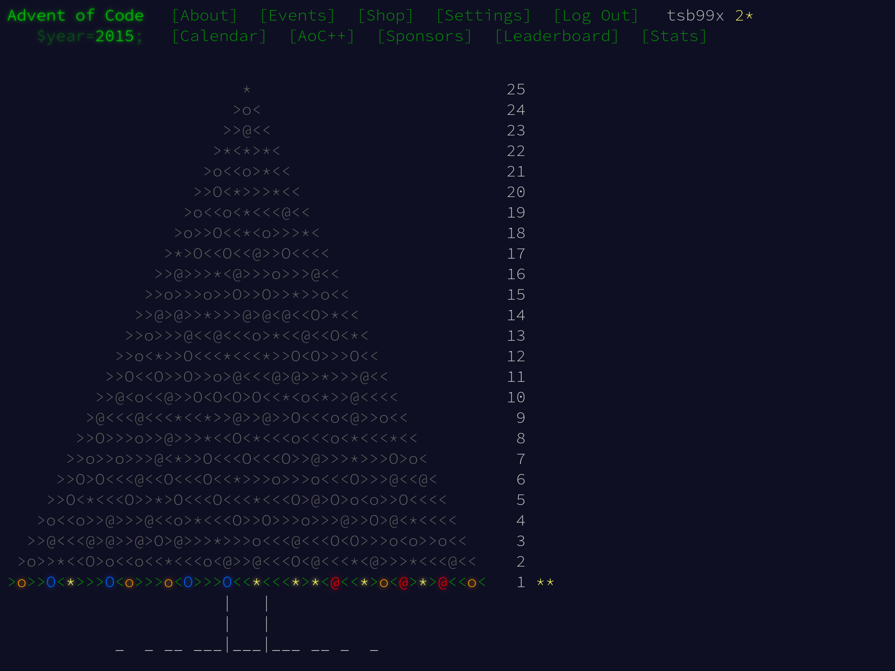

Сегодня разберём [задачу первого дня] из Advent of Code 2015. Постановка
довольно интересная. Вот вольный перевод для упрощения понимания.

## Задача

Санта должен доставить подарки в большом здании, но не может найти нужный этаж.
Он начинает на этаже 0 и следует указаниям, куда двигаться дальше по этажам.
Санта перемещается согласно одному символу за раз.

Открывающая скобка ( означает Санта должен двигаться на один этаж вверх.
Закрывающая скобка ) -- движение на один этаж вниз.

Здание такое большое, что ни дна, ни крыши у него нет.

Примеры:

- (()) и ()() приведут на этаж 0.
- ((( и (()(()( приведут на этаж 3.
- ))((((( тоже приведёт на 3-й этаж.
- ()) и ))( приведут на этаж -1 (первый уровень подвала).
- ))) и )())()) приведут на этаж -3.

На **какой этаж** приведут Санту инструкции?

## Код программы на Си

Рассмотрим по кусочкам исходный код программы на Си в файле `part_i.c`.

В описании задачи есть указание того, как скобки будут отражаться на направлении
движения. Любые иные символы игнорируем. Достаточно примитивной функции-маппера
с единственной задачей: конвертировать символ в направление движения.

```c
static int char_to_movement(char ch)
{
        switch (ch) {
        case '(':
                return 1;
        case ')':
                return -1;
        default:
                return 0;
        }
}
```

Дальше в задачке есть указание на последовательное чтение символов-команд.
Используя `fgetc`, можно последовательно считать поток из `FILE*`. В случае
ошибки считывания потока нужно прекратить работу программы, предварительно
отобразив ошибку в STDERR с помощью `perror`.

Проверка `!feof(stream)` после получения `EOF` от `fgetc(stream)` выглядит, на
первый взгляд, странно. Тонкость в том, что результат `EOF` у `fgetc` отвечает
не только за истинный `EOF`, но и за ситуации общих ошибок. Поэтому проверка
`!feof` подчёркивает: если файл не закончился, а мы уже вышли из `while` --
точно произошла какая-то значимая ошибка считывания.

```c
static int what_floor(FILE *stream)
{
        int floor = 0;
        int ch = 0;

        while ((ch = fgetc(stream)) != EOF) {
                floor += char_to_movement((char)ch);
        }

        if (!feof(stream)) {
                perror("Failed to fgetc");
                exit(EXIT_FAILURE);
        }

        return floor;
}
```

Завершающий элемент -- `main`. Он предельно простой, делегирует работу
`what_floor` и только отображает результат с помощью `printf`.

```c
int main(int argc, char *argv[])
{
        int floor = 0;

        if (argc > 1) {
                (void)fprintf(stderr,
                              "No arguments are accepted!\n"
                              "Use IO redirection: %s < input\n",
                              argv[0]);
                return EXIT_FAILURE;
        }

        floor = what_floor(stdin);
        (void)printf("%d\n", floor);

        return EXIT_SUCCESS;
}
```

Отдельно отметим приведение к `(void)`. Смысл этой конструкции в том, чтобы дать
компилятору или линтеру понять, что мы что-то сознательно игнорируем. В данном
случае такое приведение нужно для `printf` и `fprintf`, т.к. мы не обрабатываем
результат, который возвращают эти функции. На это будет ругаться Clang с флагом
`-Weverything` или Cppcheck с параметром `--addon=misra`.

Запускаем тесты (подробнее про скрипт тестирования в [отдельной заметке]):

```shell-session
$ ./test_i.sh

Test (()) => 0 PASSED
Test ()() => 0 PASSED
Test ((( => 3 PASSED
Test (()(()( => 3 PASSED
Test ))((((( => 3 PASSED
Test ()) => -1 PASSED
Test ))( => -1 PASSED
Test ))) => -3 PASSED
Test )())()) => -3 PASSED
All tests are completed and passed!
Answer for input: 232
```

Получаем ответ 232. Advent of Code говорит, что это верно.

## Вторая часть

Задачи на Advent of Code состоят из двух частей. Вторая часть появляется только
после успешного решения первой. Парафразирую вторую часть задачи:

Имея те же инструкции, нужно найти позицию символа, который указывает Санте
войти в подвал (этаж -1). Первый символ в инструкциях имеет позицию 1, второй --
2, и т.д.

Примеры:

- ) приведёт в подвал на позиции 1.
- ()()) приведёт в подвал на позиции 5.

Символ на **какой позиции** приведёт Санту в подвал?

## Изменения в исходном решении

Постановка задачи немного расширена, включено новое условие про вхождение в
подвал. Это условие раннего терминирования программы. Как только мы с ним
столкнёмся, нужно сразу же завершить исполнение алгоритма и программы.

Для демонстрации изменений будем пользоваться `diff`. Этот инструмент наглядно
покажет построчные изменения (новые аннотацией `+`, а удалённые аннотацией `-`).

Посмотрим на `diff -u part_{i,ii}.c`:

```diff
--- part_i.c    2025-03-13 10:21:39.845917592 +0300
+++ part_ii.c   2025-03-11 12:11:49.409125231 +0300
@@ -13,13 +13,18 @@
         }
 }

-static int what_floor(FILE *stream)
+static int basement_enter(FILE *stream)
 {
         int floor = 0;
+        int position = 1;
         int ch = 0;

         while ((ch = fgetc(stream)) != EOF) {
                 floor += char_to_movement((char)ch);
+                if (floor < 0) {
+                        return position;
+                }
+                position++;
         }

         if (!feof(stream)) {
@@ -27,12 +32,12 @@
                 exit(EXIT_FAILURE);
         }

-        return floor;
+        return -1;
 }

 int main(int argc, char *argv[])
 {
-        int floor = 0;
+        int position = 0;

         if (argc > 1) {
                 (void)fprintf(stderr,
@@ -42,8 +47,12 @@
                 return EXIT_FAILURE;
         }

-        floor = what_floor(stdin);
-        (void)printf("%d\n", floor);
+        position = basement_enter(stdin);
+        if (position < 0) {
+                (void)puts("Santa has not visited the basement");
+                return EXIT_FAILURE;
+        }
+        (void)printf("%d\n", position);

         return EXIT_SUCCESS;
 }
```

Пройдёмся по изменениям в коде функции `what_floor`. Она будет называться
`basement_enter`. Функция теперь будет считать позицию символа, на которой
сейчас находится считывание. После каждого обновления `floor` теперь есть
проверка -- не пришёл ли Санта в подвал. Если пришёл, мы просто вернём позицию.

Если Санта никогда не заходил в подвал, возвращаем позицию `-1`.

Ну а в `main` просто обработаем результаты, включая тот случай, когда Санта
вообще не приходил в подвал. Просто выведем ошибку и вернём `EXIT_FAILURE`.

Запускаем тесты и проверяем вывод:

```shell-session
$ ./test_ii.sh

Test ) => 1 PASSED
Test ()()) => 5 PASSED
All tests are completed and passed!
Answer for input: 1783
```

Advent of Code ответ 1783 на вторую часть принимает, задача решена.

Решения задачек можно найти в [репозитории] на GitHub.

[задачу первого дня]: https://adventofcode.com/2015/day/1
[отдельной заметке]: /notes/bash-script-for-solutions.html
[репозитории]: https://github.com/tsb99x/solutions
