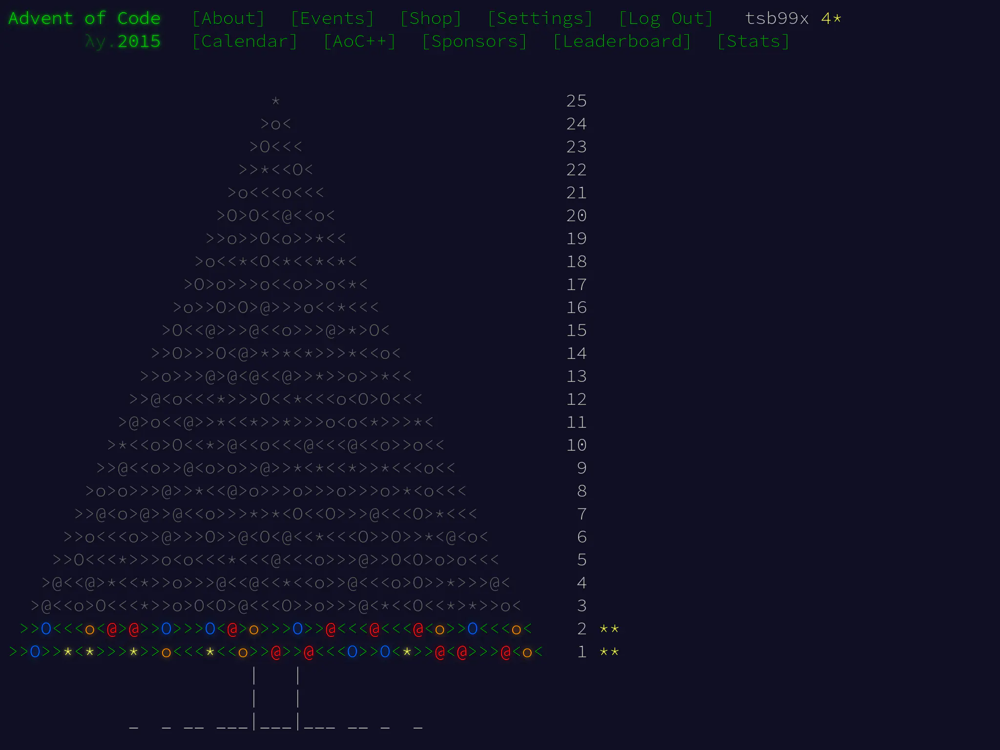

Продолжаем решать задачки Advent of Code. Сегодня будет [задача второго дня].
Полностью переводить её не буду, сделаю очередную краткую выжимку от себя.

# Задача

Эльфы оборачивают подарки в обёрточную бумагу. Подарки находятся в прямоугольных
коробках. Чтобы посчитать, сколько бумаги нужно для обёртки, нужно вычислить
площадь поверхности коробки:

$$ S_{box} = 2\:l\:w + 2\:w\:h + 2\:h\:l $$

Здесь $$ l $$ -- длина, $$ w $$ -- ширина, а $$ h $$ -- высота коробки.

Кроме этого, эльфам потребуется немного лишней (запасной) бумаги в размере
площади наименьшей стороны коробки.

Примеры:

- Коробка 2x3x4 это 2\*6 + 2\*12 + 2\*8 = 52 и запас 6, итого 58 кв. футов.
- Коробка 1x1x10 это 2\*1 + 2\*10 + 2\*10 = 42 и запас 1, итого 43 кв. фута.

Сколько квадратных футов бумаги нужно заказать эльфам **для всех** подарков?

# Решение на Си

Основная часть задачи -- расчёт поверхности коробки и дополнительной бумаги "про
запас". Не смотря на то, что в условиях фигурируют $$ l $$, $$ w $$ и $$ h $$, с
точки зрения кода проще всего работать с площадью сторон. На то же намекают и
примеры для тестов. Если выделить площади сторон как `a`, `b` и `c`, то
нахождение площади наименьшей стороны коробки станет элементарным использованием
`min(a, b, c)`.

Поскольку Си не имеет функции `min`, её тоже нужно реализовать.

```c
static int min(int a, int b) { return (a < b) ? a : b; }

static int feet_of_paper(int l, int w, int h)
{
        int a = l * w;
        int b = w * h;
        int c = h * l;
        int wrap = (2 * a) + (2 * b) + (2 * c);
        int slack = min(min(a, b), c);

        return wrap + slack;
}
```

Файл `input` для задачи содержит построчный листинг размерностей коробок. Имеет
смысл выделить отдельную функцию, чтобы вычитать ввод, преобразовать его в
параметры и отдать определённой выше функции `feet_of_paper`.

Особое внимание уделим функции `fscanf`. В строке формата есть ограничители для
максимального количества символов у числа. `%3d` значит "считывать не больше
трёх символов". А результат `fscanf` сравнивается с `3` -- количеством успешно
обработанных параметров. Если не указывать ограничения по символам и не
проверять результат `fscanf`, то можно получить неожиданные результаты.

Строка формата также содержит пробелы между `%3d`, хотя файл `input` от Advent
of Code не содержит пробелов между размерами. Так допустимо делать, т.к. группа
функций `scanf` будет просто игнорировать эти пробелы. Зато, разделение строки
формата на визуальные блоки `%3d` наглядно показывает количество аргументов.

После получения ввода обязательно проверяем его на соответствие ожиданиям. В
случае этой задачи мы получаем размеры коробки, они не могут быть с минусом или
равными нулю. В случае ошибок, опять же, заканчиваем исполнение программы.

Традиционная проверка `feof` даст понять, весь ли ввод корректно обработан.

```c
static int total_feet_of_paper(FILE *stream)
{
        int l = 0;
        int w = 0;
        int h = 0;
        int total = 0;

        while (fscanf(stream, "%3d x %3d x %3d", &l, &w, &h) == 3) {
                if ((l <= 0) || (w <= 0) || (h <= 0)) {
                        (void)fprintf(stderr,
                                      "All sizes must be >= 0, "
                                      "but dimensions were: %d x %d x %d\n",
                                      l, w, h);
                        exit(EXIT_FAILURE);
                }
                total += feet_of_paper(l, w, h);
        }

        if (!feof(stream)) {
                perror("Failed to fscanf");
                exit(EXIT_FAILURE);
        }

        return total;
}
```

Завершает решение базовый `main`. Тут только передаём бразды правления функции
`total_feet_of_paper` и выводим результат. Дополнительно проверяем, что по
ошибке в программу не были переданы аргументы. Их не имеет смысла принимать,
т.к. основной поток ввода -- STDIN, а вывода -- STDOUT.

```c
int main(int argc, char *argv[])
{
        int total = 0;

        if (argc > 1) {
                (void)fprintf(stderr,
                              "No arguments are accepted!\n"
                              "Use IO redirection: %s < input\n",
                              argv[0]);
                return EXIT_FAILURE;
        }

        total = total_feet_of_paper(stdin);
        (void)printf("%d\n", total);

        return EXIT_SUCCESS;
}
```

Запускаем тесты:

```shell-session
$ ./test_i.sh

Test 2x3x4 => 58 PASSED
Test 1x1x10 => 43 PASSED
All tests are completed and passed!
Answer for input: 1586300
```

Advent of Code устроил полученный ответ.

## Вторая часть

Эльфам не хватает ещё и ленты для подарков. Лента имеет одинаковую ширину, нужно
найти только длину. Длина ленты вокруг подарка -- наикратчайшая дистанция вокруг
сторон или, проще, наименьший периметр одной из граней.

Каждый подарок также требует бантик из ленты. Количество ленты для банта равно
объёму подарка. Даже не спрашивайте как такой бантик завязывать...

Примеры:

- Коробка 2x3x4 это 2+2+3+3 = 10 и бант 2\*3\*4 = 24, всего 34 фута.
- Коробка 1x1x10 это 1+1+1+1 = 4 и бант 1\*1\*10 = 10, всего 14 футов.

Сколько футов ленты нужно заказать эльфам для **всех подарков**?

## Изменения в исходном решении

Формулы для расчёта в новой постановке поменялись. Теперь нас интересуют не
столько площади, сколько периметры сторон и объём коробки. Доработаем код.

Как и в предыдущей задаче, посмотрим на `diff -u part_{i,ii}.c`:

```diff
--- part_i.c    2025-03-11 12:11:55.837225321 +0300
+++ part_ii.c   2025-03-11 12:12:00.997305687 +0300
@@ -3,18 +3,18 @@

 static int min(int a, int b) { return (a < b) ? a : b; }

-static int feet_of_paper(int l, int w, int h)
+static int feet_of_ribbon(int l, int w, int h)
 {
-        int a = l * w;
-        int b = w * h;
-        int c = h * l;
-        int wrap = (2 * a) + (2 * b) + (2 * c);
-        int slack = min(min(a, b), c);
+        int a = l + w;
+        int b = w + h;
+        int c = h + l;
+        int wrap = 2 * min(min(a, b), c);
+        int bow = l * w * h;

-        return wrap + slack;
+        return wrap + bow;
 }

-static int total_feet_of_paper(FILE *stream)
+static int total_feet_of_ribbon(FILE *stream)
 {
         int l = 0;
         int w = 0;
@@ -29,7 +29,7 @@
                                       l, w, h);
                         exit(EXIT_FAILURE);
                 }
-                total += feet_of_paper(l, w, h);
+                total += feet_of_ribbon(l, w, h);
         }

         if (!feof(stream)) {
@@ -52,7 +52,7 @@
                 return EXIT_FAILURE;
         }

-        total = total_feet_of_paper(stdin);
+        total = total_feet_of_ribbon(stdin);
         (void)printf("%d\n", total);

         return EXIT_SUCCESS;
```

Основные изменения приходятся только на `feet_of_paper`. Эта функция теперь
называется `feet_of_ribbon`. Как видно, кроме этого, теперь меняются формулы.
`a`, `b` и `c` описывают полу-периметры, а `wrap` представляет объём коробки.
Кроме смены формул, других значимых изменений в коде не требуется.

Запускаем тесты для проверки обновлённого решения:

```shell-session
$ ./test_ii.sh

Test 2x3x4 => 34 PASSED
Test 1x1x10 => 14 PASSED
All tests are completed and passed!
Answer for input: 3737498
```

Advent of Code полученный ответ принял, задача полностью решена.

Решения задачек можно найти в [репозитории] на GitHub.

[задача второго дня]: https://adventofcode.com/2015/day/2
[репозитории]: https://github.com/tsb99x/solutions
