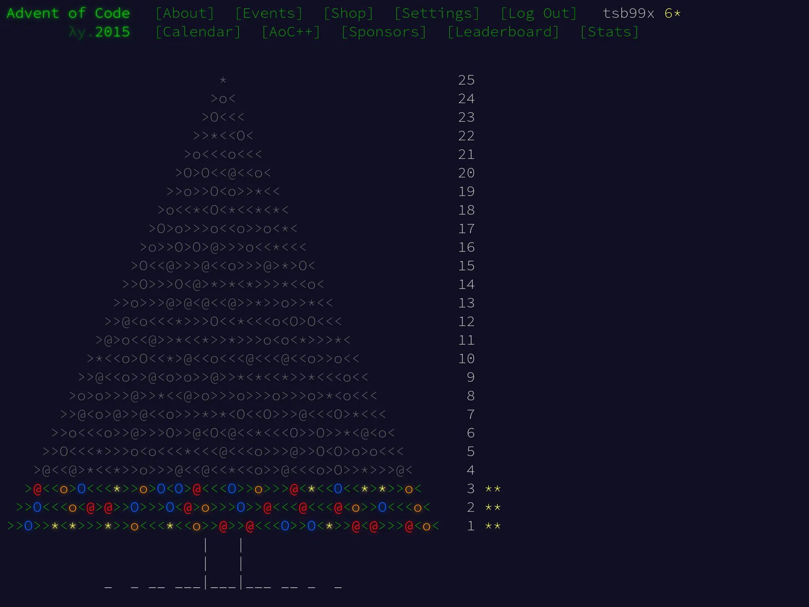

Следующая задача из Advent of Code 2015. Сегодня [задача третьего дня]. Первым
делом разбираем условия. Вольный перевод от меня следует далее.

# Задача

Санта доставляет подарки на бесконечной двумерной сетке из домов.

Он начинает с доставки подарка на его стартовой позиции. Затем эльф с Северного
полюса связывается с Сантой по радио и говорит, куда двигаться дальше. Команды
всегда означают следующий дом на север (^), юг (v), восток (>) или запад (<).
После каждого движения Санта доставляет подарок в дом на его новой позиции.

Эльф на Северном полюсе выпил много эгг-нога, поэтому его указания не совсем
точные. Санта посетит некоторые дома больше, чем один раз. Как много домов будет
иметь **хотя бы один подарок**?

Примеры:

- \> доставит подарок в 2 дома: один на стартовой точке и один на востоке.
- \^>v< доставит подарки в 4 дома, очерчивая квадрат, включая двойное посещение
дома на стартовой/конечной точках.
- \^v\^v\^v\^v\^v доставит много подарков очень везучим ребятам в 2-ух домах.

# Решение на Си

Эта задача прямо говорит о передвижениях, повторениях и поиске уникальных
координат. Основной элемент задачи -- двумерная сетка из домов и модель
перемещения по ним. Сфокусируемся на понятии позиции как точки в двумерном
пространстве и обработки команд для перемещения.

```c
struct point_2d {
        int x;
        int y;
};

static void move(struct point_2d *pos, char ch)
{
        switch (ch) {
        case '>':
                pos->x++;
                return;
        case '<':
                pos->x--;
                return;
        case '^':
                pos->y++;
                return;
        case 'v':
                pos->y--;
                return;
        default:
                return;
        }
}
```

Структура `point_2d` представляет ту самую точку. Процедура `move` позволит
применить поступившую "инструкцию" и обновить координаты. Неизвестные команды
игнорируем. Достаточно прямолинейно.

Теперь к вопросу представления сетки домов. Решение в лоб -- взять двумерный
массив и отмечать на нём перемещения. После обработки всех команд пройтись по
этой сетке и посчитать посещённые Сантой точки.

Это решение, пусть и простое, имеет один недостаток -- тяжело спрогнозировать
объём реально используемой памяти для работы и понять как корректировать
размерность сетки. Пример: Санта пошёл в одну сторону и идёт только в этом
направлении. Когда он упрётся в границы поля, что дальше делать? Подобное
решение требует дополнительного учёта множества граничных ситуаций, которые не
описали в исходной постановке.

Вернёмся к условиям: задача говорит только о поиске **уникальных** координат. У
нас уже имеется структура `point_2d`. Если сохранять `point_2d` в некий аналог
математического множества (Set), то мы сможем значительно упростить работу!

Самая большой недостаток этого подхода -- отсутствие понятия Set в Си. Давайте
реализуем самый наивный вариант того, как можно добавлять элементы в Set.

```c
#define SET_SIZE 4096

static int set_add(int set_count, struct point_2d set[], struct point_2d elem)
{
        for (int i = 0; i < set_count; i++) {
                if ((set[i].x == elem.x) && (set[i].y == elem.y)) {
                        return set_count;
                }
        }

        if (set_count >= SET_SIZE) {
                (void)fputs("Failed to set_add, capacity reached\n", stderr);
                exit(EXIT_FAILURE);
        }

        set[set_count] = elem;
        return set_count + 1;
}
```

Это имплементация, построенная вокруг простого массива. При добавлении в `set`
элемента `elem`, мы первым делом перебираем весь массив в попытке найти такой же
элемент. Если получилось найти, то возвращаем исходное количество элементов
множества, ведь мы ничего не добавили.

Если такого элемента нет, то мы проверяем, есть ли место в массиве для новых
элементов, `set_count >= SET_SIZE`. Если места нет -- просто "падаем" с ошибкой.
В ином случае записываем новый элемент на следующую доступную позицию в `set` и
возвращаем новое количество элементов `set_count + 1`.

Эту реализацию можно значительно улучшать: сделать динамическую аллокацию,
деаллокацию и реаллокацию памяти; сделать структуру `set_point_2d`, куда вынести
`set_count`, и где сохранить `set_capacity`... Вариантов много, но это более
многословная реализация, не требуемая для этой задачи.

Самое главное, чего удалось добиться -- понятного увеличения количества
используемой памяти. Set на основе массива -- одномерная структура, тут нет
проблем с пониманием как увеличить выделенную память (достаточно поменять
значение `SET_SIZE`).

Теперь перейдём к основной функции `how_many_houses`.

```c
static int how_many_houses(FILE *stream)
{
        int ch = 0;
        struct point_2d pos = {0};
        struct point_2d set[SET_SIZE] = {0};
        int set_count = set_add(0, set, pos);

        while ((ch = fgetc(stream)) != EOF) {
                move(&pos, (char)ch);
                set_count = set_add(set_count, set, pos);
        }

        if (!feof(stream)) {
                perror("Failed to fgetc");
                exit(EXIT_FAILURE);
        }

        return set_count;
}
```

Это -- связующее звено между предыдущими функциями. Как и в предыдущих задачах,
принимаем ввод в виде стрима из `FILE*`. С самого начала инициализируем `set` и
добавляем в него исходную позицию Санты. На каждую инструкцию в `ch` изменяем
позицию `pos` и добавляем значение обновлённой позиции в `set`. Для получения
ответа на задачу просто возвращаем `set_count` -- количество элементов в `set`.

Завершает решение типичная функция `main`.

```c
int main(int argc, char *argv[])
{
        int houses = 0;

        if (argc > 1) {
                (void)fprintf(stderr,
                              "No arguments are accepted!\n"
                              "Use IO redirection: %s < input\n",
                              argv[0]);
                return EXIT_FAILURE;
        }

        houses = how_many_houses(stdin);
        (void)printf("%d\n", houses);

        return EXIT_SUCCESS;
}
```

Здесь ничего нового относительно предыдущих решений нет.

Запускаем тесты:

```shell-session
$ ./test_i.sh

Test > => 2 PASSED
Test ^>v< => 4 PASSED
Test ^v^v^v^v^v => 2 PASSED
All tests are completed and passed!
Answer for input: 2565
```

Этот ответ устраивает Advent of Code.

## Вторая часть

В следующем году, чтобы ускорить процесс, Санта создаёт робо-версию себя,
**Робо-Санту**.

Санта и Робо-Санта начинают на той же локации. Они доставляют два подарка в один
и тот же дом, а затем поочерёдно двигаются по инструкциям от эльфа, который
читает те же указания, что и в предыдущем году, попивая эгг-ног.

Как много домов будут иметь **хотя бы один подарок** в этом году?

Примеры:

- \^v доставит подарки в 3 дома, потому что Санта отправляется на север, а затем
Робо-Санта идёт на юг.
- \^>v< теперь доставит подарки в 3 дома, а Санта и Робо-Санта придут в ту же
точку, откуда начинали.
- \^v\^v\^v\^v\^v теперь доставляет подарки в 11 домов, ведь Санта идёт в одну
сторону, а Робо-Санта идёт в другую.

## Изменения в исходном решении

Постановка практически не изменилась, за исключением появления новой позиции у
Робо-Санты и поочерёдной обработки указаний от эльфа.

Посмотрим на `diff -u part_{i,ii}.c`:

```diff
--- part_i.c    2025-03-12 18:20:38.991916889 +0300
+++ part_ii.c   2025-03-12 18:20:45.428005634 +0300
@@ -49,13 +49,16 @@
 static int how_many_houses(FILE *stream)
 {
         int ch = 0;
-        struct point_2d pos = {0};
+        struct point_2d santa_pos = {0};
+        struct point_2d robo_pos = {0};
+        struct point_2d *current = &santa_pos;
         struct point_2d set[SET_SIZE] = {0};
-        int set_count = set_add(0, set, pos);
+        int set_count = set_add(0, set, *current);

         while ((ch = fgetc(stream)) != EOF) {
-                move(&pos, (char)ch);
-                set_count = set_add(set_count, set, pos);
+                move(current, (char)ch);
+                set_count = set_add(set_count, set, *current);
+                current = (current == &santa_pos) ? &robo_pos : &santa_pos;
         }

         if (!feof(stream)) {

```

Теперь `pos` разделился на `santa_pos` и `robo_pos`. Появился указатель
`current`, который определяет какую именно позицию мы будем изменять. После
каждой команды `current` переключается с Санты на Робо-Санту или наоборот.

Прогоняем тесты:

```shell-session
$ ./test_ii.sh

Test ^v => 3 PASSED
Test ^>v< => 3 PASSED
Test ^v^v^v^v^v => 11 PASSED
All tests are completed and passed!
Answer for input: 2639
```

И этот ответ подошёл, отлично! Задача решена.

Решения задачек можно найти в [репозитории] на GitHub.

[задача третьего дня]: https://adventofcode.com/2015/day/3
[репозитории]: https://github.com/tsb99x/solutions
