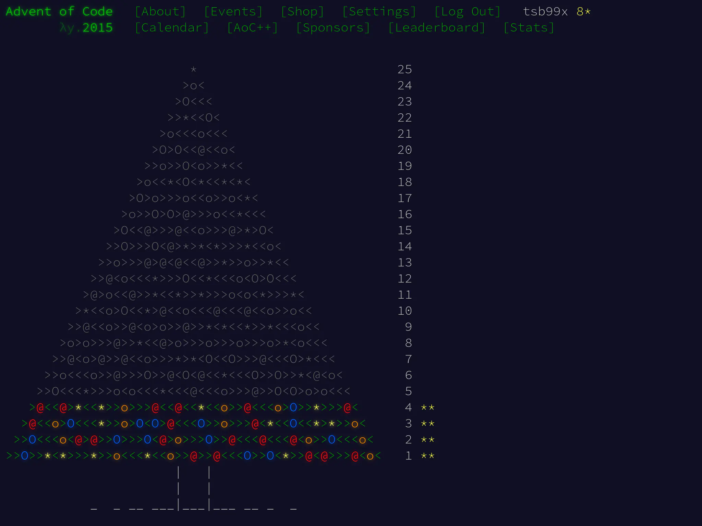

И следующая задача Advent of Code 2015. Сегодня решаем [задачу четвёртого дня].

## Задача

Санте нужна помощь с майнингом AdventCoin, которые похожи на Bitсoin. Он хочет
использовать AdventCoin как подарки для финансово дальновидных детей.

Чтобы накопать AdventCoin, нужно найти MD5-свёртку. Она должна начинаться **с
пяти нулей** в шестнадцатеричном виде. На вход в MD5 хэш-функцию поступает
секретный ключ, за которым идёт значение в десятичной системе (суффикс). Для
Санты нужно найти наименьшее положительное значение суффикса (без ведущих нулей:
1, 2, 3...), которое даст искомую свёртку.

Примеры:

- Если секретный ключ это abcdef, то ответ 609043, т.к. MD5 свёртка для
abcdef609043 начинается с пяти нулей (000001dbbfa...) и это наименьший суффикс.
- Если секретный ключ это pqrstuv, то наименьший суффикс, с которым можно
получить начинающуюся на пять нулей MD5 свёртку -- это 1048970. MD5 свёртка для
pqrstuv1048970 выглядит как 000006136ef...

## Решение на Си

Эта шуточная задача имеет требования к наличию функции для MD5 свёртки, но в
стандартной библиотеке Си нет подобных алгоритмов. Хоть [RFC 1321] уже содержит
референсную имплементацию MD5 на Си, копировать её смысла нет. Поскольку фокус
задачи на расчёте суффикса, мы воспользуемся готовыми библиотеками.

Устанавливаем пакет `libssl-dev`:

```shell-session
$ sudo apt install libssl-dev
```

После установки описываем функцию `find_five_zeroes`.

```c
#include <openssl/err.h>
#include <openssl/evp.h>

#define BUF_SIZE 64

static long find_five_zeroes(const char prefix[])
{
        char buf[BUF_SIZE] = {0};
        unsigned char md[EVP_MAX_MD_SIZE] = {0};
        unsigned int md_size = 0;

        for (long i = 1; i < LONG_MAX; i++) {
                int chs = snprintf(buf, sizeof(buf), "%s%ld", prefix, i);
                if (chs < 0) {
                        perror("Failed to snprintf");
                        exit(EXIT_FAILURE);
                }
                if ((size_t)chs >= sizeof(buf)) {
                        (void)fputs("Failed to snprintf: Buffer overflow\n",
                                    stderr);
                        exit(EXIT_FAILURE);
                }

                if (!EVP_Digest(buf, strlen(buf), md, &md_size, EVP_md5(),
                                NULL)) {
                        ERR_print_errors_fp(stderr);
                        exit(EXIT_FAILURE);
                }

                // NOLINTNEXTLINE
                if ((md[0] == 0x00U) && (md[1] == 0x00U) && (md[2] < 0x10U)) {
                        return i;
                }
        }

        return -1;
}
```

Функция принимает `prefix`, добавляет к нему суффикс `i` с помощью `snprintf`,
рассчитывает MD5 свёртку с помощью `EVP_Digest` и проверяет наличие нулей в
начале свёртки. `EVP_Digest` -- высокоуровневый интерфейс openSSL для свёрток.

Две проверки для результата `snprintf` нужны из-за двух проблемных сценариев:
если печать не удалась из-за ошибок IO (системных) и если `snprintf` должен был
напечатать больше символов, чем размер `sizeof(buf)`. Оба сценария маловероятны
в данном случае, но универсальное правило для Си -- проверять всё, что можно.

Поскольку свёртка представлена байтами, то первые пять цифр шестнадцатеричного
значения будут находится в первых трёх байтах (`md[0]`, `md[1]` и `md[2]`). На
каждый байт приходится две шестнадцатеричных цифры. Трюк тут только в работе с
`md[2]`. Нужно проверять, что `md[2] < 0x10U`. Это будет гарантировать, что
первая цифра из байта `md[2]` -- ноль.

Отдельно отметим `0x00U`. `U` отвечает за приведение литерала к виду unsigned,
т.е. беззнакового. Это нужно, т.к. в массиве `md` находятся unsigned char.
Сравнивать знаковые и беззнаковые типы -- моветон, в этом нет никакого смысла.
Линтеры вроде Cppcheck с флагом `--addon=misra` будут ругаться на такой код.

Один из важных элементов цикла `for` -- использование `long` как типа для `i`.
Может возникнуть желание использовать `int`, но надо вспомнить: Си гарантирует
диапазон значений `int` только в рамках [−32767, +32767]. В приведённых примерах
уже есть цифры, выходящие за границы этого диапазона (609043, 1048970). Поэтому
необходимо расширить диапазон, использовав `long`.

Также в функции есть комментарий `// NOLINTNEXTLINE`. Это указание `clang-tidy`
для игнорирования следующей строки. Если его не дать, то `clang-tidy` будет
ругаться на использование "магических значений". Отключать перманентно такую
проверку не стоит, т.к. в большинстве случаев она оправдана. Тут она требует
выделить какое-то имя для `0x10` и придумать его достаточно тяжело.

Перейдём к `main`, она отличается от предыдущих задач.

```c
#define MAX_ARG_LEN 32U

int main(int argc, char *argv[])
{
        size_t arg_len = 0;
        long suffix = 0;

        if (argc != 2) {
                (void)fprintf(stderr,
                              "Only one argument is accepted!\n"
                              "Use like this: %s prefix\n",
                              argv[0]);
                return EXIT_FAILURE;
        }

        arg_len = strlen(argv[1]);
        if (arg_len > MAX_ARG_LEN) {
                (void)fprintf(stderr,
                              "Secret prefix argument must be less than %d "
                              "chars of length, but was %zu\n",
                              MAX_ARG_LEN,
                              arg_len);
                return EXIT_FAILURE;
        }

        suffix = find_five_zeroes(argv[1]);
        if (suffix < 0) {
                (void)fprintf(stderr,
                              "Failed to find MD5 with 5 zeroes for %s\n",
                              argv[1]);
                return EXIT_FAILURE;
        }
        (void)printf("%ld\n", suffix);

        return EXIT_SUCCESS;
}
```

Для этой задачи нет отдельного файла `input`, который можно подать на вход.
Advent of Code сразу выдаёт небольшую строчку, которая будет префиксом
секретного ключа. Нет смысла писать функцию для считывания STDIN.

Вся логика сводится в таком случае к: проверке наличия аргумента командной
строки, передаваемой в программу (`argc == 2`); количества символов у этого
аргумента (`strlen(argv[1])`); передачи аргумента в функцию `find_five_zeroes`.

Длина аргумента требует ограничения, т.к. внутри функции для поиска свёртки
будет выделяться буфер известного размера `BUF_SIZE`. Можно использовать и
динамическое выделения памяти, но это нецелесообразно в такой задаче.

Запускаем тесты:

```shell-session
$ ./test_i.sh

Checking part_i.c ...
Test abcdef => 609043 PASSED
Test pqrstuv => 1048970 PASSED
All tests are completed and passed!
Answer for input: 117946
```

Advent of Code доволен, переходим к открывшейся части задачи.

## Вторая часть

Теперь найдите MD5 свёртку, начинающуюся **с шести нулей**.

## Изменения в исходном решении

Изменения в постановке тривиальны. Единственная вещь, которая должна измениться
-- проверка шестнадцатеричных цифр в начале свёртки, более ничего не меняется.

Посмотрим на `diff -u part_{i,ii}.c`:

```diff
--- part_i.c    2025-03-13 14:11:34.682639162 +0300
+++ part_ii.c   2025-03-13 14:12:57.239963465 +0300
@@ -8,7 +8,7 @@
 #define MAX_ARG_LEN 32U
 #define BUF_SIZE 64

-static long find_five_zeroes(const char prefix[])
+static long find_six_zeroes(const char prefix[])
 {
         char buf[BUF_SIZE] = {0};
         unsigned char md[EVP_MAX_MD_SIZE] = {0};
@@ -32,8 +32,7 @@
                         exit(EXIT_FAILURE);
                 }

-                // NOLINTNEXTLINE
-                if ((md[0] == 0x00U) && (md[1] == 0x00U) && (md[2] < 0x10U)) {
+                if ((md[0] == 0x00U) && (md[1] == 0x00U) && (md[2] == 0x00U)) {
                         return i;
                 }
         }
@@ -63,10 +62,10 @@
                 return EXIT_FAILURE;
         }

-        suffix = find_five_zeroes(argv[1]);
+        suffix = find_six_zeroes(argv[1]);
         if (suffix < 0) {
                 (void)fprintf(stderr,
-                              "Failed to find MD5 with 5 zeroes for %s\n",
+                              "Failed to find MD5 with 6 zeroes for %s\n",
                               argv[1]);
                 return EXIT_FAILURE;
         }

```

Была переименована функция `find_five_zeroes` в `find_six_zeroes`, а также
изменена проверка `md[2]`. Теперь сравниваем равенство с `0x00`. Это решение
даже чуть проще предыдущего.

Снова запускаем тесты, но для второй части:

```shell-session
$ ./test_ii.sh

Checking part_ii.c ...
Answer for input: 3938038
```

Это то, что Advent of Code и ожидал. Задача решена.

Решения задачек можно найти в [репозитории] на GitHub.

[задачу четвёртого дня]: https://adventofcode.com/2015/day/4
[RFC 1321]: https://www.ietf.org/rfc/rfc1321.txt
[репозитории]: https://github.com/tsb99x/solutions
