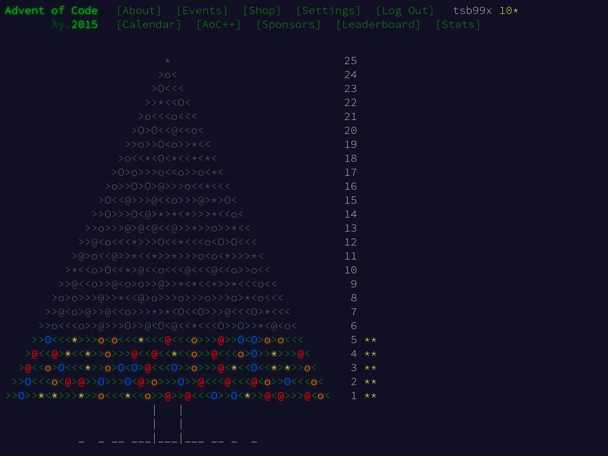

Очередная задача Advent of Code 2015. Сегодня решаем [задачу пятого дня].

## День 5: Разве у него нет эльфов-стажёров для этого?

Санта нуждается в помощи, чтобы определить, какие строки в его текстовом файле
хорошие или плохие.

**Хорошей** строкой считается строка, удовлетворяющая всем следующим условиям:

- Она содержит как минимум три гласные (только a, e, i, o, u), например, aei,
xazegov или aeiouaeiouaeiou.
- Она содержит как минимум одну букву, которая встречается дважды подряд,
например, xx, abcdde (dd) или aabbccdd (aa, bb, cc или dd).
- Она **не** содержит строки ab, cd, pq или xy, даже если они являются частью
одного из других требований.

Например:

- ugknbfddgicrmopn – хорошая, потому что в ней есть как минимум три гласные
(u...i...o...), двойная буква (...dd...) и отсутствуют запрещенные подстроки.
- aaa – хорошая, потому что в ней есть как минимум три гласные и двойная буква,
даже если буквы, используемые разными правилами, перекрываются.
- jchzalrnumimnmhp – плохая, потому что в ней нет двойной буквы.
- haegwjzuvuyypxyu – плохая, потому что она содержит строку xy.
- dvszwmarrgswjxmb – плохая, потому что она содержит только одну гласную.

Сколько всего строк -- хорошие?

## Решение на Си

Задача требует работы со строками, отдельными символами и подстроками. Для Си
работа со строками подразумевает, высокоуровнево, выбор: работать со строками
как с указателями или как с массивами. Моё предпочтение обычно падает на работу
с массивами. По-моему, так логика выглядит чуть понятнее, но это дело вкуса.

Одно из первых условий касается подсчёта гласных. Это значит, что нам надо
пройтись по всем символам и посмотреть, попадает ли конкретный символ в набор
"aeiou". Функция `strchr` поможет с этим.

Поскольку в будущих функциях нужно будет работать с той же строкой, то `len`,
длину строки, я вынесу на уровень выше. Вот первая функция:

```c
static int count_vowels(size_t len, const char sz[])
{
        int vowels = 0;

        for (size_t i = 0; i < len; i++) {
                if (strchr("aeiou", sz[i]) != NULL) {
                        vowels++;
                }
        }

        return vowels;
}
```

Следующая проверка касается двух одинаковых букв подряд. Нужно пробежать по
строке и сравнивать символ с предыдущим. При использовании строки как массива
выглядит довольно просто:

```c
static bool has_double_letter(size_t len, const char sz[])
{
        for (size_t i = 1; i < len; i++) {
                if (sz[i] == sz[i - 1U]) {
                        return true;
                }
        }

        return false;
}
```

Третья часть про отсутствие подстрок решается с помощью цепочки `strstr`,
связанной с помощью ИЛИ `||`. Есть более производительные варианты, но это
достаточно простая задача и смысла с ней возиться нет.

```c
static bool has_disallowed_substrings(const char *sz)
{
        return strstr(sz, "ab") || strstr(sz, "cd") || strstr(sz, "pq")
               || strstr(sz, "xy");
}
```

Все проверки удобно скомбинировать в функцию `is_string_nice`:

```c
static bool is_string_nice(const char *sz)
{
        size_t len = strlen(sz);
        return (count_vowels(len, sz) >= 3) && has_double_letter(len, sz)
               && !has_disallowed_substrings(sz);
}
```

Advent of Code опять выдал файл `input` как набор строк, по которым нужно
пробежаться. На этот раз используем функцию `fgets`, чтобы полностью поместить
строку в буфер `buf`.

Функция `fgets` имеет одну особенность -- она оставляет `\n` как часть
полученной строки. Кроме того, она никак не подсказывает, была ли вычитана
полная строка или нет.

Супротив этих двух проблем помогает функция `strcspn`. Используя функцию в виде
`strcspn(buf, "\n")`, можно узнать полную длину строки до `\n`, если он есть или
`\0`, если `\n` не нашёлся. `fgets` всегда добавит `\0` в конце строки, даже
если не удалось вычитать все символы за раз, поэтому `strcspn` будет безопасен.

Поняв истинную длину строки, можно сравнить её с размером буфера. Если строка
меньше чем буфер всего на 1 символ -- вероятно, мы не считали данные полностью.

Отталкиваясь от этого, реализуем функцию для считывания строк, проверки того,
является ли она "хорошей" и подсчёта общего количества "хороших" строк:

```c
#define BUF_SIZE 32

static int count_nice_strings(FILE *stream)
{
        char buf[BUF_SIZE] = {0};
        int counter = 0;

        while (fgets(buf, sizeof(buf), stream) != NULL) {
                size_t len = strcspn(buf, "\n");
                if (len >= sizeof(buf) - 1U) {
                        (void)fputs("Failed to fgets: Line is too long",
                                    stderr);
                        exit(EXIT_FAILURE);
                }
                buf[len] = '\0';

                if (is_string_nice(buf)) {
                        counter++;
                }
        }

        if (!feof(stream)) {
                perror("Failed to fgets");
                exit(EXIT_FAILURE);
        }

        return counter;
}
```

Завершает решение первой части уже традиционный `main`:

```c
int main(int argc, char *argv[])
{
        int nice_count = 0;

        if (argc > 1) {
                (void)fprintf(stderr,
                              "No arguments are accepted!\n"
                              "Use IO redirection: %s < input\n",
                              argv[0]);
                return EXIT_FAILURE;
        }

        nice_count = count_nice_strings(stdin);
        (void)printf("%d\n", nice_count);

        return EXIT_SUCCESS;
}
```

Запускаем тесты и получаем результат.

```shell-session
$ ./test_i.sh

Test ugknbfddgicrmopn => 1 PASSED
Test aaa => 1 PASSED
Test jchzalrnumimnmhp => 0 PASSED
Test haegwjzuvuyypxyu => 0 PASSED
Test dvszwmarrgswjxmb => 0 PASSED
All tests are completed and passed!
Answer for input: 258
```

Advent of Code такой результат устроил.

## Часть вторая

Поняв свою ошибку, Санта переключился на более совершенную модель определения
того, является ли строка хорошей или плохой. Все старые правила не применяются,
так как они все явно нелепы.

Теперь хорошей строкой считается строка, удовлетворяющая всем следующим
условиям:

- Она содержит пару любых двух букв, которая появляется в строке как минимум
дважды без перекрытия, например, xyxy (xy) или aabcdefgaa (aa), но не как aaa
(aa, но оно перекрывается).
- Она содержит как минимум одну букву, которая повторяется с ровно одной буквой
между ними, например, xyx, abcdefeghi (efe) или даже aaa.

Например:

- qjhvhtzxzqqjkmpb – хорошая, потому что в ней есть пара, которая появляется
дважды (qj), и буква, которая повторяется с ровно одной буквой между ними (zxz).
- xxyxx – хорошая, потому что в ней есть пара, которая появляется дважды, и
буква, которая повторяется с одной между ними, даже если буквы, используемые
каждым правилом, перекрываются.
- uurcxstgmygtbstg – плохая, потому что в ней есть пара (tg), но нет повторения
с одной буквой между ними.
- ieodomkazucvgmuy – плохая, потому что в ней есть повторяющаяся буква с одной
между ними (odo), но нет пары, которая появляется дважды.

Сколько строк являются хорошими по этим новым правилам?

## Изменения в исходном решении

Поглядим на `diff -u part_{i,ii}.c`:

```diff
--- part_i.c	2025-03-20 19:31:52.313558912 +0300
+++ part_ii.c	2025-03-20 19:22:26.303652143 +0300
@@ -5,23 +5,26 @@

 #define BUF_SIZE 32

-static int count_vowels(size_t len, const char sz[])
+static bool has_pair_of_non_overlaping_duplicates(size_t len, const char sz[])
 {
-        int vowels = 0;
+        char buf[3] = {0};

-        for (size_t i = 0; i < len; i++) {
-                if (strchr("aeiou", sz[i]) != NULL) {
-                        vowels++;
+        for (size_t i = 1; i < len; i++) {
+                buf[0] = sz[i - 1U];
+                buf[1] = sz[i];
+
+                if (strstr(&sz[i + 1U], buf) != NULL) {
+                        return true;
                 }
         }

-        return vowels;
+        return false;
 }

-static bool has_double_letter(size_t len, const char sz[])
+static bool has_same_letter_with_spacing(size_t len, const char sz[])
 {
-        for (size_t i = 1; i < len; i++) {
-                if (sz[i] == sz[i - 1U]) {
+        for (size_t i = 2; i < len; i++) {
+                if (sz[i] == sz[i - 2U]) {
                         return true;
                 }
         }
@@ -29,17 +32,11 @@
         return false;
 }

-static bool has_disallowed_substrings(const char *sz)
-{
-        return strstr(sz, "ab") || strstr(sz, "cd") || strstr(sz, "pq")
-               || strstr(sz, "xy");
-}
-
 static bool is_string_nice(const char *sz)
 {
         size_t len = strlen(sz);
-        return (count_vowels(len, sz) >= 3) && has_double_letter(len, sz)
-               && !has_disallowed_substrings(sz);
+        return has_pair_of_non_overlaping_duplicates(len, sz)
+               && has_same_letter_with_spacing(len, sz);
 }

 static int count_nice_strings(FILE *stream)
```

Самое сложное изменение -- проверка, есть ли дубликаты подстрок, которые не
пересекаются. Самое простое решение на мой вкус -- сделать небольшой буфер на 3
символа (`buf[3]`), скопировать туда два соседних символа из строки (например,
`sz[i - 1U]` и `sz[i]`). Затем можно применить `strstr` к строке, начиная со
**следующего** символа по очереди (`&sz[i + 1U]`). Это далеко не самый
производительный, но достаточно наглядный код.

Второе изменение, поиск символа через один -- примитивная модификация функции
`has_double_letter`. Достаточно сравнивать символы в виде `sz[i] == sz[i - 2U]`
и начинать отсчёт `i` не с `1`, а в виде `i = 2`.

Иных значимых изменений не понадобилось, запускаем тесты:

```shell-session
$ ./test_ii.sh

Test qjhvhtzxzqqjkmpb => 1 PASSED
Test xxyxx => 1 PASSED
Test uurcxstgmygtbstg => 0 PASSED
Test ieodomkazucvgmuy => 0 PASSED
All tests are completed and passed!
Answer for input: 53
```

Решение подошло, ура!

Решения задачек можно найти в [репозитории] на GitHub.

[задачу пятого дня]: https://adventofcode.com/2015/day/5
[репозитории]: https://github.com/tsb99x/solutions
