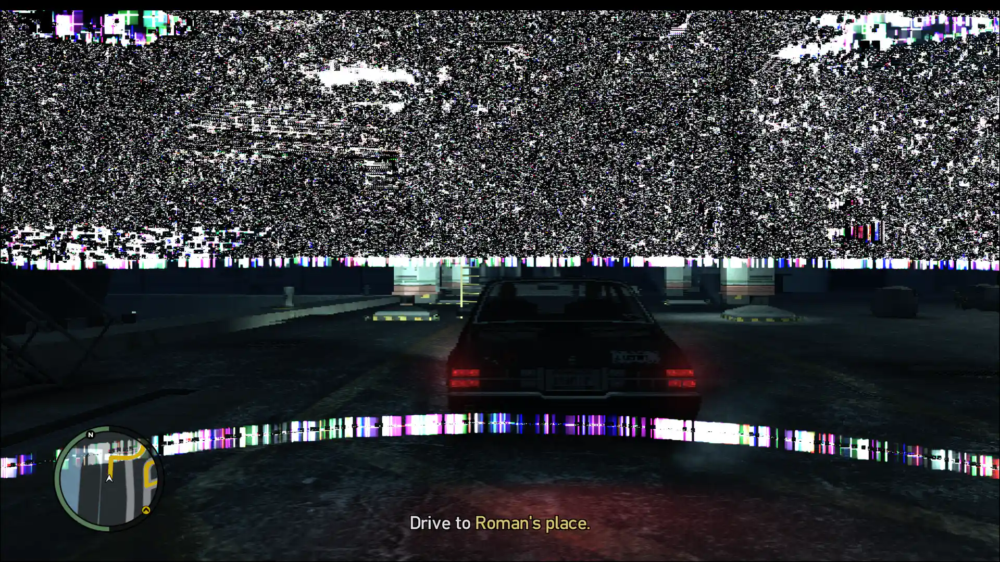
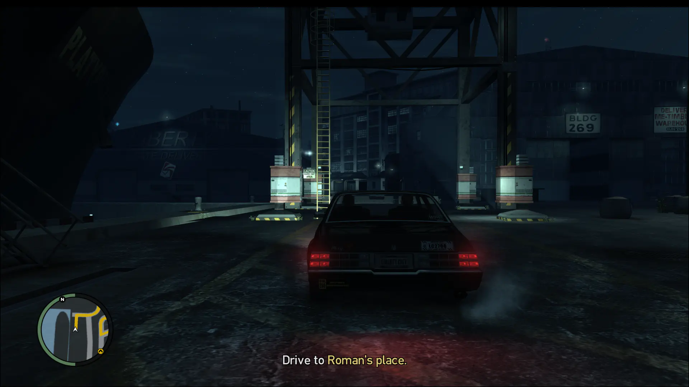

Я наблюдал интересные артефакты рендеринга в играх с момента последней установки
Debian Bookworm, т.е. с 2023 года. Появлялись они ровно в тот момент, когда был
включен DXVK. Поскольку Lutris по умолчанию включает DXVK, прошло немало
времени, пока я не нашёл первопричину и временное решение.

Артефакты выглядели по-разному в разных играх. Need for Speed Underground
превращалась в шахматную доску из видимых частей окна с наложением чёрных плит.
В Split/Second на некоторых трассах появлялась странная блочность, мыльность или
рябь.

Устранить проблему помогал либо запуск через gamescope, либо постоянно открытый
оверлей MangoHud. Ни в одной игре я не мог нормально сделать скриншот того, как
артефакты выглядят в конкретном случае. Поиск не дал результатов.

На позапрошлой неделе я достал из закромов серию Grand Theft Auto. И тут
столкнулся с самым ярким проявлением проблемы за всё время. Экран в процессе
игры видно лишь наполовину. Да и то, что видно, невероятно размыто и блочно.

Открытие MangoHud или запуск через gamescope оказались бессильны. Смена настроек
графики, разрешения экрана, запуск из Steam (Proton) или Wine-GE не давали
эффекта. Но на этот раз скриншот отлично захватывает представление артефакта.
Вот как это выглядит на моём компьютере сейчас:

И тут поиск наконец-то помог докопаться до временного решения проблемы в отличие
от предыдущих случаев, а точнее дал наводку на [обсуждение бага на GitHub]. Один
из пользователей DXVK приложил скриншот с аналогичным артефактом.

Решение на сегодня, как указывали в переписке -- попробовать отключить Delta
Color Compression (DCC) с помощью установки переменной окружения
`RADV_DEBUG=nodcc`, согласно [документации Mesa по переменным окружения].

К большой радости, это решение помогает. Изображение теперь ровно такое, какое и
можно ожидать для GTA IV:

Проверка на Mesa 24 из Flathub показала, что этот баг не решается только лишь
обновлением Mesa, дело, похоже, и в драйвере AMD. Свежий linux-firmware не
даёт позитивных результатов. Ядро 6.6 видимых изменений также не даёт.

Что ж, тогда будем применять `RADV_DEBUG=nodcc` для Wine Runner'ов глобально и
ждать исправлений...

[обсуждение бага на GitHub]: https://github.com/doitsujin/dxvk/issues/1862
[документации Mesa по переменным окружения]: https://docs.mesa3d.org/envvars.html
