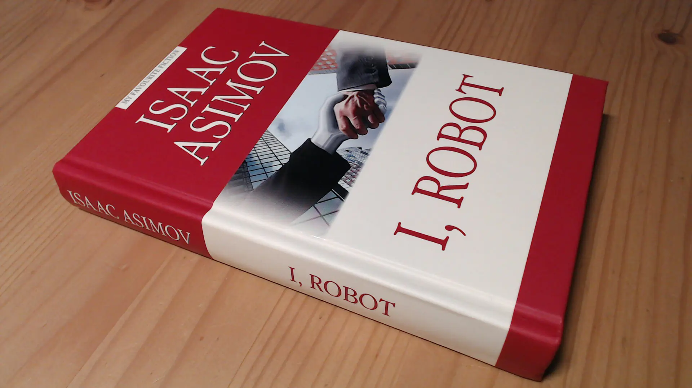

На прошлой неделе дочитал отличную книгу Азимова.

Коротко о сути: простые смертные в фантастическом будущем отлаживают
нон-детерминированную логику роботов в опасных, необычных или просто странных
условиях.

В фокусе находятся 3 закона робототехники (перефразировано):

- Робот не должен причинять вред человеку, а своим бездействием допускать, чтобы
человеку был причинён вред.
- Робот должен следовать всем приказам человека, кроме таких приказов, которые
противоречат первому закону.
- Робот должен заботится о своей сохранности, если его действия не нарушат
первого или второго закона.

Книга занимательная. К слову, практически не имеющая сходства с одноимённым
фильмом. Некоторые мелкие детали в сюжет кино перенесли, но не сами истории из
книги.

Ну а в целом, большое количество книг от фантастов старой формации, как Азимов,
интересны своим представлением о прогрессе и мироустройстве будущего, включая
наше время. Спойлер: как и самошнурующиеся ботинки Макфлая, ничего так не
устроено, конечно же :)
