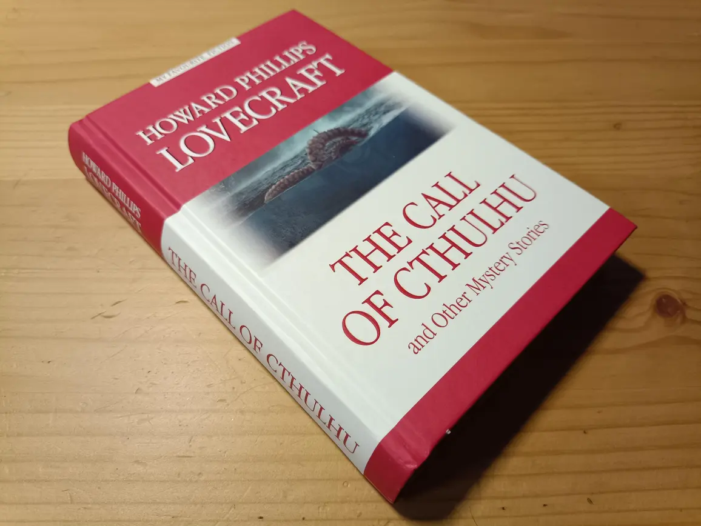
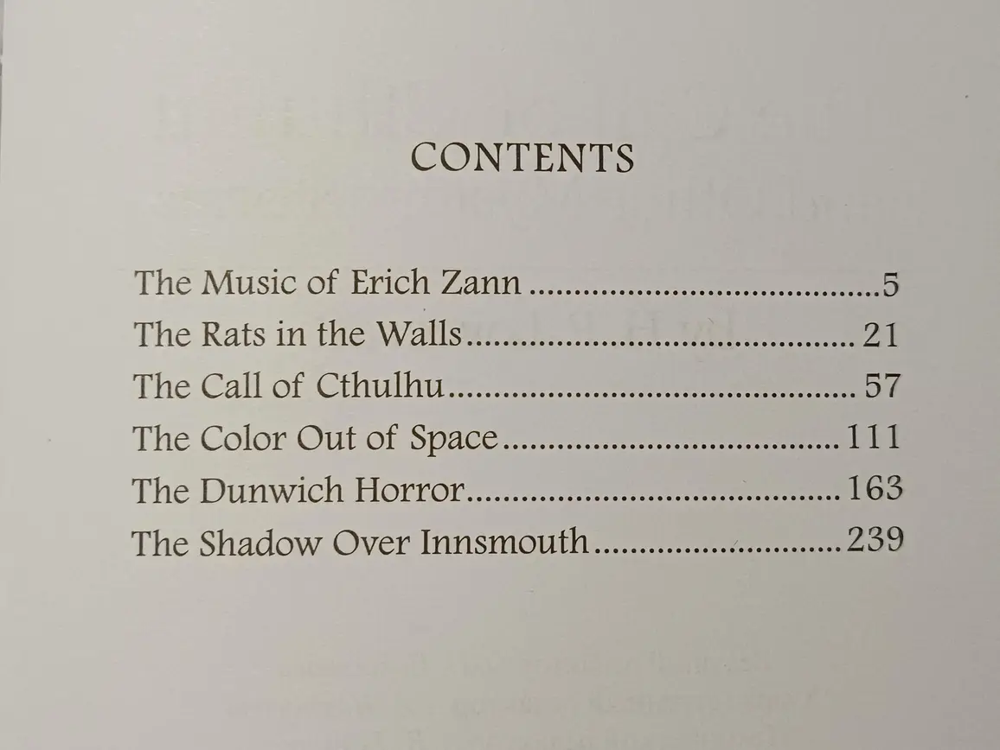
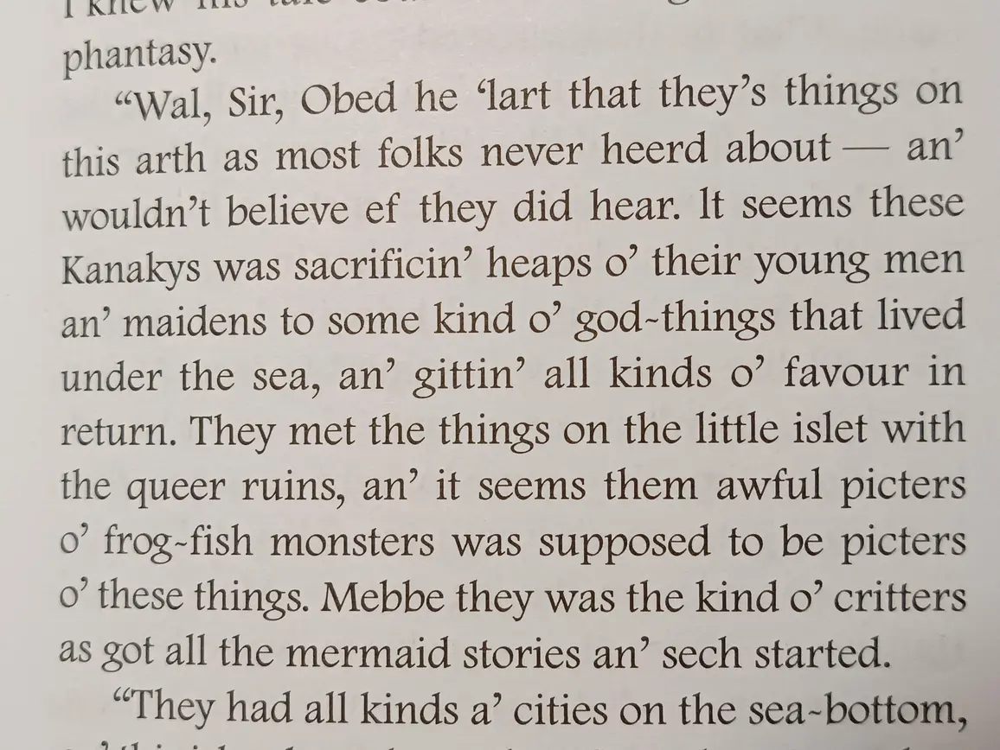

Дочитал на днях один занимательный сборник.

Со сборниками Лавкрафта есть довольно сложная история. При жизни он публиковался
только в журналах. А полные собрания всех его произведений обычно очень толстые
(~1000 страниц среднего размера). В этом же сборничке (350 страниц малого
размера) собрали неплохую компашку. Присутствуют самые известные произведения --
"The Call of Cthulhu" и "The Shadow Over Innsmouth". А наряду с ними поставили
произведения, не менее значимые для построения духа этой кошмарной вселенной.

Да, большая часть произведений Лавкрафта находится в едином контексте. Оно и
понятно, основной референс Лавкрафта -- древние верования, в частности,
языческие. В таких традициях есть много небольших историй про одни и те же
божества и иные сверхъестественные сущности.

Мне же особенно хочется отметить "The Music of Erich Zann". Это первое
произведение в сборнике. Оно же, по словам самого Лавкрафта, было из его лучших.
Почему? Там не было деталей. Фокус на чём-то неосязаемом и вне поля
человеческого понимания, что, мне кажется, отлично получилось передать. Это
прекрасный пример того, когда читатель сам себе додумает более захватывающую и
ужасную картину, чем если бы всё было детально расписано.

В целом, конкретно это издание очень приятное. Как и с предыдущей книгой от
"Антологии", качество бумаги и печати хорошее. Текст оригинальный, а не
адаптированный. Сносок нет, но они тут и не требуются. Очепяток, правда,
довольно много. Думаю, это допустимо. Наборщик просто охреневал, мне кажется, от
того, как Лавкрафт передавал на бумаге провинциальный говор Новой Англии.

Полагаю, что сейчас эти произведения уже не имеют *такого* эффекта, как это было
в начале XX века, но отрицать их культурную важность будет странным. Даже
современная попса вроде DC и Marvel имеет элементы мира Лавкрафта (вспомнить
Аркхем или чудищ из Доктора Стрэнджа). А в первом Quake босс -- Шуб-Ниггурат. Это
только отдельные примеры, влияние куда более значительно...

P.S.: После прочтения побегал по электронным превьюшкам русских переводов. Мде.
Такое себе. В оригинале несколько иные по смыслу слова... Поскольку большая
часть произведений уже много лет в Public Domain, текст их можно найти на
Wikisource. Приложены даже аудио-версии для любителей.
