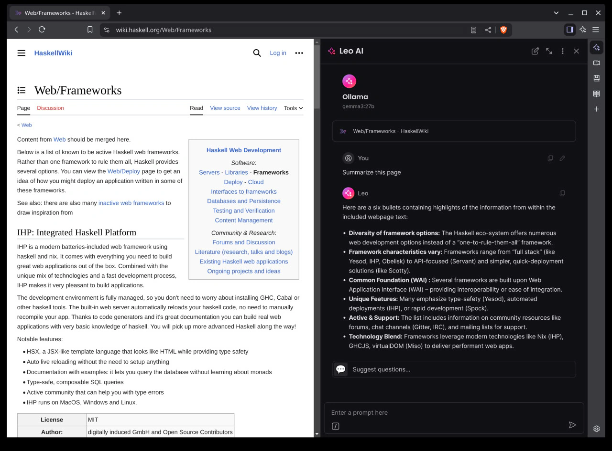

Пока изучал GUI для Ollama, узнал, что в Brave теперь появилась возможность
настраивать свою установку Ollama как backend для Leo. Тогда открытая
веб-страница будет контекстом для модели.

В Brave этот подход называют BYOM — Bring Your Own Model.

Статью о BYOM можно найти [в блоге Brave](https://brave.com/blog/byom-nightly/).
