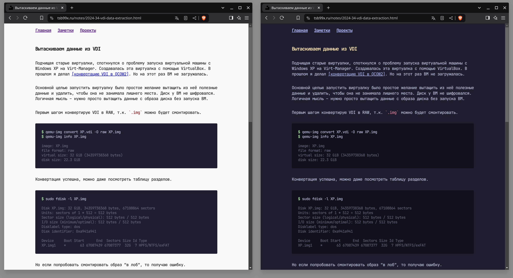

Сегодня занялся CSS-ом для сайта. Мне визуально не нравился старый стиль. Вроде
и не было особых проблем. Но всё-же, что-то не так. Обдумал, посмотрел... Точно!

Светлое оформление мне не нравится больше всего. Из-за привычки. Большую часть
времени я провожу в инструментах, где установлена тёмная [тема
Catppuccin](https://catppuccin.com/). Включая и NeoVim, в котором пишу заметки.
При этом, когда делал предыдущие CSS, то пытался частично реплицировать вид
заметок, в котором я вижу их в исходниках на Markdown.

Теперь, для пущего соответствия, использовал палитру Catppuccin Mocha на сайте.
Как бонус — теперь сайт не будет выжигать глаза пользователям с тёмными темами и
бесцельно разряжать батарейку устройствам с OLED экранами.

Не уверен, что стало лучше. Но хоть чуть-чуть, на самый ноготочек, стало больше
мне нравится. Мда, сам себе дизайнер — то ещё занятие...

А темы Catppuccin, к слову, очень рекомендую.
