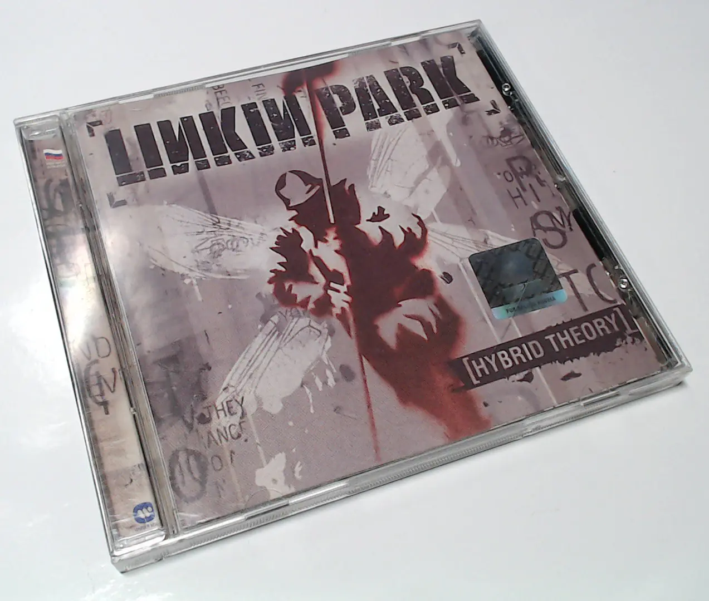

Пару недель назад я перебирал свои старые диски, а среди них достал тот самый
альбом Hybrid Theory от Linkin Park (в числе нескольких других). Последний раз я
делал рипы со своих дисков в далёких 2012-2013 годах. Делал это с помощью
iTunes, а он по дефолту кодирует в AAC.

Лежит, значит, у меня диск. Лежат файлики в AAC. Вот и подумал — а можно ли на
Debian сделать хороший рип с CD во FLAC, да такой, что подстать классическому
Exact Audio Copy для Windows? Да, это возможно и получилось сделать!

Удивительно, к слову, что Compact Disc Digital Audio существует с 1982-го
(стандарту исполнилось уже 43 года). И ещё более удивительно, что аудио в форме
стерео с частотой дискретизации 44.1KHz и глубиной в 16-bit до сих пор является,
в некотором смысле, апогеем прослушиваемой музыки.

В итоге, я уже 2 недели по уши в музыке (аудиофилии). Обновляю знания по
современному аудиофильскому снобизму. Изучаю рынок наушников, ЦАП, усилков и
CD-транспортов. Занятие увлекательное :)
