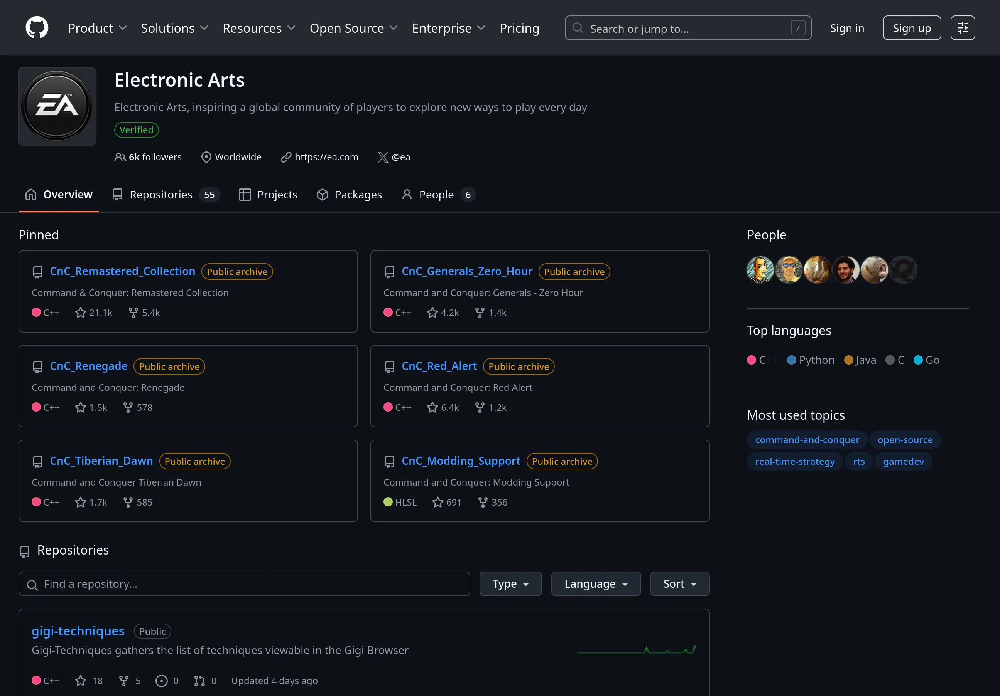

Приятная новость на сегодня — EA выложила код некоторых игр серии C&C в открытый
доступ. Об этом есть [статья на
Phoronix](https://www.phoronix.com/news/EA-Open-Source-CnC-Red-Alert) и
[объявление на
Steam](https://store.steampowered.com/news/app/2229890/view/502818210084553731).
Список игр:

- Tiberian Dawn
- Red Alert
- Renegade
- Generals, Zero Hour

Код находится [на GitHub](https://github.com/electronicarts) под лицензией GNU
GPLv3. Очень неожиданно и очень правильно. Обычно "затыки" начинаются именно с
лицензиями. Хотя, некоторые студии вообще умудряются терять код своих старых
игр.

Что же, прекрасно! Ждём нативных бинарников под Linux! Меня особенно интересуют
Generals, Zero Hour и Renegade, ведь именно с ними связана моя юность...
