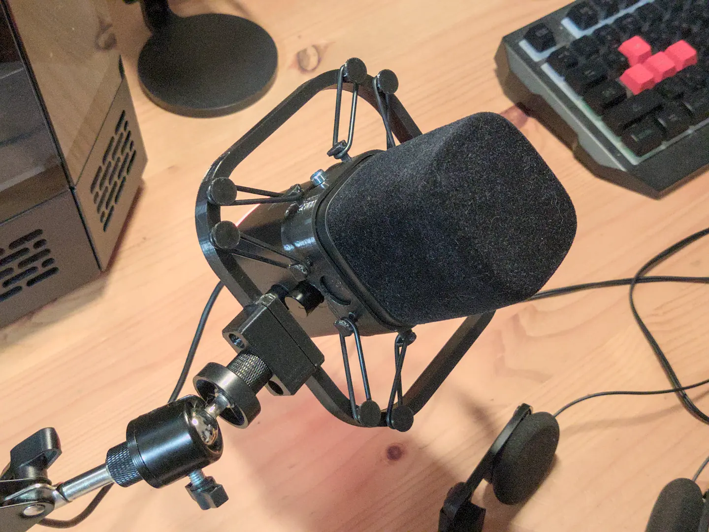
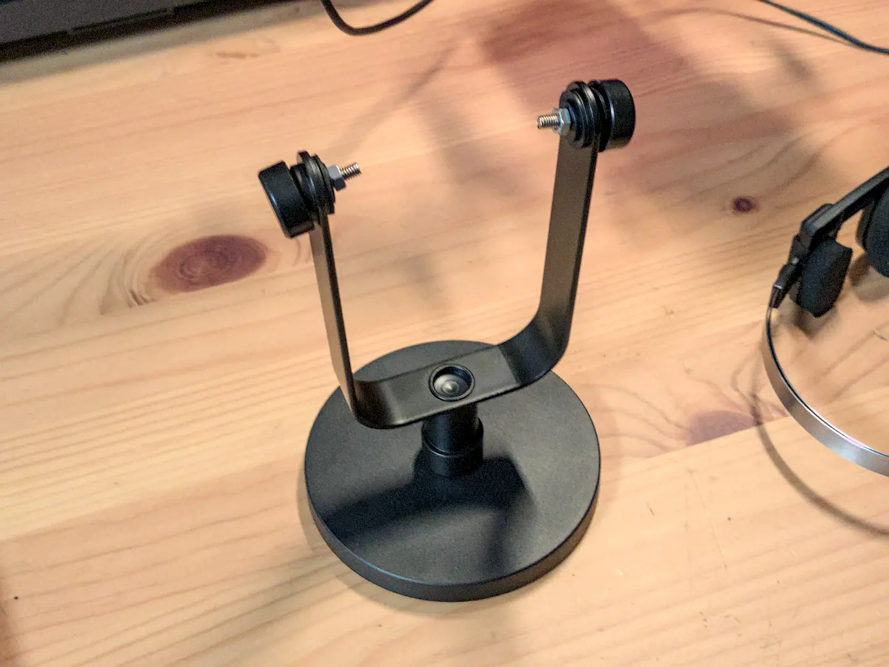
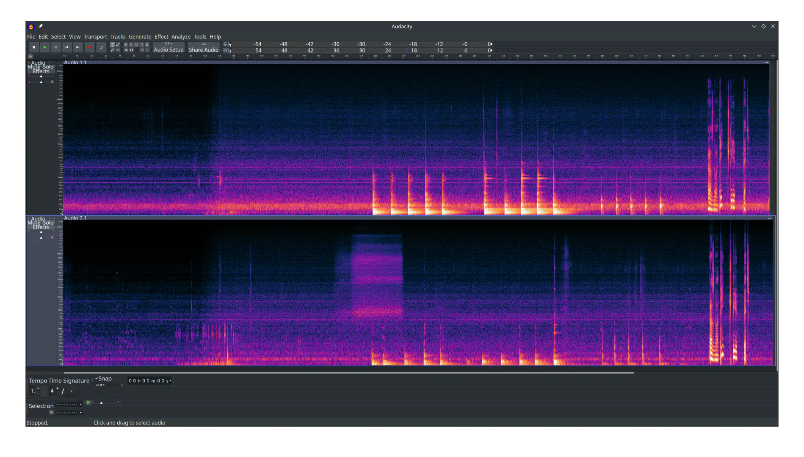

Последние несколько дней разбирался с новым микрофоном.

Раньше у меня был Fifine A8, который оказался очень приятным в пользовании. Но
это типичный конденсаторник, а тут из каждого утюга говорят, что для простых
смертных (без подготовленных помещений звукозаписи) лучше динамические
микрофоны. Кроме того, кого не послушай, все в восторге от Fifine AM8 (отличие в
буковенке M).

Ну что, купил на свою голову Fifine AM8. Поставил на пантограф. И... Какой ужас.

Одна из проблем: в комплекте он поставляется не с пауком, а с жёсткой
металлической "рогаткой", которая ловит все вибрации. Даже от вентиляторов моего
системника... Даже топот соседей у НИХ в квартире. Молчу уж о кликах мыши и
нажатиях на клавиатуре.

Вот, забрал сегодня кастомный паук из ПВЗ маркетплейса.

Приложил спектрограмму. Сверху -- как было на "рогатке". Снизу -- как стало на
пауке. Фоновый шум РАЗИТЕЛЬНО ниже. Снизилась реакция микрофона на вибрации.
Уменьшились и шлейфы.

Глядишь, шумодаву полегче будет :)
