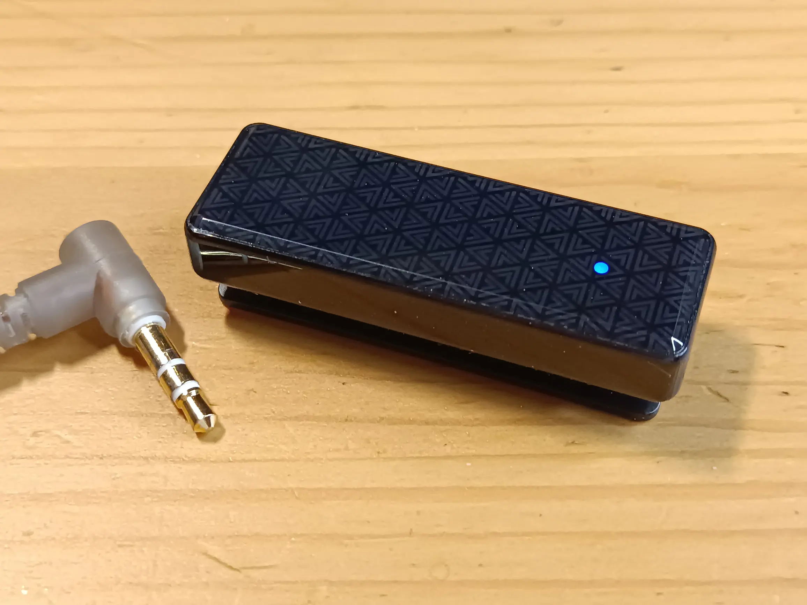

Иногда мы с женой смотрим по вечерам кино. Слушать аудио без наушников мы не
очень любим, ведь уровень громкости в современном кино постоянно плавает. Думаю,
многие с этим сталкивались, когда нужно снижать и увеличивать громкость пультом
от сцены к сцене. Один из простых выходов -- надевать наушники.

Но экономика масштаба -- вредная тётка. На современных телевизорах часто нет
встроенного ЦАП с выходом на 3.5мм Jack. Это мой случай, есть только варианты
выводить звук по Bluetooth и оптике. Подключить несколько Bluetooth-наушников на
этом ТВ нельзя, поэтому быстро перешёл к варианту с оптикой.

Несколько лет назад купил типовой ЦАП со встроенным усилителем за 750 рублей,
подключил к телевизору по оптике, и вот, появился 3.5мм Jack. К Jack подключил
Y-образный сплиттер на 2 пары наушников. Схема рабочая, но использование моего
варианта ЦАП имеет несколько неудобств.

*Во-первых*, приходится доставать удлинители, диван стоит от ТВ на расстоянии
больше двух метров, провод у наушников часто короче. *Во-вторых*, регулировать
громкость никак нельзя, передаваемый по оптике аудио сигнал не имеет понятия
"усиление" и ТВ не контролирует уровень громкости вообще, у ЦАП тоже не сделали
ручку gain. *В-третьих*, мощности встроенного усилителя для двух пар типовых
наушников иногда чуть-чуть нехватает.

Так и жили, мирясь с раскладом. Но тут ситуация немного изменилась.

Около года назад я познакомился с продуктами FiiO (DM13, Snowsky ECHO).
Некоторые решения у FiiO мне понравились. На днях попался на глаза их
Bluetooth-приёмник BTR11 за 2 тыс. рублей. Штука предельно классная за свой
прайс, закрывает все мои проблемы и даже больше.

BTR11 -- младшая модель в серии автономных Bluetooth-ресиверов с аккумулятором.
Принимает сигнал Bluetooth версии 5.3 в кодеках SBC, AAC и даже LDAC. Выводит
аудио через Jack 3.5мм. Две пары типовых наушников через сплиттер раскачивает
получше, чем исходный ЦАП с оптикой. Держит в памяти два последних устройства, к
которым подключался, повторять сопряжение каждый раз не нужно. Есть жизненно
необходимая качелька громкости. Положили даже микрофон, но исключительно
функциональный, использовать BTR11 как петличку или гарнитуру я бы не стал.
Никаких экранов у BTR11 нет, общается устройство с помощью пары светодиодов на
передней панели и женского голоса в наушнике. Заряжается по Type-C, в процессе
зарядки свисток можно использовать как обычно. Ах да, есть прищепка!

Поигрался немного с BTR11 на телевизоре, всё работает. Тут смекнул, что можно
подключить свисток и к компьютеру. Linux сразу предложил LDAC как кодек. Зарядил
до 100% и полтора дня (разрядил до 10%) выслушивал свои проводные наушники.
Какой же кайф взять старые Koss Porta Pro или дешманские KZ-шки и сделать их
беспроводными!

В BTR11 стоит неизвестный мне ЦАП с усилителем, но никаких значимых отличий от
другой техники я не услышал, все частоты аудио на месте. Из тонкостей -- не
хватило фирменной фичи Low-Gain, чтобы снизить уровень шума в IEMках. Но для
этого есть старшая модель BTR13.

В целом, FiiO BTR11 очень рекомендую, если нужно подобное устройство за
умеренный ценник.
