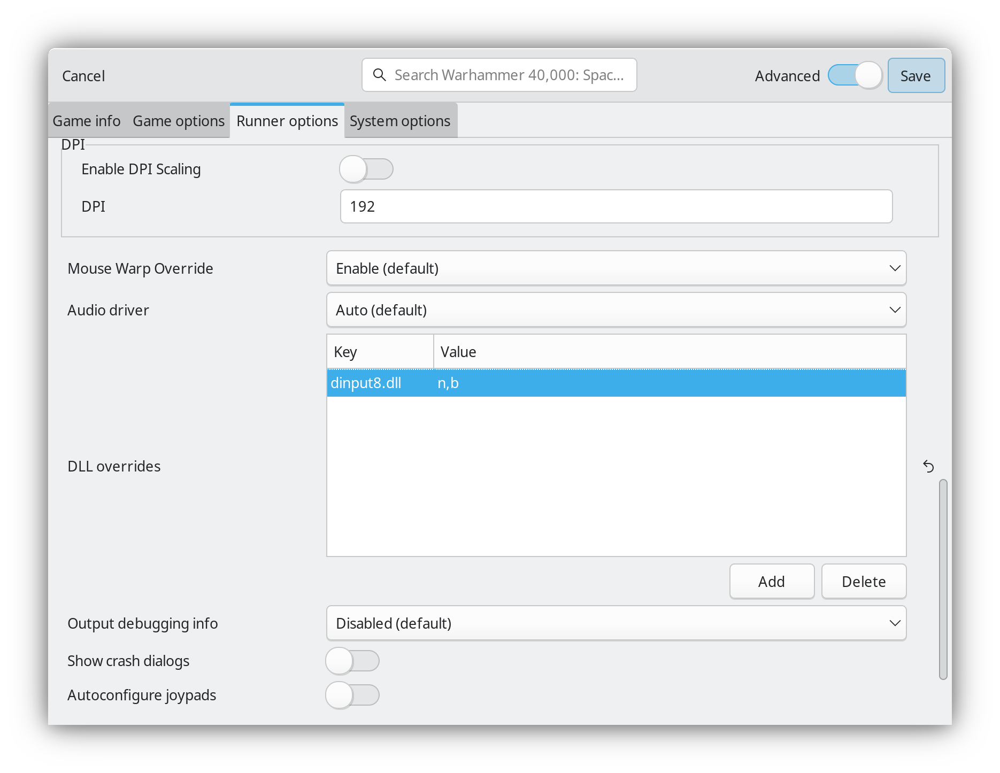
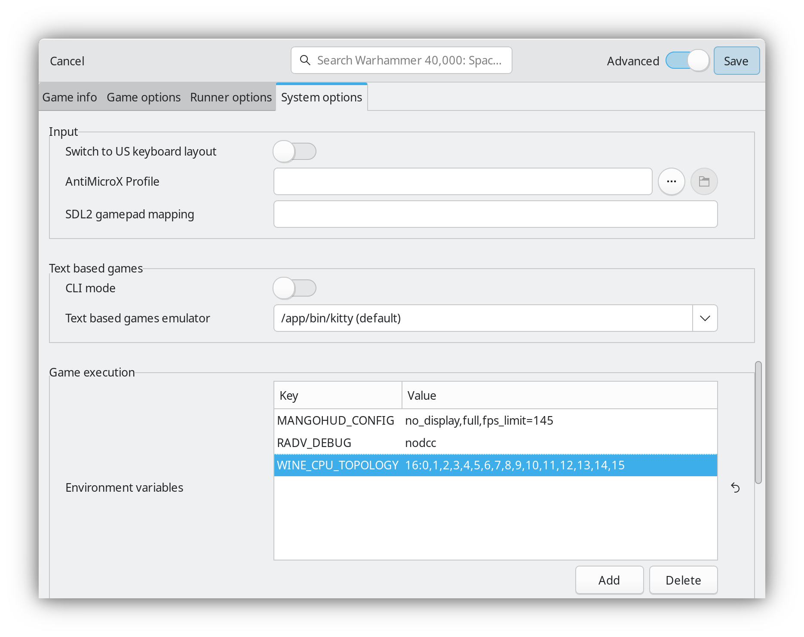

Некоторые игры прихотливы к количеству процессорных ядер. Они могут просто не
запускаться, как это происходит с Warhammer 40,000: Space Marine. Речь далее
пойдёт про **первую часть игры**, а не вторую. Проблем со второй частью нет.

В изданиях от GoG иногда можно найти предустановленные фиксы, но не в данном
случае. При старте игры появляется ошибка и предложение послать Error Report.

Проблема в том, что игра не была рассчитана на слишком большое количество ядер.
Причин может быть множество, но это не тема заметки. Главное: Space Marine
просто не запустится без ограничения количества *физических ядер* до 12.

Функция Restrict number of cores used в Lutris не помогла. Но отключение SMT в
BIOS позволило запустить игру. Sidenote: SMT -- аналог Hyper-threading.

Облазил ряд форумов. Для Windows можно найти хаки вроде проекта [Space Marine
Core Fix]. Это решение подменяет ответ на запрос количества ядер, чтобы игра
думала, что их меньше, чем на самом деле. Это рабочее решение для Windows.

Чтобы использовать такое решение в Lutris, можно скачать DINPUT8.dll из релизов
в GitHub. Потом положить DLL в папку с игрой, а в runner options добавить DLL
override вида `dinput8.dll=n,b`. Это стандартный процесс установки DLL.

После применения игра будет запускаться.

Для Linux есть готовые альтернативы. Одну из них подсмотрел в [Issue у Proton].
Решение через простую установку переменных окружения меня особо порадовало.
Просто, практично, не требует подмены каких-либо DLL в установленной игре.

С Lutris мне достаточно в Environment variables добавить переменную окружения
`WINE_CPU_TOPOLOGY` со значением `16:0,1,2,3,4,5,6,7,8,9,10,11,12,13,14,15`.

Эта установка выделит игре 16 *потоков*. Эти потоки будут располагаться на 8-и
*физических ядрах* процессора. Перечисление от 0 до 15 задаёт выборку конкретных
потоков. Потоки 0 и 1 соответствуют первому ядру CPU. 2 и 3 второму. И т.д.

Если оставить только общее значение 16, то потоки исполнения могут быть выбраны
абсолютно случайно. В моём случае это не играет значения. А если у Вас процессор
с 3D V-Cache только на одном CCD, стоит явно "поместить" игру на тот самый ССD
для повышения производительности.

CCD имеют сквозную нумерацию ядер. К примеру, я знаю, что у Ryzen 5950x имеется
2 ССD. Ядер всего 16. 16 ядер / 2 ССD = 8 ядер на ССD. Т.е., в примере выше я
прибил игру к первому ССD, пусть и не получаю прироста производительности.

Для 7950X3D с 3D V-Cache ситуация будет аналогичной. 16 ядер и 2 CCD. Но, в этом
случае, используя ту же строку, что и у меня, можно ожидать увеличения FPS.

Ну а, в итоге, игру удалось запустить, так что:

++ PRAISE THE OMNISSIAH ++

[Space Marine Core Fix]: https://github.com/adrian-lebioda/SpaceMarineCoreFix
[Issue у Proton]: https://github.com/ValveSoftware/Proton/issues/5927
