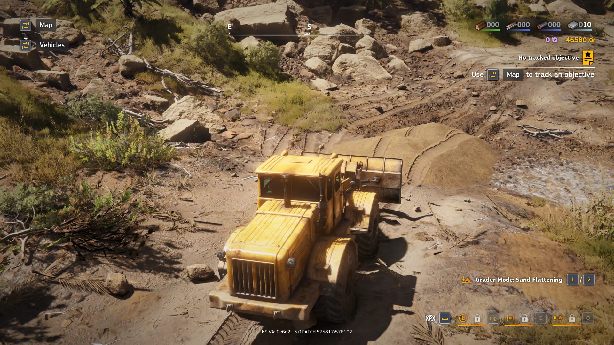

Добрался на выходных до демо-версии RoadCraft. Прохождение заняло (по цифрам
Steam) около 4 часов.

Впечатления смешанные. Как и в случае с Expeditions, разработчики захотели
сделать SnowRunner, но не совсем SnowRunner. Получилось так себе, как и с тем же
Expeditions.

Самая большая проблема -- они берут всего один аспект SnowRunner и выкручивают
его на максимум. В Expeditions -- это исследования местности, в RoadCraft --
ремонт инфраструктуры. Но формула SnowRunner в таком случае рассыпается и играть
становится не так интересно.

Чести ради, в RoadCraft было проще втянуться, чем в Expeditions, там я не
продержался и пары часов. А тут демку до конца прошёл.

К слову, в отличие от SnowRunner, RoadCraft можно купить в ру-регионе Steam. Но
смотрю на цены... Уф. Сейчас игра стоит 1749 рублей (30% скидка от 2499 руб.)
Нет уж, я лучше пойду в классику какую-нибудь поиграю...
