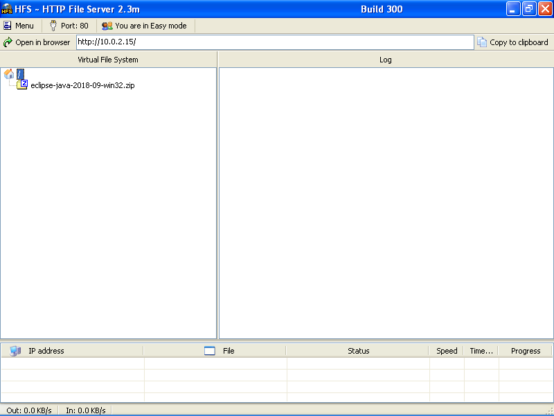
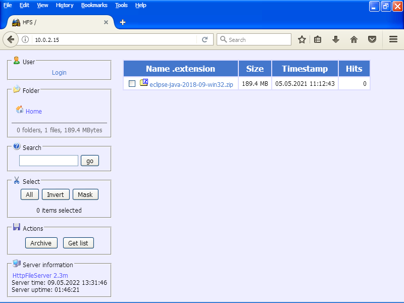
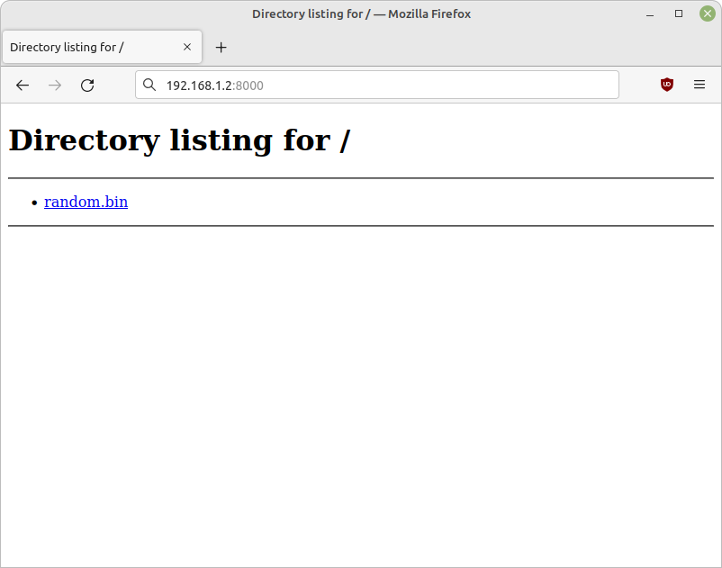

> В прошлом я много рекомендовал HFS 2. К сожалению, Rejetto кардинально изменил
> свой софт в версии 3. Теперь это другая программа. Рекомендовать её в новом
> виде я не могу. Старая версия, как пишет разработчик, "имеет проблемы с
> безопасностью". Патчить HFS 2-й версии Rejetto не будет.

Метод подходит для копирования файлов:

-   с компьютера на телефон без USB-кабеля
-   на ноутбук без флешки
-   на VM с хост-машины
-   без настройки SMB, NFS, FTP
-   без настройки Nginx или Apache
-   на устройство, где нельзя установить ПО

## Запуск сервера на Windows

Для Windows используем портативное приложение [HFS] размером 2.5MB. Работает,
начиная от XP. Последовательность действий:

-   скачать и запустить `hfs.exe`
-   скинуть в окно файлы для раздачи
-   HFS определит IP сервера, на скриншоте это `10.0.2.15`



## Запуск сервера на Linux или OS X

Дистрибутивы Linux и Mac OS X поставляются с Python и модулем HTTP сервера,
который решает задачу раздачи файлов. Перейдем в папку с файлами для раздачи:

```shell-session
$ cd /home/my_user/dir_to_share
```

Выполним команду запуска для Python 3 и модуля [http.server]:

```shell-session
$ python3 -m http.server
```

При отсутствии Python 3 -- для Python 2 и модуля [SimpleHTTPServer]:

```shell-session
$ python2 -m SimpleHTTPServer
```

Сервер запустится на порте `8000` всех сетевых интерфейсов.

Узнаем IP раздающего устройства в домашней сети:

```shell-session
$ ip -o route get '1.1.1.1' | awk '{ print $7 }'
```

Или посмотрим IP для всех интерфейсов и подберем нужный:

```shell-session
$ ip -br a
```

## Загрузка файлов

Переходим в веб-браузере по IP сервера и посмотрим на список доступных файлов.





Скачиваем необходимые файлы по клику в списке.

[HFS]: https://rejetto.com/hfs/
[http.server]: https://docs.python.org/3/library/http.server.html
[SimpleHTTPServer]: https://docs.python.org/2/library/simplehttpserver.html
