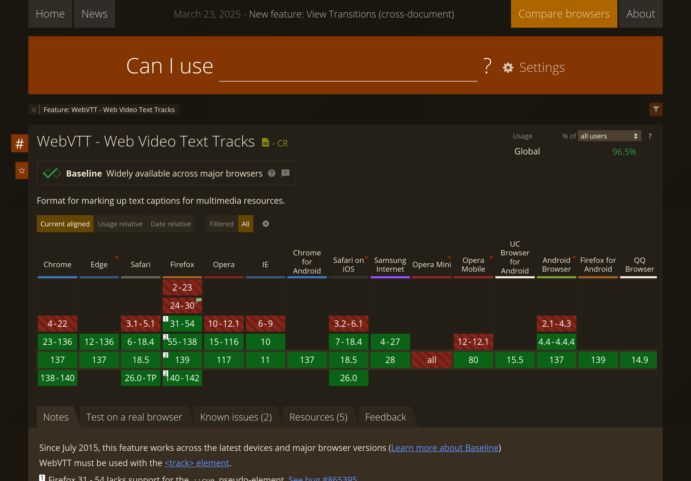

Был приятно удивлён, узнав, что у элемента `<video>` есть поддержка `<track>`, в
который можно положить субтитры в формате WebVTT. Формат не сильно отличается от
того же SRT/ASS, которым все пользуются. Есть даже удобный конвертер.

Вот думаю... В принципе, можно разобраться, как сделать переключение разрешения
видео. На JS задача должна быть элементарная. Чистый HTML5 такого ещё не
предусматривает. И вот, уже можно будет хостить видео и у себя на сайте!

- [Поддержка браузерами WebVTT](https://caniuse.com/webvtt)
- [Простой конвертер на WebVTT.org](https://www.webvtt.org/)
