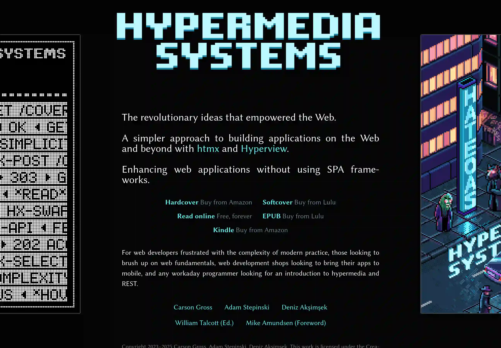

HATEOAS и Hypermedia получают, на мой взгляд, недостаточно внимания. Подходы,
которые описывал в докторской Рой Филдинг, всё реже трактуются в связке с
HATEOAS.

Это удивительно, потому как слово REST в обсуждениях я слышу часто. Но только в
формате "используйте HTTP глаголы для описания действий". Или, еще хуже, как
[синоним HTTP JSON
API](https://roy.gbiv.com/untangled/2008/rest-apis-must-be-hypertext-driven).

Как же так? Как обсуждать REST без учёта [концепции зрелости
Ричардсона](https://martinfowler.com/articles/richardsonMaturityModel.html)? Это
тема, которая требует дополнительного обсуждения, ведь HATEOAS — высший уровень
зрелости REST.

К чему я? Прочитал за два дня книгу [Hypermedia
Systems](https://hypermedia.systems/). Авторы до этой книги работали над HTMX.

Хоть и сталкивался с HTMX, книга помогла дополнительно прояснить, как HTMX
соотносится с HATEOAS. Авторы представляют уверенную аргументацию, что простой
HTML можно рассматривать как ключевой элемент реализации HATEOAS. И что SPA с
раздутыми JavaScript-фреймворками для маппинга JSON API в HTML — тупиковая ветвь
эволюции.

Книгу можно и последовательно читать, и использовать как справочник по HTMX. Она
есть в публичном доступе.

Если Вы ещё не встречались с HTMX, HATEOAS, Hypermedia, и не знаете, что это
такое, рекомендую всеми руками, объём достаточно небольшой.
