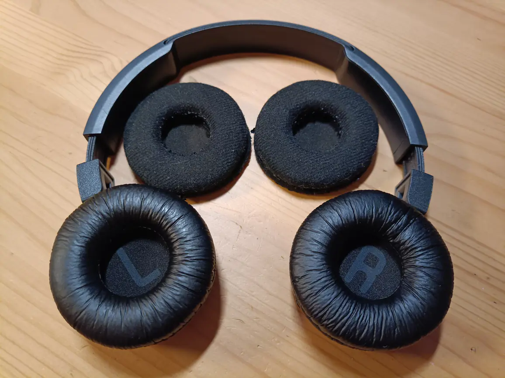
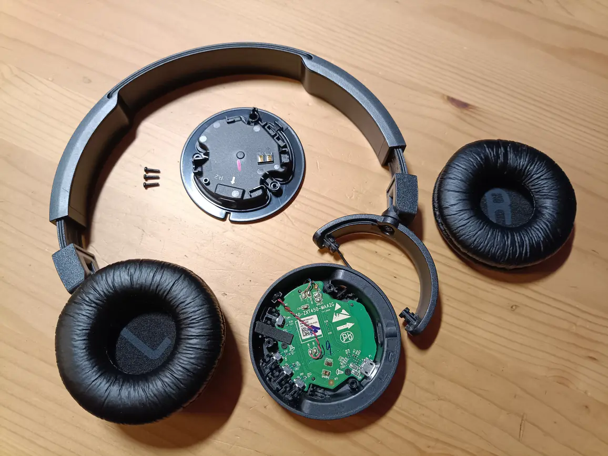

Продолжая [тематику bluetooth аудио], я заказывал на мои старые JBL T450BT новые
амбушюры. Цена вопроса всего 150 рублей, а мои старые амбушюры сносились так,
что осталась только ткань. Качество звука немного ухудшилось. Это всё-таки, не
открытые или полуоткрытые наушники. Это закрытая классика.

В процессе смены амбушюров обнаружил, что можно легко снять динамик, он крепится
к чашке всего 3-я обычными винтиками. Динамик просто сидит на двух контактах,
поэтому снять и поставить его -- несложная задача.

Правая чашка у меня давно начала люфтить. Это не доставляет неудобств, но прижим
наушников был чуть слабее, чем я ожидал бы. Поглядел. И чашку можно снять, нужно
растянуть удерживающую её пластиковую лапу, на которой сама чашка вращается.

<blockquote class="warning">

Главное не дёргать резко чашку, чтобы не оборвать провод!

</blockquote>

А у самой лапы, точнее, у шарнира, на котором она вращается, есть винт,
подкрутив который я и нивелировал тот самый люфт правого наушника.

Порядок сборки наушников обратный. Вставляем чашку в лапу (следя за укладкой
провода), ставим динамик, закручиваем 3 винтика и надеваем амбушюр.

После замены амбушюров качество звука чуть повысилось. Это не фантастические
наушники, но они прослужили мне уже достаточно долго (6 лет). Приятно
было увидеть, что ремонтопригодность у них достаточно высокая.

Кстати, у новых амбушюров даже есть LR маркировки, чтобы проще отличать стороны.

[тематику bluetooth аудио]: /notes/sbc-xq-in-linux.html
