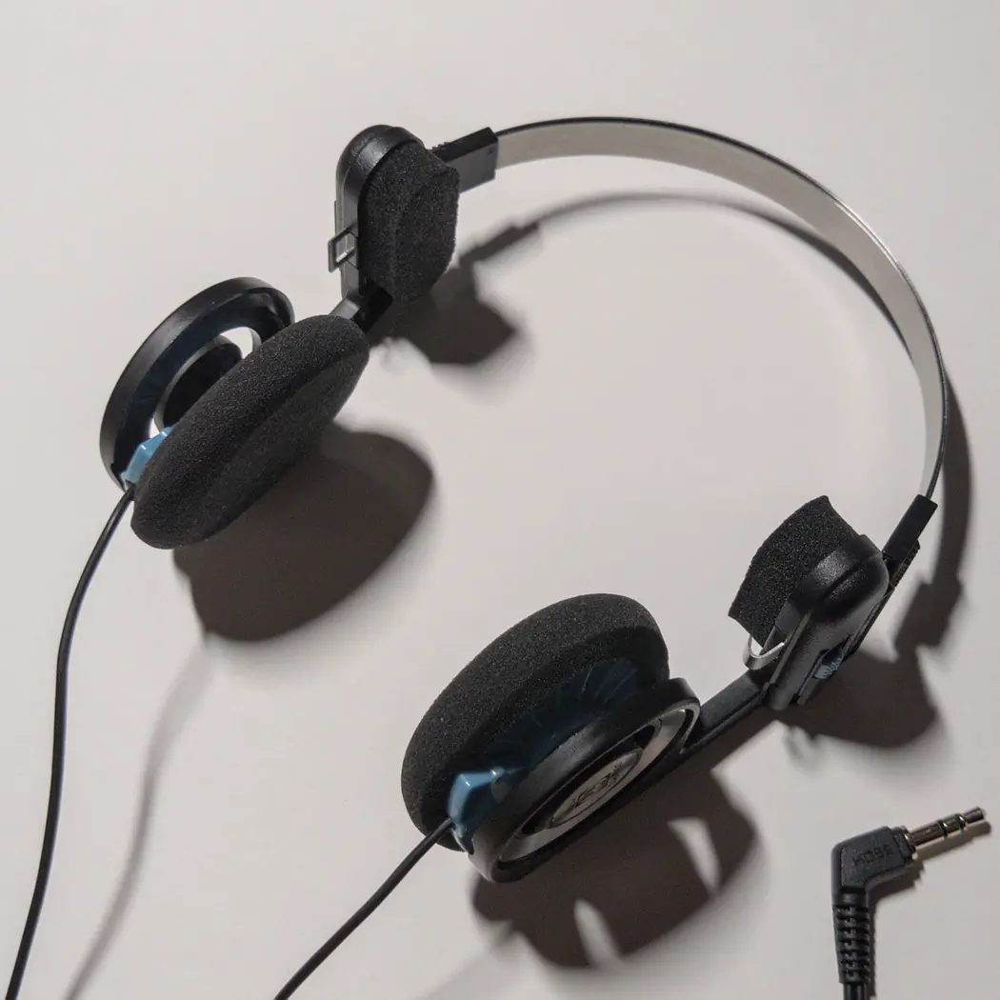
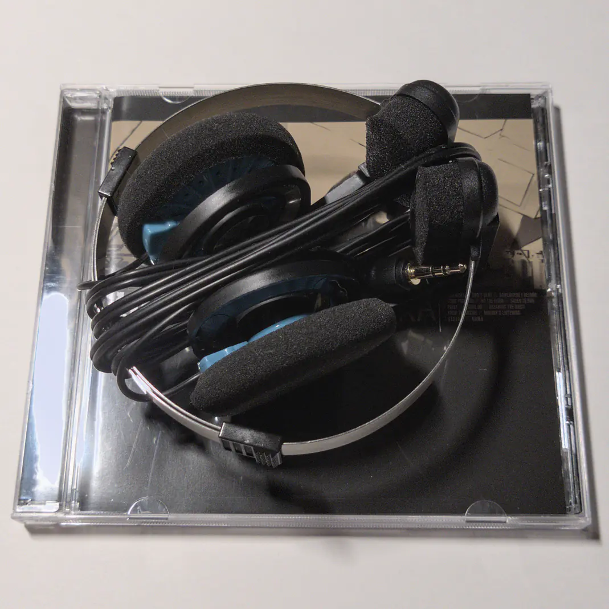

Уже как пару месяцев слушаю Koss Porta Pro. Это легендарная модель наушников как
минимум потому, что она совсем не изменилась за последние 40 лет. По
характеристикам -- простые наушники, накладные, с довольно резкими басами.

Музыку слушать приятно. За счёт открытого формата и сильных низов хорошо
создаётся объём звучания. Открытый формат, правда, не подходит для шумных мест
типа метро.

Сидят на ушах приемлемо. Конструкция оголовья простая, но крепкая. Две
металлические дуги соединены с помощью перемычек. Иногда между дуг попадаются
волосы, которые наушники могут больно дёрнуть при снятии...

Сначала я был разочарован звучанием голоса. С женским вокалом всё ок, но вот
мужской, который ближе к 100Hz, превращается в бубнёжку из-за усиленного баса.

Благо, на сайте AutoEq есть пресеты от oratory1990. Этот EQ выравнивает АЧХ и
делает наушники достойными критического прослушивания аудио.

Вместе с EQ это -- отличные наушники, особенно для любителей ретро-эстетики. И
да, у них есть и беспроводные варианты! :)
