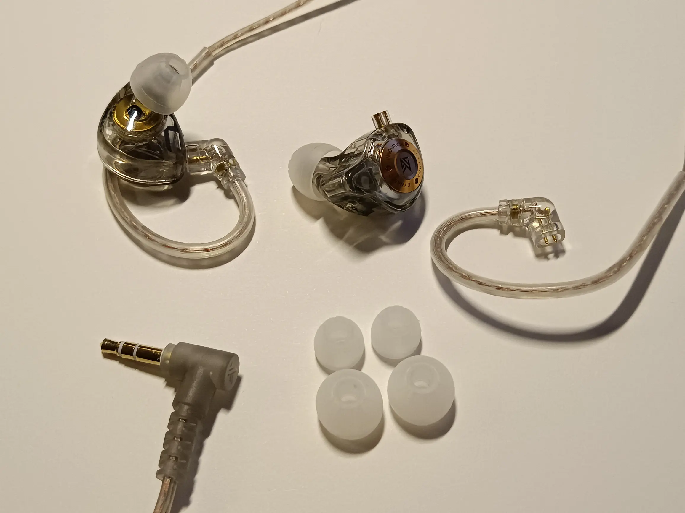

В начале июня, когда я [увлёкся] аудио-тематикой, я потратил немного времени на
обновление знаний о наушниках. Одной из интересных тем для меня стали In-Ear
Monitors (IEM). С полноразмерными мониторами я уже сталкивался и пользовался, но
новинкой стала именно внутриканальная вариация.

Несколько подумав, нашёл дешёвый вариант, который в этих наших Интернетах иногда
рекомендуют начинающим работу с IEM: KZ EDX. Мне попалась версия [KZ EDX PRO X].
Купил эти IEM за 800 рублей и считаю, что это отличная для них цена.

Поставляются они в минимальной комплектации из самих наушников, отсоединяемого
провода на Jack 3.5 мм и трёх пар насадок (амбушюров) -- маленьких, средних и
больших. Прозрачное исполнение -- элемент стиля, есть полноцветные варианты.

По звучанию они меня порадовали. Не думал, что до тысячи рублей сейчас можно
получить такое звучание. Но, на то это и IEM. Сделать довольно точный тюнинг
кривой для внутриканальных наушников считается проще, чем для полноразмерных.

Основное назначение IEM -- критическое прослушивание музыки или, собственно,
личный мониторинг. Например, записываешь свой голос или инструмент и сразу
слушаешь: где сибилянты (шипящие), какие частоты слишком громкие или тихие.

К слову о сибилянтах. Эти IEM подсветили мою боль к шипящим. Особенно это слышно
на конкретных треках. Один из альбомов, который я слушал в последнее время --
[The Trip Home] от The Crystal Method. Есть там трек Ghost In The City. В нём
сибилянты слышно так, что становится больно ушам. Понятное дело, что эквалайзер
спасает. Но я бы микшировал трек совсем по-другому, подрезав сибилянтов.

В целом, есть ощущение, что кривую АЧХ чуть завысили по басам, но это не столь
критично, как например у большинства моделей наушников JBL, там перестарались.

А ещё, что интересно, отсоединяемый провод можно заменить на [Bluetooth модули]
и получатся Bluetooth-IEM. Ништяк :)

[увлёкся]: /notes/cd-disks-and-audio-tech.html
[KZ EDX PRO X]: https://kz-audio.com/kz-edx-pro-x.html
[The Trip Home]: https://www.discogs.com/master/1437103-The-Crystal-Method-The-Trip-Home
[Bluetooth модули]: https://kz-audio.com/kz-az09.html
