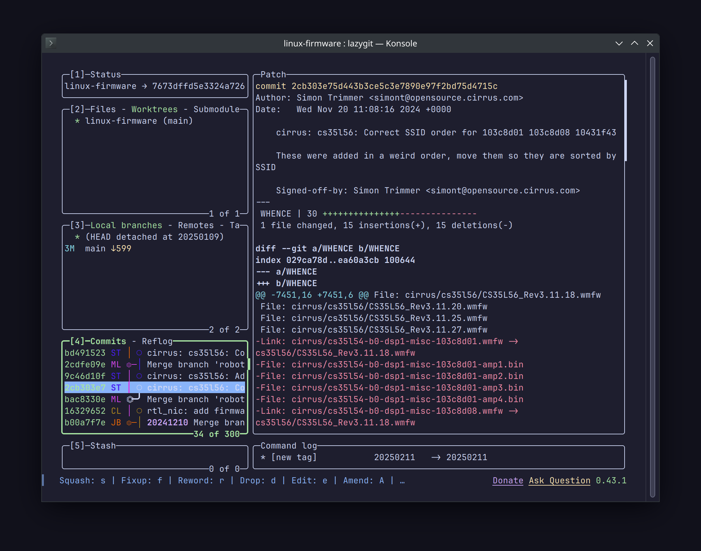

При работе с Git я почти не пользуюсь отдельными программами. В корпоративной
разработке у меня под рукой есть IntelliJ с достаточно удобной панелькой Git. А
для своих проектов я привык пользоваться Git CLI.

И всё же, время от времени, нужно посмотреть изменения в разрезе нескольких
коммитов. Делать тучу git diff не очень удобно, особенно когда нужно дать хэш
конкретного коммита.

И тут на помощь приходит [Lazygit](https://github.com/jesseduffield/lazygit).
Этот TUI позволяет удобно шастать по дереву Git стрелками. Окна в программе
настраиваются, мышка поддерживается, темы оформления есть.

Можно делать stage для кусков кода, а не целых файлов. Можно делать commit,
fixup, revert, amend... В общем, все (или почти все) функции Git в наличии.

Благодаря тому, что это TUI инструмент, им можно пользоваться на удалённых
машинах по SSH. Очень удобно и практично.

Из минусов: Lazygit нет в репозиториях Debian Bookworm, но забрать бинарник
можно из релизов на GitHub, а потом поместить в `~/.local/bin/`.
