Время от времени я сталкиваюсь с проблемами оперативной памяти. Часто это
выражается в странной, нестабильной работе компьютера. Для Windows, например,
это синие экраны смерти (BSOD'ы). Для Linux -- зависания и резкие перезагрузки.
В редких случаях проблемы с оперативной памятью выражаются в битых данных при
сохранении файлов, графических артефактах и спектре других странностей.

Чтобы понять, что это действительно проблемы с оперативной памятью, а не
что-либо другое, можно воспользоваться тестом оперативной памяти. Существуют
разные варианты таких тестов, я предпочитаю пользоваться Memtest86+.

Заметка состоит из 3-х частей:

- В [первой](#подготовка-usb-флешки-на-windows) разберёмся, как записать
USB-флешку с Memtest86+ из Windows.
- Во [второй](#подготовка-на-linux) -- как подготовить Memtest86+ из Linux
- В [третьей](#запуск-memtest86-и-интерпретация-результатов) -- как Memtest86+
запускать и как читать результаты.

## Подготовка USB-флешки на Windows

Первым делом отправляемся на [сайт Memtest86+](https://memtest.org/). На главной
странице есть раздел Download, в котором находятся файлы загрузки. Нас там
интересует вариант `Windows USB Installer (32/64 bits)`. Загружаем файл по
ссылке.

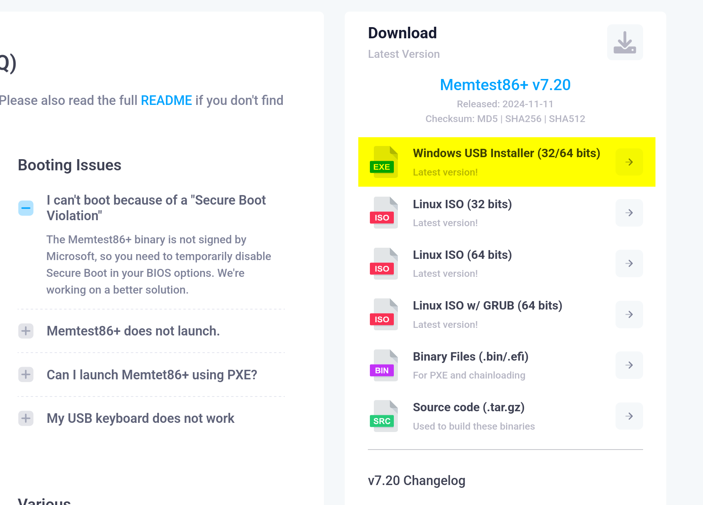

Перед запуском приложения находим USB-флешку и вставляем в порт компьютера.
Подойдёт практически любая флешка, Memtest86+ не требует много места. У меня,
например, для Memtest86+ выделена вот такая старушка на 64M.

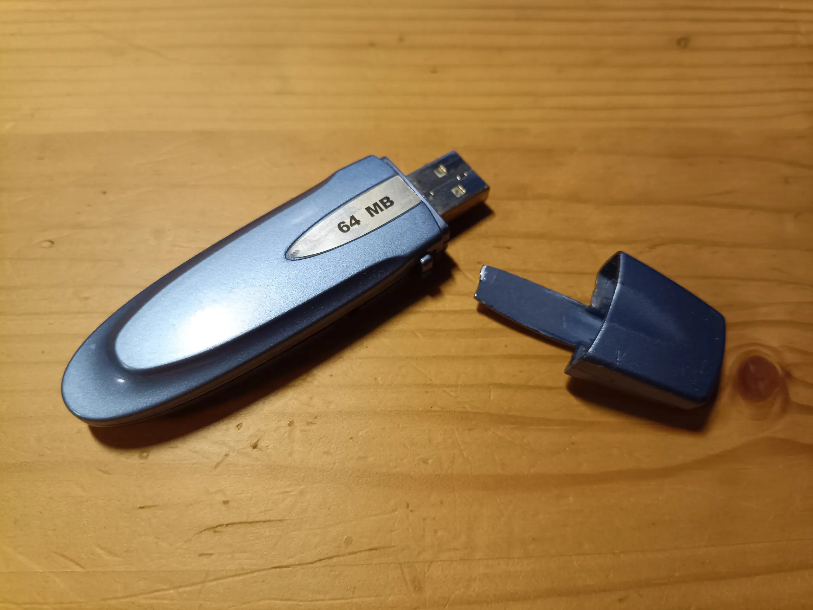

Запускаем установщик и соглашаемся с условиями лицензии GNU/GPLv2 кликнув по
кнопке `I Agree`.

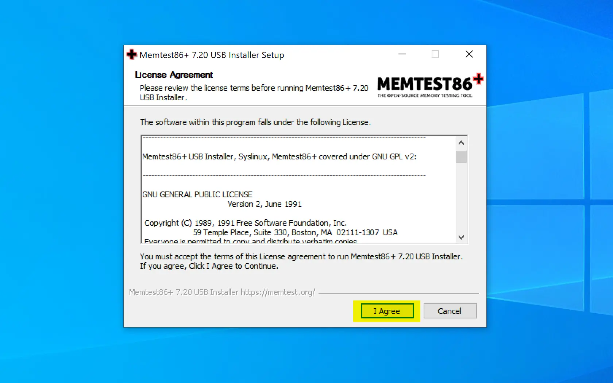

Выбираем USB-флешку из списка. Если USB-флешка у Вас одна, то вариант будет
только один, в моём случае так и есть. Только `E:\`. Если вариантов всё-же
несколько, то перепроверьте букву диска, дабы не стереть нужные файлы.

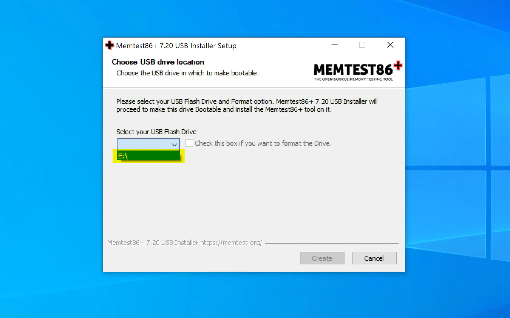

Ставим соответствующую галочку в чекбокс для форматирования флешки.

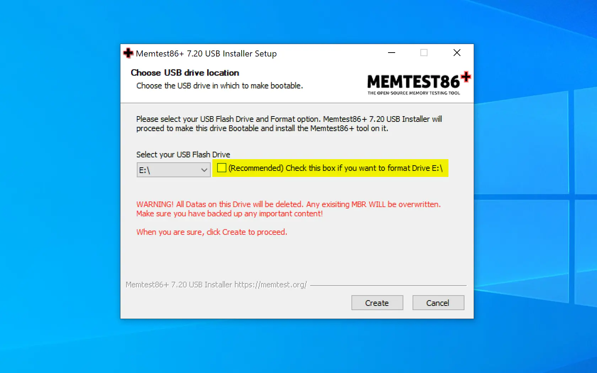

Отдельно подчеркну:

<blockquote class="warning"><p>

Все данные на USB-флешке будут стёрты в процессе записи Memtest86+! Сделайте
копию данных на компьютер, чтобы не потерять важные файлы!

</p></blockquote>

Нажимаем `Create` для записи на USB-флешку образа Memtest86+.

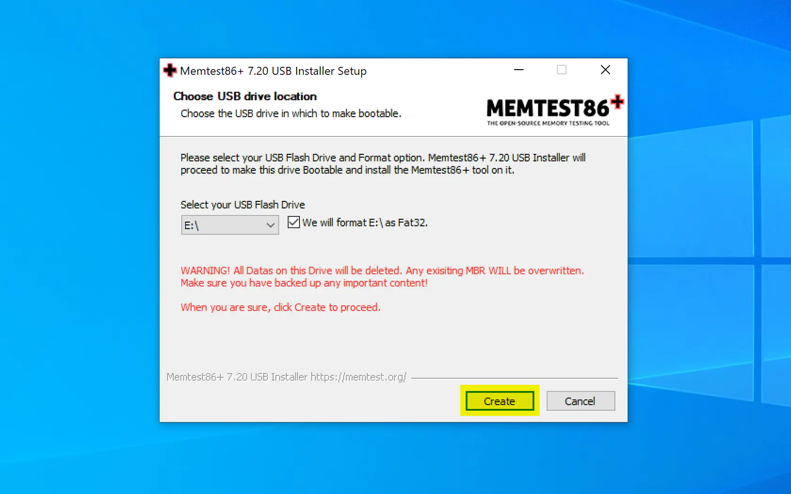

<blockquote class="warning"><p>

Не вынимайте USB-флешку из порта, пока не завершилась работа установщика!

</p></blockquote>

После окончания записи просто нажимаем `Next >`.

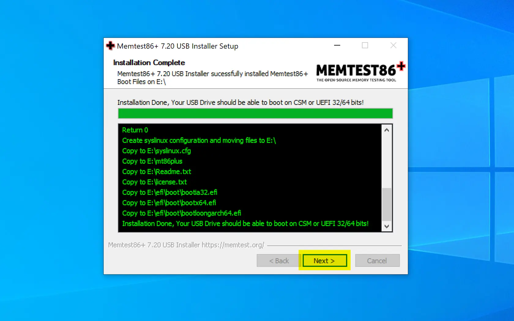

И выходим из установщика, нажав `Finish`.

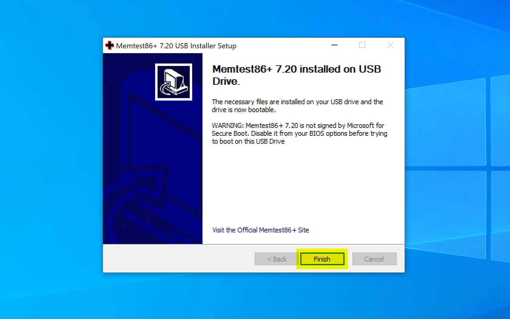

Не забывайте, что USB-флешки нужно *безопасно* извлекать. Кликаем правой кнопкой
мыши по USB-флешке в проводнике и выбираем `Извлечь`.

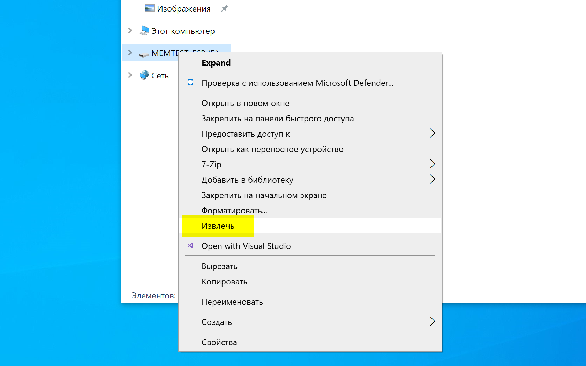

Вот и всё! Можно переходить к [запуску
Memtest86+](#запуск-memtest86-и-интерпретация-результатов).

## Подготовка на Linux

Для Linux есть следующие варианты подготовить Memtest86+:

- Взять готовый образ ISO с Memtest86+ на борту
- Установить системный пакет с Memtest86+
- Подготовить USB-флешку

Рассмотрим по порядку.

### Готовые Live ISO с Memtest86+

В мире Linux Memtest86+ является определённым стандартом. Таким, что некоторые
Live ISO поставляются с Memtest86+ как вариантом загрузки. Вот, например,
варианты загрузки для свежего образа Arch.

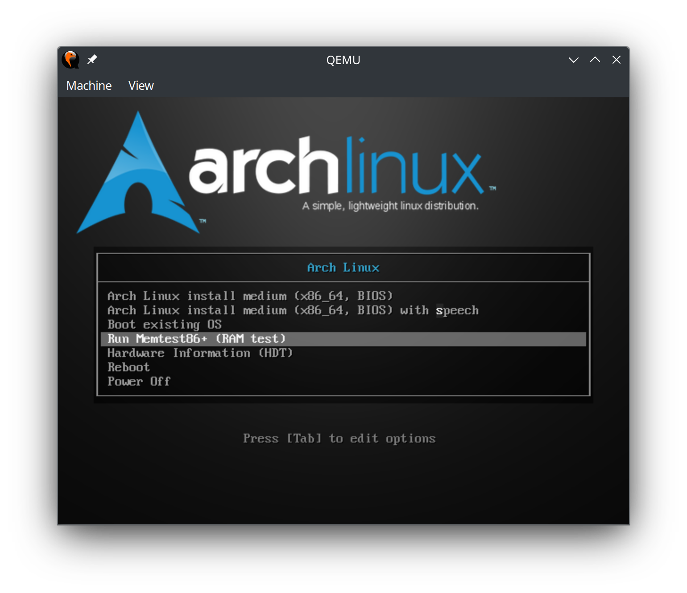

Список ISO образов, которые есть у меня в наличии и имеют Memtest86+ на борту:

- Arch Linux
- Ubuntu
- Linux Mint
- Proxmox
- Даже Dr.Web Live Disk

Если Вы не знаете, есть ли Memtest86+ у ISO образа Вашего любимого дистрибутива,
то, при наличии QEMU, быстрый вариант проверки -- запустить образ командой:

```shell-session
$ qemu-system-x86_64 -cdrom archlinux.iso
```

Если образ для i386, то следует использовать `qemu-system-i386`.

### Установка системного пакета

В некоторых дистрибутивах Linux есть вариант установить системный пакет с
Memtest86+. В таком случае Memtest86+ станет доступен как одна из опций загрузки
GRUB. Удобно, т.к. не требует возни с USB-флешками и устройствами загрузки.

Чтобы найти нужный пакет, рекомендую воспользоваться средствами поиска в
Вашем дистрибутиве. У меня в Debian это делается вот так:

```shell-session
$ apt search memtest

Sorting... Done
Full Text Search... Done
memtest86+/stable,now 6.10-4 amd64 [installed]
  thorough real-mode memory tester

memtester/stable 4.6.0-1 amd64
  Utility for testing the memory subsystem
```

Пакет `memtest86+` и есть тот самый, что нужен. Устанавливается он как обычно:

```shell-session
$ sudo apt install memtest86+
```

После установки, при загрузке системы, новая опция появится в GRUB. При её
выборе, как и в случае с опцией у Live ISO, автоматически запустится Memtest86+.

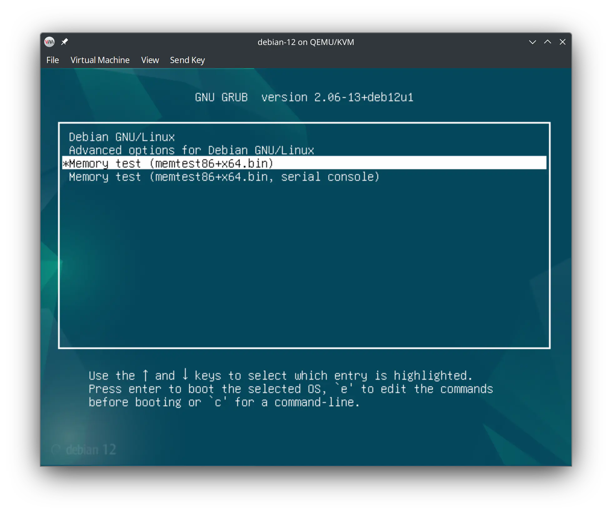

### Подготовка USB-флешки на Linux

Если Вы уже знакомы с [Ventoy](https://github.com/ventoy/Ventoy), то отличный
способ подготовки флешки -- закинуть образы ISO с сайта Memtest86+ на флешку.
Но рассматривать подготовку флешки с Ventoy в этой заметке я не буду.

В простом же случае, когда флешки с Ventoy у Вас нет, достаточно загрузить один
из образов Memtest86+. Для 64-х битной системы или 32-х битной. Комбинированного
образа, как тот, что подготавливается установщиком на Windows, для Linux
официально не поставляется.

Как понять, какой образ нужен? Правило большого пальца: если компьютер, на
котором требуется проверка, был выпущен после 2010 года, то Вам, скорее всего,
нужен 64-х битный вариант. Но иногда попадаются нетривиальные случаи. У меня
есть Asus X205TA, нетбук 2015 года, у которого процессор является 64-х битным,
но вот UEFI и загрузчик работают только в 32-х битном режиме.

Поэтому, в целом, рекомендую пользоваться простым алгоритмом:

- Пробуйте сначала **64-х битный** образ.
- Если не сработало, то пробуйте **32-х битный**.

Образы находятся в разделе Download на [сайте Memtest86+](https://memtest.org/).

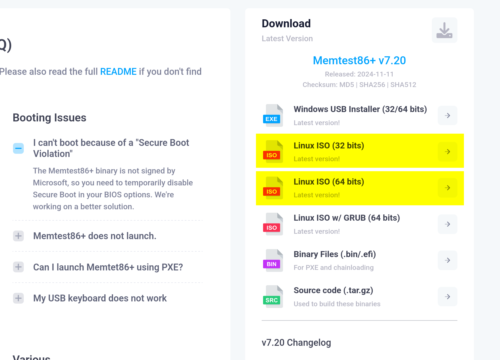

После загрузки вставляем USB-флешку в порт.

Чтобы найти устройство, соответствующее флешке, пользуемся `ls`:

```shell-session
$ ls -1 /dev/disk/by-id/usb-*

/dev/disk/by-id/usb-TwinMOS_MOBILE_DISK-0:0
/dev/disk/by-id/usb-TwinMOS_MOBILE_DISK-0:0-part1
/dev/disk/by-id/usb-TwinMOS_MOBILE_DISK-0:0-part2
```

Видно, что есть корневое устройство `usb-TwinMOS_MOBILE_DISK` с двумя разделами
(`part-1` и `part-2`). Других устройств нет. Если у Вас есть больше одного
USB-диска, то сначала нужно понять, какое из них целевая флешка, дабы не
повредить ценные файлы.

<blockquote class="warning"><p>

Все данные на USB-флешке будут стёрты в процессе записи Memtest86+! Сделайте
копию данных на компьютер, чтобы не потерять важные файлы!

</p></blockquote>

Самый простой способ записать образ -- с помощью `cp`. Для 64-х битного ISO
типичный сценарий записи будет такой (для 32-х битного ISO меняется только
названия архива, вместо `*_64.iso*` будет `*_32.iso*`):

```shell-session
$ unzip mt86plus_7.20_64.iso.zip

Archive:  mt86plus_7.20_64.iso.zip
  inflating: memtest.iso

$ sudo cp memtest.iso /dev/disk/by-id/usb-TwinMOS_MOBILE_DISK-0\:0

$ sync
```

Т.е.: сначала распаковываем образ из ZIP архива с помощью `unzip`, копируем его
в корень устройства (а не раздел!) с помощью `cp` и принудительно синхронизируем
ФС с помощью `sync`.

<blockquote class="warning"><p>

Не вынимайте флешку из порта, пока не завершилась работа `cp` и `sync`!

</p></blockquote>

После успешного завершения `sync` можно будет вытаскивать флешку из USB-порта.
На этом подготовка USB-флешки на Linux завершена, переходим к запуску.

## Запуск MemTest86+ и интерпретация результатов

<blockquote><p>

Единого стандарта на выбор загрузочного устройства на любом компьютере на
сегодняшний день нет. Если загрузиться с USB-флешки как в примере ниже не
получается, то хорошая альтернатива -- погуглить модель Вашего устройства и/или
полистать пользовательскую инструкцию.

</p></blockquote>

Выключаем компьютер. Если Вы подготавливали USB-флешку, то вставляем её.
Запускаем ПК и нажимаем на какую-то кнопку для выбора устройства, с которого
будет загружаться система. В моём случае (на MSI, Gigabyte, Asus или HP)
работает `ESC`, `F2` или `F8`. Выглядит интерфейс, например, так:

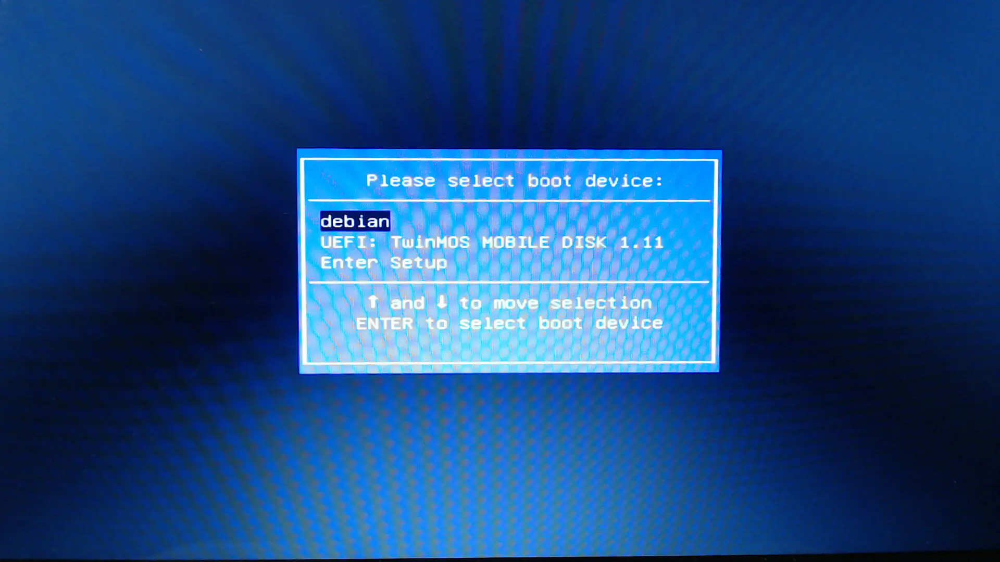

Если в списке устройств для загрузки нет флешки, но её видно в операционной
системе, у Вас может быть отключена загрузка с внешних носителей. Тогда нужно
зайти в BIOS/UEFI (у меня это кнопка `Del` при старте или вариант `Enter Setup`
на фото выше) и включить опцию загрузки с USB-флешек. Эта фича обычно оформлена
в виде порядка загрузки. На X205TA опции BIOS в разделе `Boot` выглядят так:

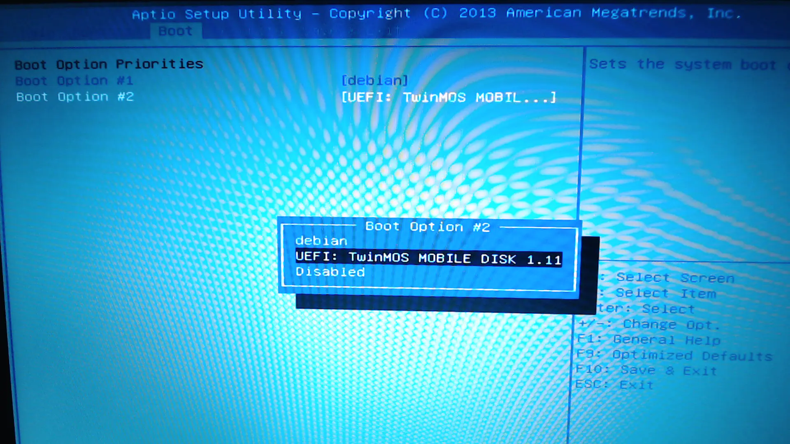

Кроме всех указанных сложностей, часто можно столкнуться с подобным сообщением
об ошибке при выборе USB-флешки с Memtest86+ для загрузки:

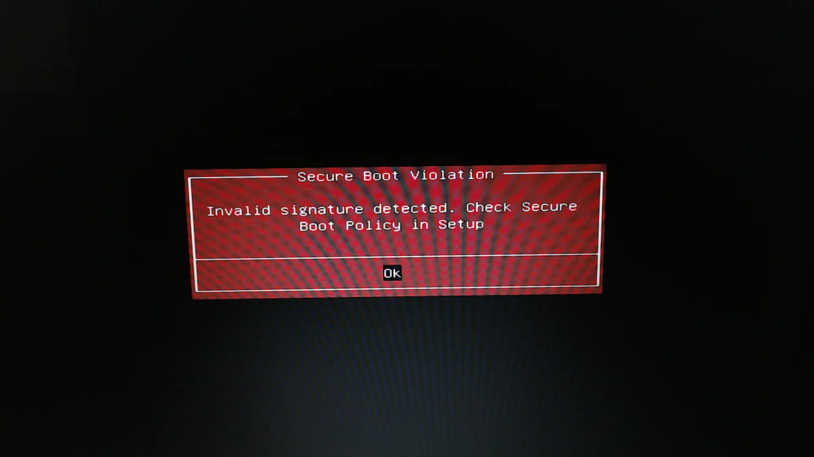

Решается эта проблема **временным** отключением Secure Boot в настройках
BIOS/UEFI. Такая опция находится, обычно, в настройках загрузки или
безопасности. После завершения работы с Memtest86+, Secure Boot имеет смысл
снова включить. У меня экран с опцией `Secure Boot Control` находится в разделе
`Security` и выглядит следующим образом:

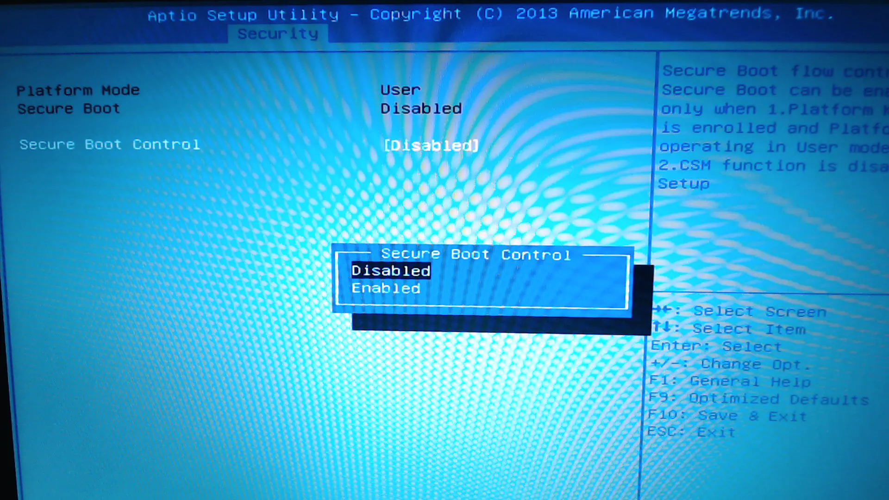

Иных проблем с запуском я не встречал, поэтому переходим к разбору интерфейса.

В процессе работы выглядит Memtest86+ следующим образом. Мучить отвратными фото
больше не буду, посмотрим на скриншот VM с выделенными точками интереса:

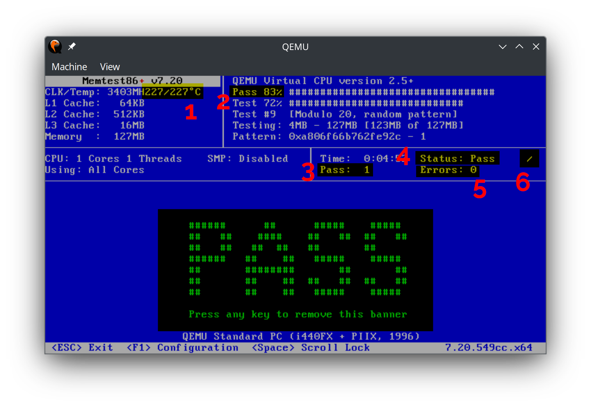

Пройдём по порядку:

1) Температура. На скриншоте она ошибочно определена как 227°C. В реальности это
хороший индикатор перегрева процессора. Если температура меньше 90°C, то,
обычно, всё окей. Если больше -- стоит задуматься о замене термопасты.
2) Процент завершения одного целого набора тестов. Смотреть на прогресс
отдельных тестов значимого смысла нет, какие-то слишком быстрые, а какие-то
слишком медленные.
3) Сколько полных наборов тестов завершено. В данном случае один. Больше тестов
завершено без ошибок -- больше уверенности в стабильности системы и RAM.
4) Статус тестирования. `Pass` значит, что **пока** всё нормально. `Fail` -- что
обнаружены ошибки.
5) Если в процессе тестирования найдены ошибки, то тут будет общее количество
ошибок за этот сеанс Memtest86+.
6) Индикатор проводимой работы. Слэш крутится, чтобы визуально отобразить
работу. Если он стоит на месте, а другие индикаторы из списка никак не
изменяются, вполне вероятно, что Memtest86+ завис. Обычно это происходит из-за
дефектов компьютера, а не самого Memtest86+.

Глобальная цель тестирования -- получить как можно больше успешно завершённых
полных наборов тестов (`Pass`, индикатор (3)), насколько это возможно. В целом,
всё зависит от Вашего свободного времени и необходимостей.

Я целюсь в значение от 5 до 10 успешных прогонов в зависимости от ситуации. Если
я тестирую RAM после разгона, то буду ожидать до 10-и успешных прогонов без
ошибок. Если просто проверяю в рамках общей диагностики, то ограничусь и 5-ю.

Если на ПК ошибки появляются даже на первом прогоне тестов, то, с огромной
вероятностью, RAM дефективна или крайне нестабильна на тех настройках, которые
выставлены материнской платой. Если Вы занимались разгоном, нужно сбросить
настройки BIOS по-умолчанию. Если же разгона не было и RAM у Вас уже давно,
вполне вероятно, что она стала дефективной.

В целом, тестирование RAM с помощью Memtest86+ поможет проявить ошибки,
связанные с оперативкой. Но такая диагностика, к сожалению, не скажет об
истинном источнике ошибок. Проблемы могут быть не только с самой RAM, но и,
например, с процессором, материнской платой или даже с системой питания.

По крайней мере, диагностика подскажет, можете ли Вы быть уверены в своей RAM
сейчас AS-IS или нет. Я же, чаще всего, и хочу получить ответ на такой вопрос.
