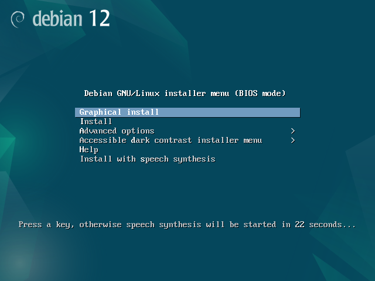
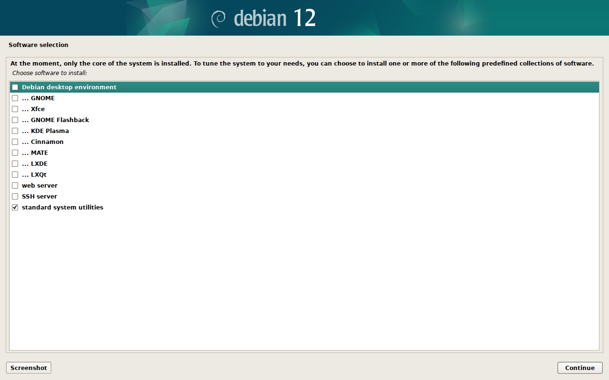
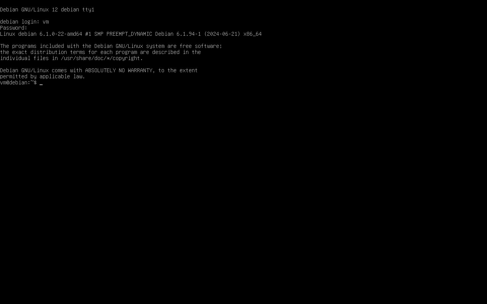
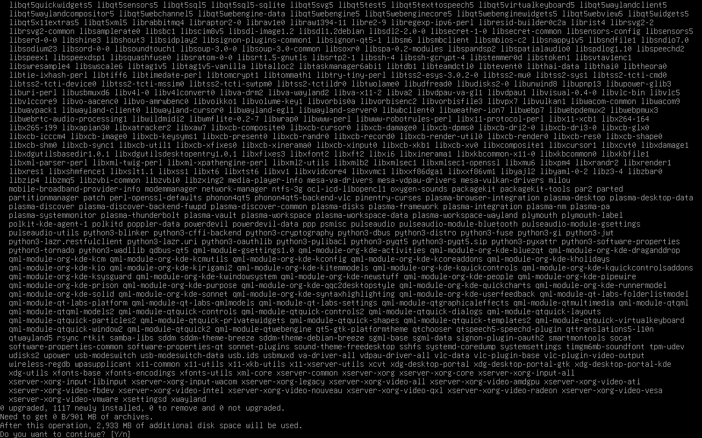
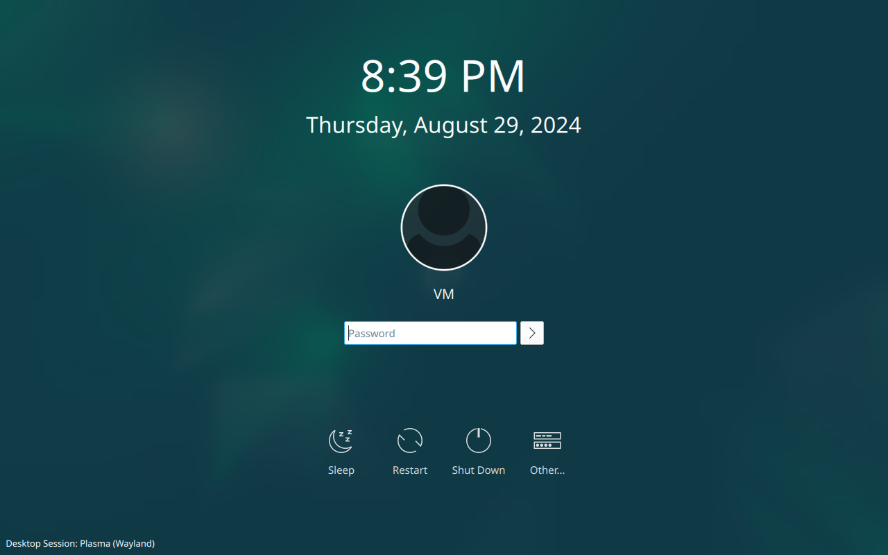
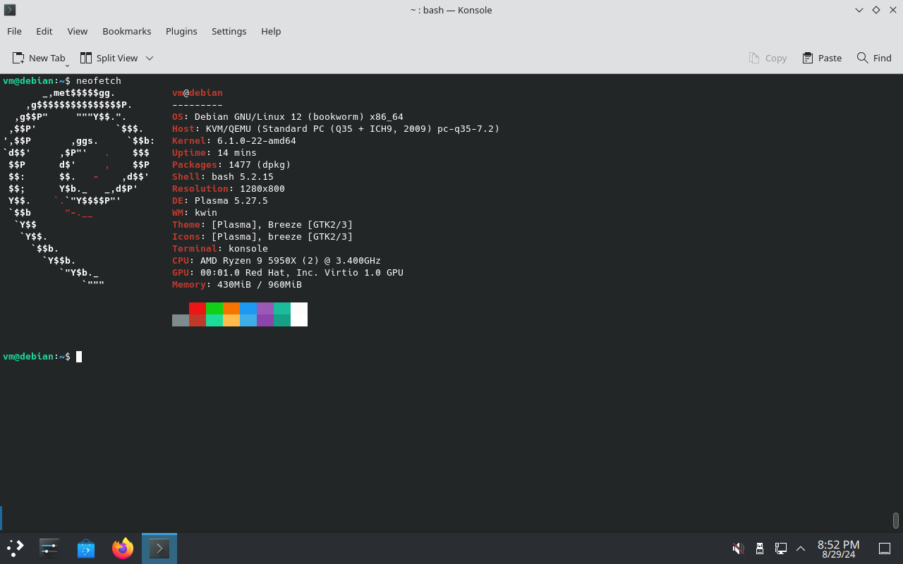
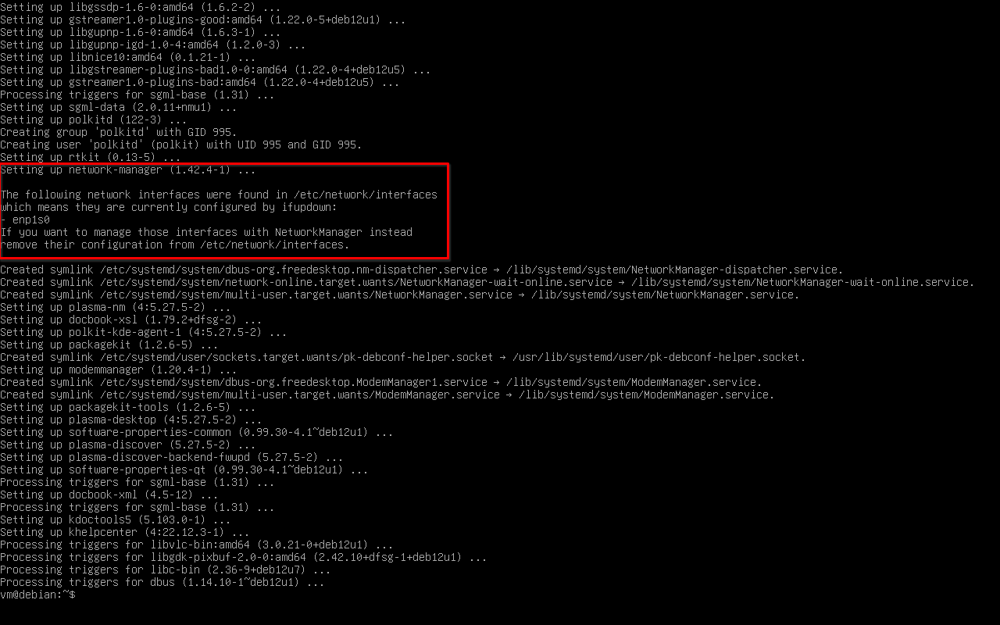

Стандартная поставка KDE на Debian не всегда мне подходит. К сожалению, при
установке с Live DVD, система будет включать в себя не только много лишних
программ (KDE Connect, Konqueror, Akregator, Golden Dict, Juk, IBus, etc.), но и
локализации к ним.

К примеру, Firefox ESR, на Live DVD, идёт в комплекте со всеми пакетами `l10n`.
Это значит, что вместе с обновлениями Firefox придётся загружать и обновления
соответствующих `l10n`. То же касается LibreOffice.

Особняком стоит странный набор пакетов, устанавливаемых Live DVD. Например, по
каким-то причинам, туда не включён ни один клиент синхронизации NTP! А ещё не
включен `bash-completion` по умолчанию...

Live DVD имеет свои преимущества для начинающих, но, если Вы уже имеете опыт
работы с Linux, имеет смысл посмотреть на альтернативные способы установки
системы, нежели простейшую установку посредством Calamares.

Я понял, что самый эффективный и минималистичный способ установки Debian с KDE
заключается в установке "голой" ОС с базовым набором пакетов и последующей
ручной установкой минимального мета-пакета `plasma-desktop`.

На Live DVD невозможно выбрать список программного обеспечения для установки,
поэтому потребуется достать другой образ. Как альтернативу можно взять
[netinst].

Запускаем установку. В загрузчике выбираем пункт меню Graphical Install.



Все настройки можно оставить как Вам нравится, за исключением шага выбора
программного обеспечения (Software Selection). На этом шаге необходимо отключить
все графические среды, как на скриншоте ниже. Достаточно оставить только
стандартные системные утилиты (standard system utilities).



После успешной установки перезагружаемся, как и предлагает установщик. После
перезагрузки нас приветствует терминальный login, а не графический. Входим с
созданным в процессе установки пользователем.



На "чистой" системе увидим всего 324 установленных пакета.

```shell-session
$ apt -qq list --installed | wc -l

WARNING: apt does not have a stable CLI interface. Use with caution in scripts.

324
```

И 1.1G использованного пространства на диске.

```shell-session
$ df -h

Filesystem      Size  Used Avail Use% Mounted on
udev            462M     0  462M   0% /dev
tmpfs            97M  600K   96M   1% /run
/dev/vda1        19G  1.1G   17G   7% /
tmpfs           481M     0  481M   0% /dev/shm
tmpfs           5.0M     0  5.0M   0% /run/lock
tmpfs            97M     0   97M   0% /run/user/1000
```

Наконец-то можно установить мета-пакет `plasma-desktop`. Он достаточно
увесист, но исключать из него рекомендуемые пакеты я не могу. В таком случае,
система будет "сломана" после установки. Не будет работать меню Plasma, включая
главное меню.

Изначально я использовал полноценный `kde-plasma-desktop`, но меня смущала такая
зависимость, как [пакет kde-baseapps]. Через него "затягиваются" зависимости
типа `konqueror` и `kwrite`, которыми я никогда не пользуюсь. Вот этот [тред на
Reddit] содержит хороший рецепт из 3-ех пакетов, который я теперь использую:

```shell-session
$ sudo apt install sddm plasma-desktop konsole
```

Стоит отметить, для меня `konsole` -- обязательный пакет для установки на этом
этапе. Без него мета-пакет `plasma-desktop` может выбрать за Вас какой-нибудь
другой эмулятор терминала, к примеру `deepin-terminal` или `zutty`.



Установка мета-пакета с рекомендациями -- хороший баланс между количеством
ручных действий и минимализмом результирующей системы. После установки
перезагружаемся.

```shell-session
$ sudo reboot
```

Логин на этот раз произойдёт через SDDM, который услужливо выберет Plasma
Wayland как основную графическую сессию.



На этом этапе можно удалить лишние пакеты от [KDE Connect].

```shell-session
$ sudo apt purge kdeconnect --auto-remove
```

Проверим количество пакетов и занятого пространства:

```shell-session
$ apt -qq list --installed | wc -l

WARNING: apt does not have a stable CLI interface. Use with caution in scripts.

1430

$ df -h

Filesystem      Size  Used Avail Use% Mounted on
udev            453M     0  453M   0% /dev
tmpfs            97M  1.1M   96M   2% /run
/dev/vda1        19G  4.1G   14G  24% /
tmpfs           481M     0  481M   0% /dev/shm
tmpfs           5.0M     0  5.0M   0% /run/lock
tmpfs            97M   48K   96M   1% /run/user/1000
```

После установки минимального мета-пакета не будет даже веб-браузера и файлового
менеджера, поэтому можно сразу установить, к примеру, Firefox ESR и Dolphin.

```shell-session
$ sudo apt install firefox-esr dolphin
```

Можем даже установить Neofetch и поделиться результатом.



1477 пакетов. Получившаяся система занимает всего 4.4G на диске.

```shell-session
$ df -h

Filesystem      Size  Used Avail Use% Mounted on
udev            453M     0  453M   0% /dev
tmpfs            97M  1.1M   96M   2% /run
/dev/vda1        19G  4.4G   14G  25% /
tmpfs           481M     0  481M   0% /dev/shm
tmpfs           5.0M     0  5.0M   0% /run/lock
tmpfs            97M   48K   96M   1% /run/user/1000
```

Да, не мало, но это полноценная система без "лишних" пакетов. Для сравнения,
Live DVD установит Debian с 2650 пакетами! Занимая 9.5G на диске!

Если Вы стремитесь к меньшим значениям, Вам стоит посмотреть в сторону сборки
своего рабочего окружения на основе WM вроде Sway, т.к. тюнинг системы дальше
будет требовать непропорциональных результатам трудозатрат.

В общем, всё! У Вас есть минимальная система без лишних пакетов, но уже с
привычным графическим окружением KDE и веб-браузером. Дальше кастомизировать по
Вашему вкусу. Имеет смысл настроить локаль, точки монтирования и много другое...

---

В большинстве конфигураций, после установки, у Вас не будет списка сетей при
нажатии на иконку `Networks` в трее. Так происходит у меня при установке Debian
Bookworm на VM с DLBD образа. Соединение с интернетом, как ни странно, есть.

Это признак того, что в `/etc/network/interfaces` есть настройки для сетевых
интерфейсов, про это есть информационное сообщение в логе установки:



 По умолчанию NetworkManager будет игнорировать управление такими
интерфейсами. Вот один из способов убрать все настройки интерфейсов из файла
`/etc/network/interfaces`:

```shell-session
$ cat <<EOF | sudo tee /etc/network/interfaces
# interfaces(5) file used by ifup(8) and ifdown(8)
# Include files from /etc/network/interfaces.d:
source /etc/network/interfaces.d/*
EOF
```

Перезагружаемся. Настройки адаптеров и сетей будут доступны через `nmcli` и
`nmtui`. Сами сетевые подключения появятся в списке при клике на иконку
`Networks` в трее.

[netinst]: https://www.debian.org/CD/netinst/
[пакет kde-baseapps]: https://packages.debian.org/bookworm/kde-baseapps
[тред на Reddit]: https://www.reddit.com/r/kde/comments/6ulr5q/how_do_i_install_kde_without_all_the_bloatware/
[KDE Connect]: https://kdeconnect.kde.org/
