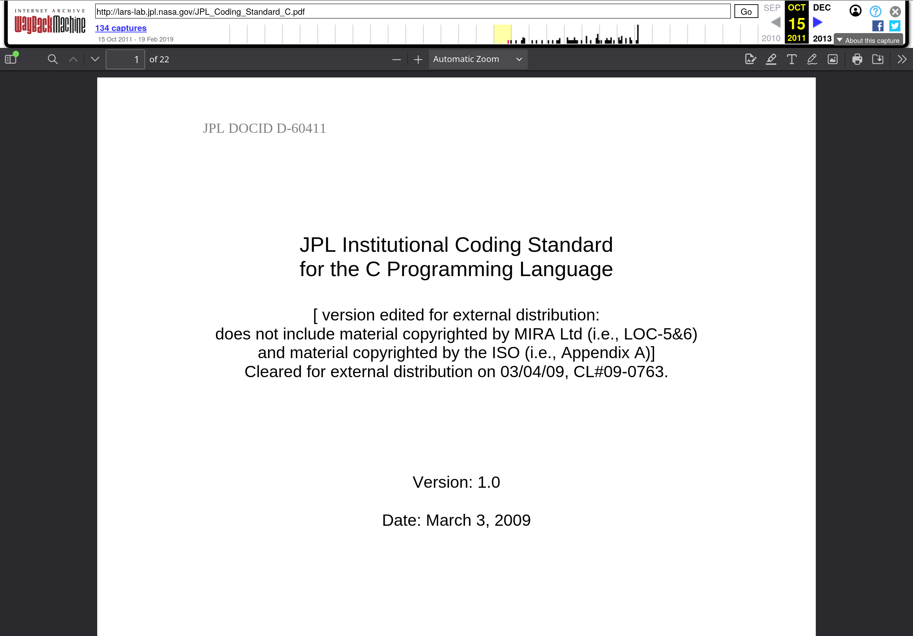

Пытаюсь собрать мысли, что есть в голове, о безопасном Си. Нюанс: я не
профессионал именно Си. Чтобы не изобретать сломанный велосипед, решил покопать
материал в общедоступных источниках от известных авторов.

Одна из самых интересных работ по теме безопасного использования Си, которая
попадалась мне на глаза в прошлом, была от Джерарда Гольцманна из JPL. JPL
разрабатывает софт для NASA, требования к качеству там высокие.

Работа Гольцманна ["The Power of 10"](https://spinroot.com/gerard/pdf/P10.pdf)
даёт хороший базис, но это далеко не исчерпывающее руководство. У JPL, как
оказалось, есть отдельный [документ-стандарт разработки на
Си](https://web.archive.org/web/20111015064908/http://lars-lab.jpl.nasa.gov/JPL_Coding_Standard_C.pdf).
Он комбинирует рекомендации "The Power of 10" с отдельными требованиями MISRA-C.

И пусть MISRA-C -- проприетарный стандарт разработки на Си, его правила
представлены в некоторых статических анализаторах кода, включая Cppcheck. А это
значит, что можно использовать автоматизированные инструменты!

То есть, для реализации части правил из документа JPL по Си, достаточно начать
делать проверки MISRA-C:

```shell-session
$ cppcheck --addon=misra main.c
```

Что интересно, я сначала посчитал большое количество диагностических сообщений
за ложно-положительные, но при доскональном изучении каждой ошибки прояснял --
проверка имеет место быть.

Собственно, вот, как и всегда, учёные уже сделали огромную работу, нужно только
учиться у них и больше применять правильные флажки для инструментов статического
анализа.

Работы Гольцмана и JPL очень рекомендую почитать и применять в меру возможности.
