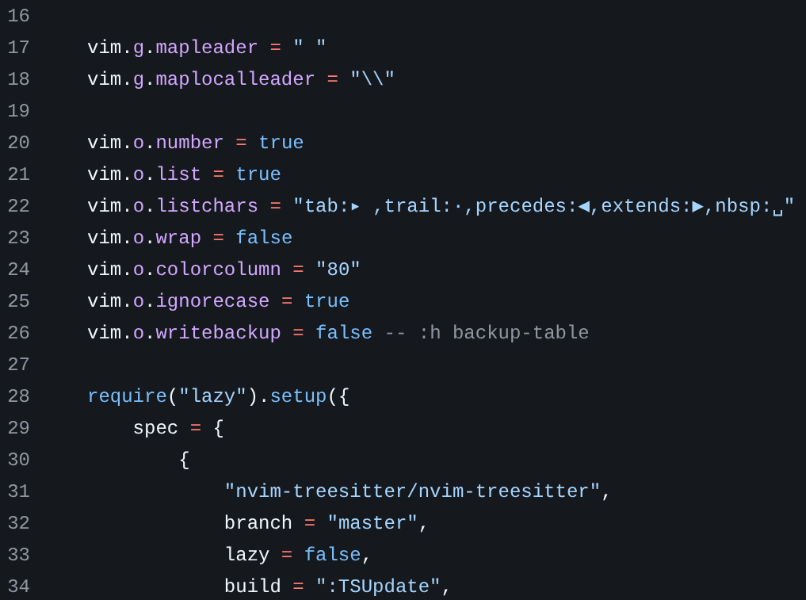

За прошедший год меня несколько раз спрашивали: каким конфигом NVIM я пользуюсь?

Люблю брать дефолтный NVIM и накидывать минимум плагинов, которые чуть-чуть
упрощают жизнь. Для локальной машины добавляю LSP, линтинг, авто-форматтеры и
тему.

Единственная особенность конфига — прибиваю гвоздями версии плагинов, чтобы они
были совместимы с NVIM v0.10. Некоторые плагины уже требуют v0.11+, но я на
Debian и в стабильных репах живёт только v0.10. Бэкпортов пока не завезли...

В общем как-то так, вот репа на [GitHub](https://github.com/tsb99x/dotfiles).
