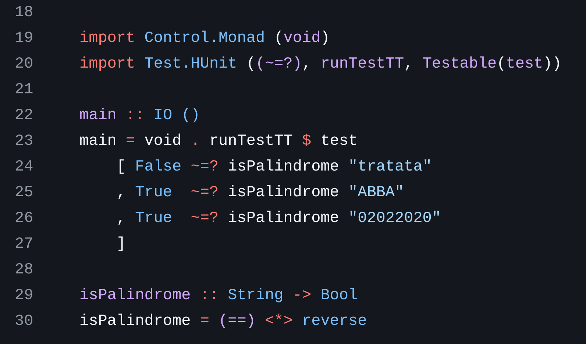

Закончил выгрузку старых реп на GitHub.

Фуф, наконец-то завершил упражнение с восстановлением старых реп для GitHub.

Часть реп уже потеряна, часть просто валялась по отдельности, часть переносил из
zip-ников, которые вообще никакой истории не хранят... Но всё равно, приятно,
что на GitHub снова есть исходнички.

По мелочи надо будет ещё подправлять код, но это потихоньку, не в один наскок.

У всех реп теперь UNLICENSED как лицензия, если кому-то это важно и нужно.

P.S.: Смотрю на исходники Haskell и умиляюсь, насколько странно он выглядит
спустя годы :)
