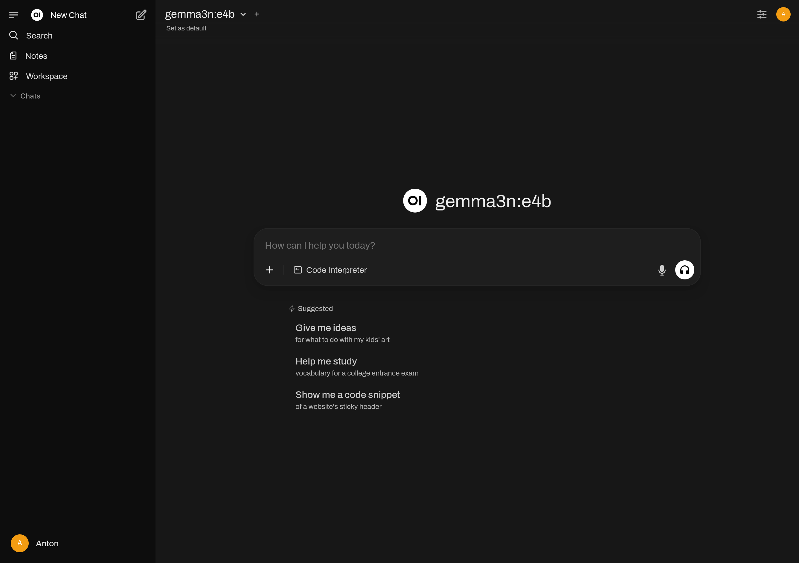

В [предыдущей заметке] мы уже запустили Ollama в Podman. Но, CLI от Ollama не
даст использовать многие плюсы моделей, вроде распознания образов с картинок.
Кроме того, банально неудобно смотреть на вывод без подсветки синтаксиса и т.п.

Как бы это не было странно, среди Open Source и Self Hosted решений в этой стезе
не так много продуктов. Самый популярный -- [Open WebUI], запустим его в Podman.

Первым шагом забираем свежий image с хостинга GitHub (ghcr.io).

```shell-session
$ podman pull ghcr.io/open-webui/open-webui:main

Trying to pull ghcr.io/open-webui/open-webui:main...
Getting image source signatures
Copying blob 4f4fb700ef54 skipped: already exists
Copying blob 483d0dd37518 skipped: already exists
Copying blob 471797cdda8c skipped: already exists
Copying blob 02a5d22e0d6f skipped: already exists
Copying blob d735c6810219 skipped: already exists
Copying blob eb54bd960342 skipped: already exists
Copying blob 1e80ef81ce95 skipped: already exists
Copying blob 3da95a905ed5 skipped: already exists
Copying blob dc06c47d3f8d skipped: already exists
Copying blob ea7e6d3e0aef skipped: already exists
Copying blob bbb7d449cf1f done
Copying blob b60ff2a71e86 done
Copying blob 838a5ef21014 done
Copying blob 72b8ccfd4120 done
Copying blob 4f4fb700ef54 skipped: already exists
Copying blob 01c7ca3659de done
Copying config 21bb7e0892 done
Writing manifest to image destination
Storing signatures
21bb7e0892cfbfaa64f9bc67ee83be1d79b1e062e946394396fded7f03a54987

$ podman image ls

REPOSITORY                     TAG         IMAGE ID      CREATED       SIZE
ghcr.io/open-webui/open-webui  main        21bb7e0892cf  42 hours ago  4.84 GB
docker.io/ollama/ollama        rocm        d466fc07e32e  12 days ago   6.42 GB
```

И в очередной раз, довольно большой образ. Но что поделать... Для первого
запуска контейнера, пользуемся немного модифицированной командой. Я убрал из
команды в доках `--restart always` и добавил порт локальной Ollama (11434). Да,
к слову, для полноценного использования обязательно нужно запустить и Ollama!

```shell-session
$ podman start ollama

ollama

$ podman run -d \
    -p 3000:8080 \
    -e 'OLLAMA_BASE_URL=http://host.containers.internal:11434' \
    -v open-webui:/app/backend/data \
    --name open-webui \
    ghcr.io/open-webui/open-webui:main

270f23c5c172b1debc64c1a86de58b6a263c0a11c98fb30f8f1ff5c4a89a8f02
```

Заходим на [localhost:3000] и видим там интерфейс настройки. Заполнив все поля,
создаём аккаунт администратора. Заполнять реальный E-mail вовсе не обязательно,
можно придумать любой. Я просто пользуюсь форматом `user@hostname.local`. Создав
администратора, попадаем в простой промт-интерфейс.



Дальше я рекомендую самостоятельно покопаться в UI. Описать всё мне будет тяжело
и это -- однозначно лишнее для фокуса этой заметки.

Чтобы остановить Open WebUI, пользуемся `podman stop`. Не забывайте про Ollama!

```shell-session
$ podman stop open-webui ollama

open-webui
ollama
```

Чтобы запустить снова, пользуемся `podman start`. Стартуем вместе с Ollama.

```shell-session
$ podman start ollama open-webui

ollama
open-webui
```

На этом всё, Ollama и Open WebUI работают, промптим! :)

[предыдущей заметке]: /notes/ollama-in-podman.html
[Open WebUI]: https://github.com/open-webui/open-webui
[localhost:3000]: http://localhost:3000
