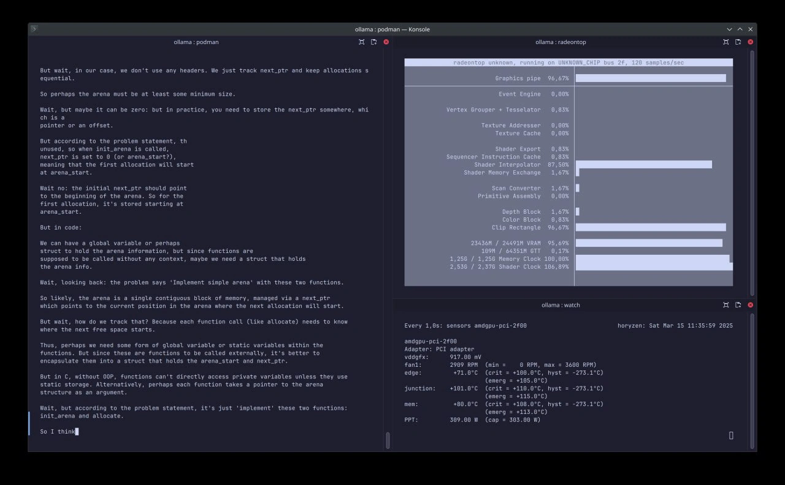

Поиграл полдня в промптера. Запустил локально Ollama в Podman и загрузил там
deepseek-r1:32b. Что важно, с поддержкой GPU!

Хорошо работает как обогреватель комнаты, видеокарта греется вплоть до 105°C при
долгой нагрузке. Жрёт больше 300W при работе.

А ответы... Ну ответы варьируются. На что-то гуманитарное и базовое ответит
приемлемо. Нормальные кусочки кода, напротив, даёт через раз. Каждый второй
пример просто не собирается. Галлюцинирует не слишком критично при настройках
по-умолчанию, но тоже бывает.

И всё же, ответы на мои вопросы выглядят лучше, чем у LLaMA. Попросил DeepSeek
R1 переписать несколько Сишных программ на Rust. Некоторые варианты очень
логичные вышли. Не скажу, что я стал бы так писать программу, но узнать, что
такие функции в принципе есть в Rust -- очень хороший для меня опыт.

Резюмируя -- типичная модель, ничего сверхъестественного нет, но на 32b уже видна
определённая стабильность без сильных галлюцинаций. Как-то так.
