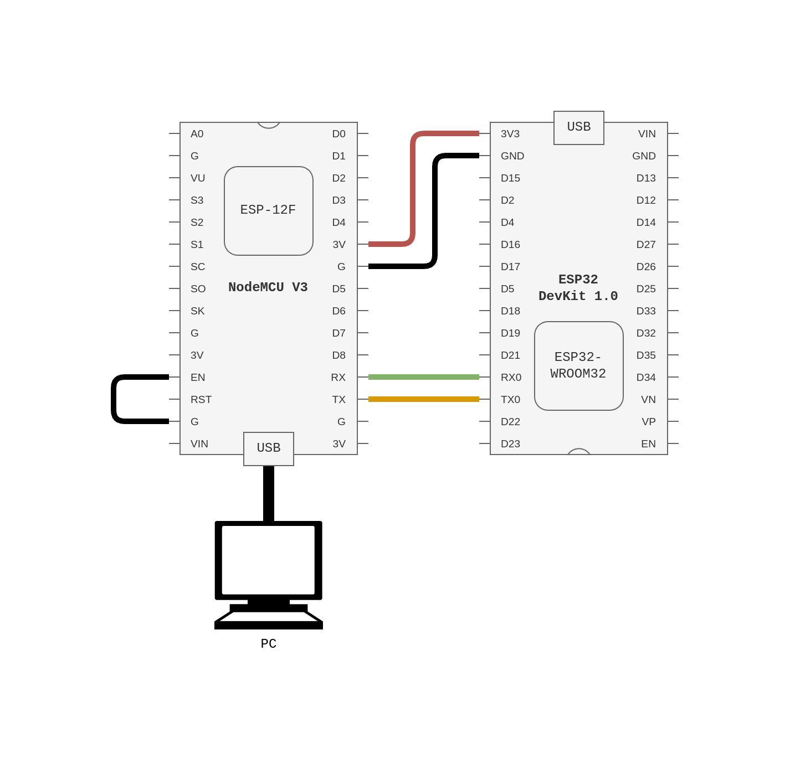

<iframe
    class="rutube-player"
    src="https://rutube.ru/play/embed/1007b2c355d4405455a8169f9f536041/"
    frameBorder="0"
    allow="clipboard-write; autoplay"
    webkitAllowFullScreen
    mozallowfullscreen
    allowFullScreen
></iframe>

Чуть больше полутора лет назад я купил ESP8266 на отладочной плате NodeMCU V3 с
SoC ESP-12F. Штука мне показалась интересной, захотелось посмотреть аналогичные
платы. Выбирал плату с ESP 32. Заказал NodeMCU с ESP32-WROOM32 за копейки.

Когда она ко мне приехала, я сразу понял: что-то не так. USB порт не Micro-USB,
а Type-C. Распиновка по именам пинов не сходилась. Подключил к ПК и ничего не
увидел. Какая-то часть платы, работающая с USB, оказалось мертвой.

Может быть дело в дорожках, чипе CH340 или самом порте. Незначительный ток по
цепи бегает, но плата не заводится. Светодиод PWR загорелся при подключении
внешних 3V и GND. Плата стоила копейки, поэтому просто кинул в коробку и забыл.

Вчера потратил день на изучение вопроса прошивки без программатора.

Для начала решил понять, какая именно плата у меня на руках. Выяснил, что у меня
никакой не NodeMCU ESP32, а клон DOIT ESP32 DevKit.

С подключением оказалось всё достаточно прозаично. По-сути, мне не хватало как
раз всей обвязки до SoC ESP32-WROOM32. 1-в-1 обвязка есть на NodeMCU с ESP-12F.
То есть, нужно их просто соединить. 3V3 и GND точно нужны для питания.



Пара TX и RX -- ключевая частью при прошивке, их тоже нужно соединить. Причём
никаких кроссов делать не нужно, TX отправляется к TX, а RX к RX.

В такой конфигурации ESP-12F не будет допускать ESP32-WROOM-32 к прошивке.
ESP-12F нужно отключить. Предыдущий опыт подсказывал, что нужно соединить EN пин
с GND, после этого ESP-12F не будет мешать ESP32-WROOM-32.

И, вроде всё уже должно работать, но нет. Прошивка никак не хотела загружаться.
Получал одну и ту же ошибку:

```
esptool.py v4.8.1
Serial port /dev/ttyUSB0
Connecting......................................

A fatal error occurred: Failed to connect to ESP32: No serial data received.
```

Никакие нажатия BOOT или EN на ESP 32 DevKit не помогали. Долго вертя в руках
плату, посмотрел спеки, почитал несколько сайтов и только [на Амперке] нашёл
корректную последовательность для перевода DevKit в Upload режим, а именно:

- Зажать **и держать** кнопку BOOT.
- Однократно нажать **и отпустить** кнопку EN.
- Отпустить кнопку BOOT.

Если выполнить эту последовательность и загружать скетч из Arduino IDE, то
программа успешно запустится. Блинк у меня заработал и душа спокойна, в запасе
есть DevKit для ESP 32, можно поиграть и с Bluetooth, а не только WiFi.

[на Амперке]: https://wiki.amperka.ru/products:esp32-wroom-wifi-devkit-v1
