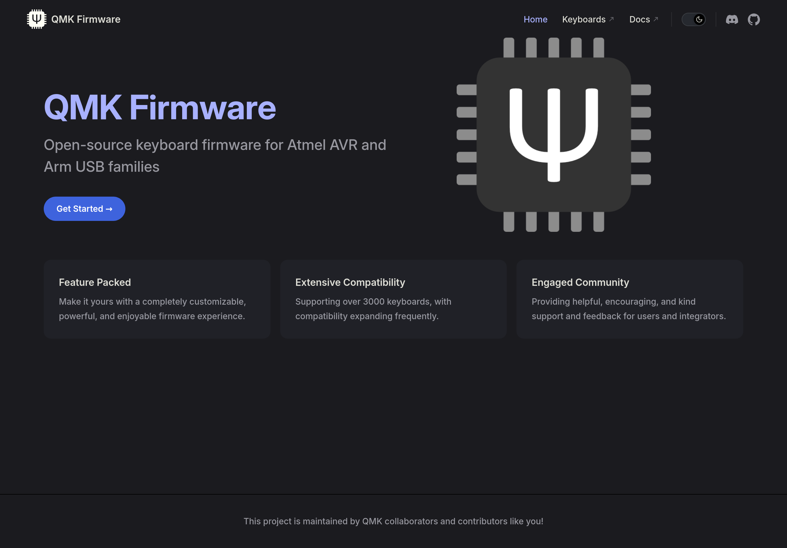

С удивлением обнаружил, что [QMK], готовый firmware для клавиатур, поддерживает
прошивку на AVR, и не каких-либо, а ATmega328P. Это же MCU от Arduino UNO! Вот,
кстати, список [поддерживаемых микроконтроллеров].

Есть QMK и для ARM, там замечены STM. Моих любимых ESP, к сожалению, нет.

ATmega328 не имеет нативной поддержки USB, поэтому будет требовать использования
V-USB, но это мелочи по сравнению с перспективами использования старичка как
базы для клавиатуры.

Для своих проектов можно собрать базовую матричную клавиатуру, а бонусом —
сделать её настраиваемой "на лету" [через VIA]! Шикарно!

[QMK]: https://qmk.fm/
[поддерживаемых микроконтроллеров]: https://github.com/qmk/qmk_firmware/blob/master/docs/compatible_microcontrollers.md
[через VIA]: https://www.caniusevia.com/docs/configuring_qmk
