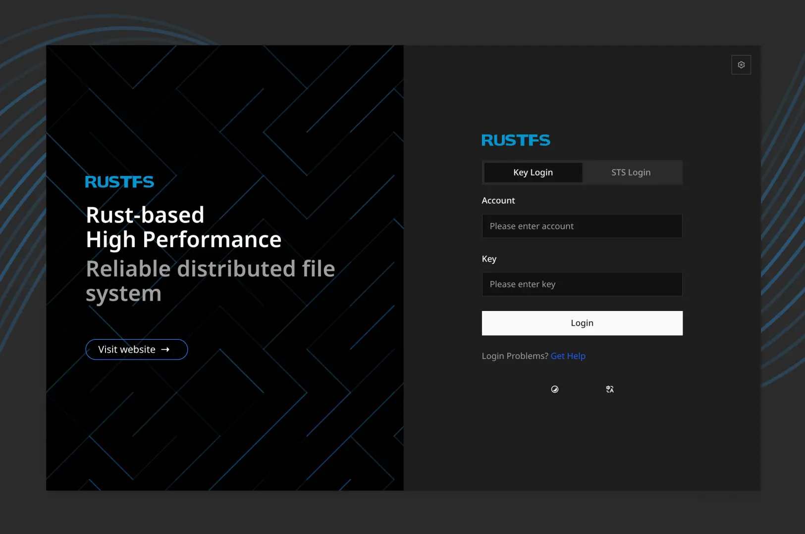

Раньше много пользовался [Minio], бывало удобно, когда нужно быстро поднять
сервис для перекидывания файлов.

Самая большая проблема у Minio, которая меня преследует в последнее время --
жёсткие требования минимального объёма свободного места на диске. Разработчики
говорят: нужно минимум 10% свободного места. Неважно абсолютное значение, хоть
даже 400T, как в одном из [issues на GitHub].

На днях нашёл [RustFS], прямой аналог Minio. RustFS даёт спокойно записать файлы
и при 1% свободного места.

Для домашнего пользования или мини-лабы — самое то!

[Minio]: https://github.com/minio/minio
[issues на GitHub]: https://github.com/minio/minio/issues/16534
[RustFS]: https://github.com/rustfs/rustfs
