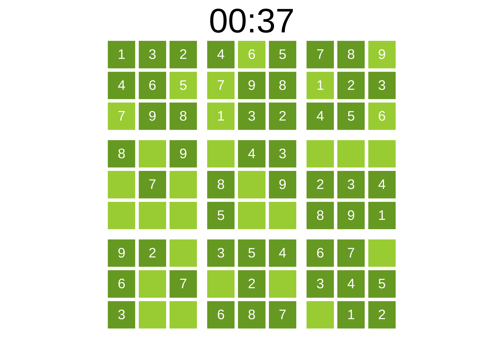

Давным-давно, в далёкой-далёкой галактике... Судоку! Кхем, ну, может быть, и не
очень давно и в не очень далёкой галактике. Вполне в нашей и ровно 10 лет назад.

В январе-феврале 2015 года я очень интересовался веб-разработкой. Понимание
бэкенда у меня тогда уже появилось, ведь я немного успел поработать в роли BE
разработчика. А вот фронтенд был мистикой... И нужно было что-то c этим делать.

Тогда только появился и набирал популярность [React]. Большинство JavaScript
проектов использовали [jQuery] или вовсе строились на динамике [XMLHttpRequest].
Чуть более стильные решения использовали [Knockout.js] или [Backbone.js]... Ах
да, был ещё [Dojo]. И мириада других решений a-la jQuery + плагины или виджеты.

Что я не брал в руки, мне не особо нравилось то, что программирование деталей
куда-то скрывалось. Хотелось поработать с чистым JavaScript и HTML. Интерес у
меня был тогда и к SVG. Логичным показалось совместить всё в одном флаконе.

Под руку как раз попалось пару примеров того, как можно собирать свои судоку.
Сложив всё вместе, я приступил к имплементации. Несколько часов на протяжении
месяца дали отличный опыт работы с JavaScript, HTML, SVG, Git и даже Nginx.

Когда самая базовая прототипная версия была готова, я положил Git репу в архив.
Свою задачу проект выполнил, опыт был получен. Публиковать его я не решился.

Пересматривая архивы на буднях, я решил всё-таки достать судоку. Интересно
стало, а будет ли всё работать? Пройдёт ли судоку испытание временем?

Прошёл. Да ещё как! Я изменил всего 2 строки в коде.

Одну строку в `style.css`. Там `font-family` был указан как `sans-serif`. Это
ошибка, т.к. здесь нет указания ни одного конкретного семейства шрифтов. Firefox
подставил DejaVu Sans и весь текст просто разъехался. Поменял шрифты на набор
`Arial, Helvetica, sans-serif`. Это стандартная практика [web safe fonts].

Вторая строка изменений -- текст в `<title>` у HTML. Там была версия PROTOTYPE,
не смотря на то, что я уже точно определил первую версию в Git. Теперь там
версия v2. Столько времени уже прошло... Странно было бы назвать это v1.

Больше ничего не потребовалось менять, фух! Но, есть куда стремиться.

Cудоку обладает парой изъянов. К примеру, нет никаких подсказок при дублировании
цифр в строке, столбце или квадрате 3x3. Ещё одна значимая проблема -- слабая
рэндомизация. Генерация судоку происходит из одного корневого решения и ряда
случайных трансформаций. Этого оказалось недостаточно и нужен более умный
алгоритм перестановок или иное корневое решение. Сейчас можно увидеть
расстановку цифр подряд, что несколько снижает спортивный интерес...

Скриншот в начале заметки хорошо отражает ситуацию. Удалось попасть на вариант,
где никакие трансформации почти не применены... Субоптимально, конечно.

Не смотря на недостатки, проект я решил выложить. Так больше шансов его не
забыть и вернуться к нему в будущем. Найти судоку можно в [репозитории] на
GitHub. Для удобства проект развёрнут на GitHub [Pages].

[React]: https://react.dev/
[jQuery]: https://jquery.com/
[XMLHttpRequest]: https://developer.mozilla.org/en-US/docs/Web/API/XMLHttpRequest
[Knockout.js]: https://knockoutjs.com/
[Backbone.js]: https://backbonejs.org/
[Dojo]: https://dojotoolkit.org/
[web safe fonts]: https://developer.mozilla.org/en-US/docs/Learn_web_development/Core/Text_styling/Fundamentals#web_safe_fonts
[репозитории]: https://github.com/tsb99x/sudoku
[Pages]: https://tsb99x.github.io/sudoku/
