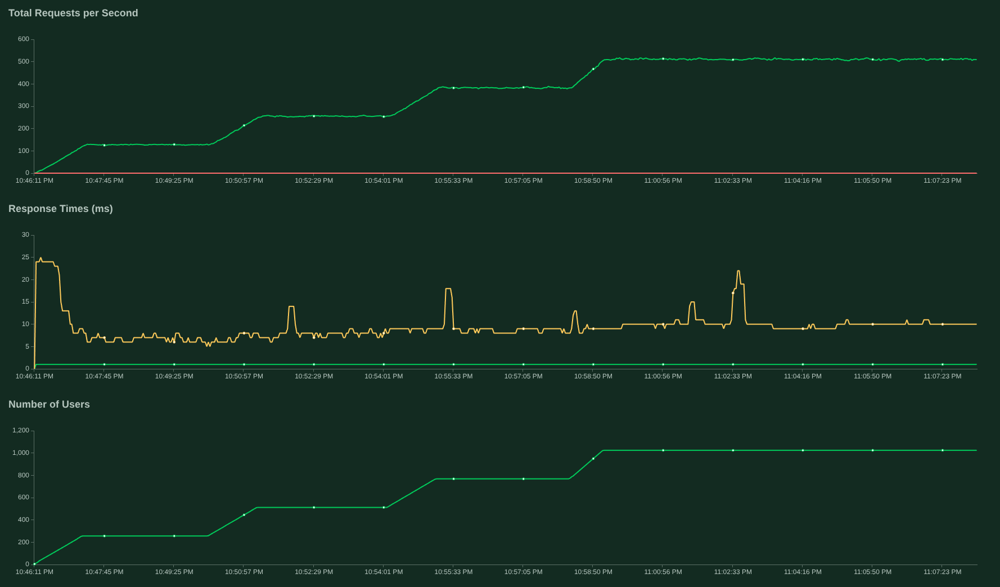

Восстановил работоспособность [проектика] от 2020 года, который писал как
небольшое тестовое.

Смысл задачи простой -- классика банковских переводов с одного счёта на другой.
Подвох, который у этой задачи есть при решении в лоб с простой таблицей баланса
счетов -- возможность дедлока при одновременных переводах.

Тогда я попадал на такое тестовое не впервые. Решил вместо мутируемого состояния
положить в основу event sourcing. Получилось интересно. Как бонус такого
подхода: хранение полной истории счёта уже включено из коробки.

Прогнал вчера нагрузочные тесты Locust'а, работает даже спустя 5 с копейками
лет, надо было только прибить корректные версии образов :)

[проектика]: https://github.com/tsb99x/transfer
