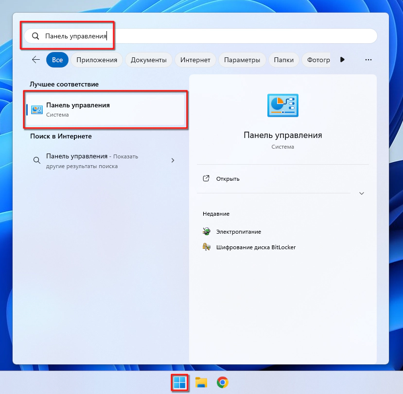
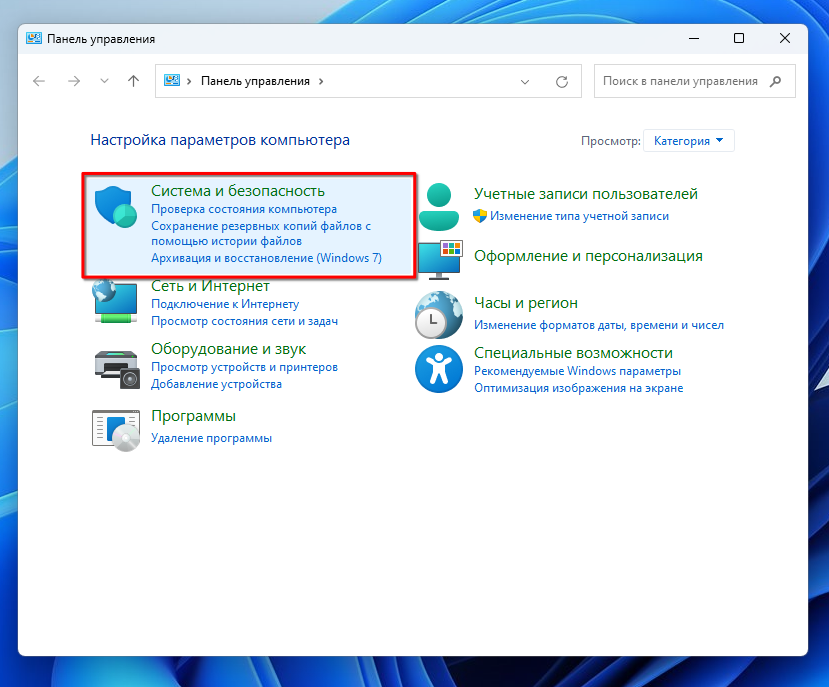
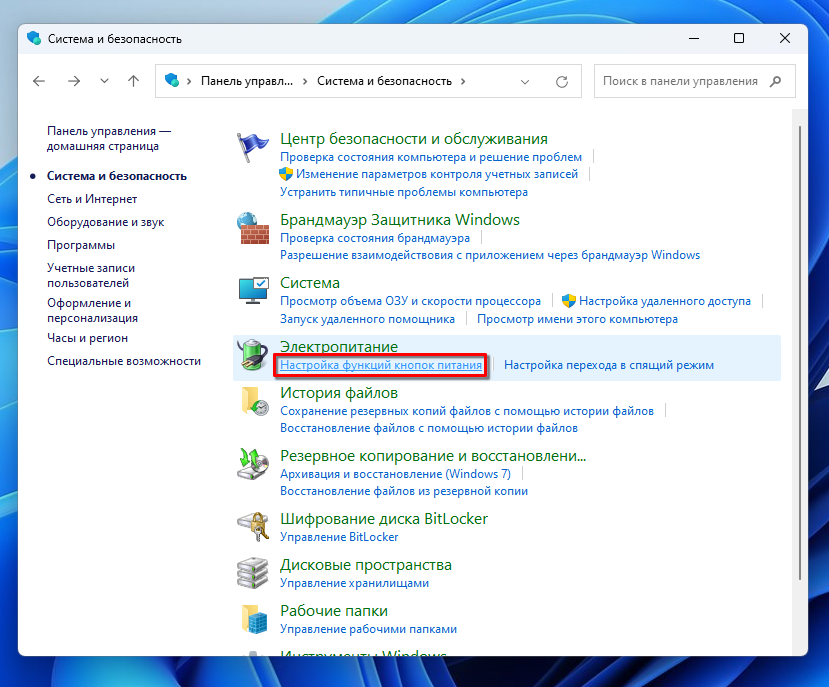
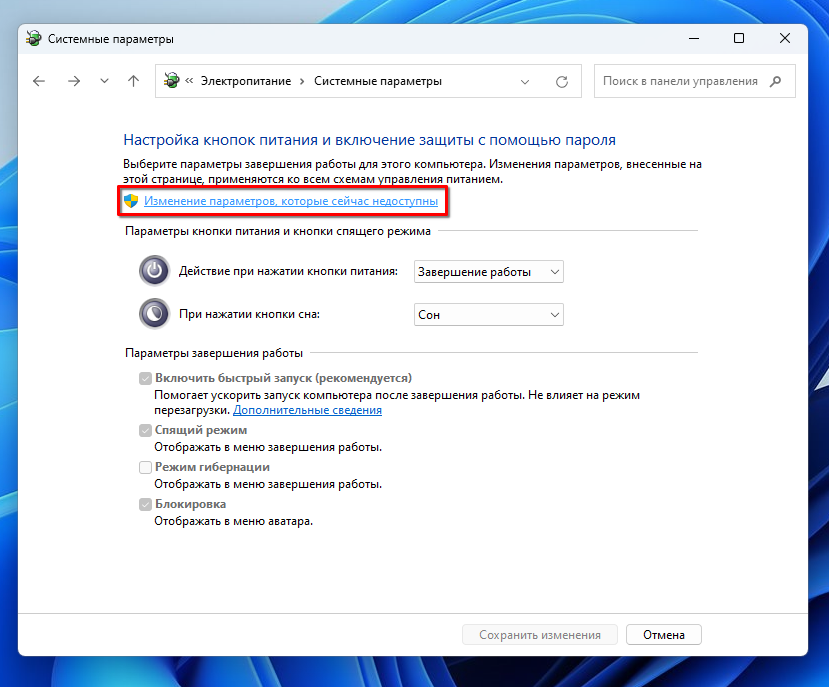
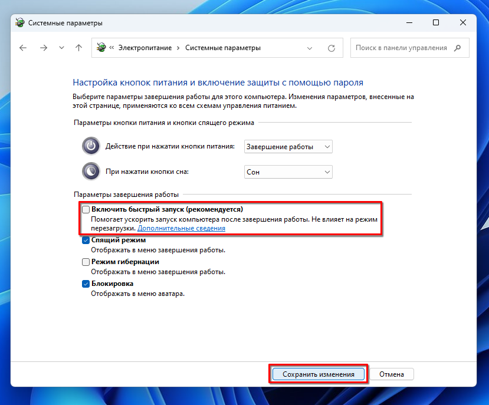

Windows версий 10 и 11 имеют одну интересную настройку по-умолчанию. Называется
она "быстрый запуск". В ряде случаев она бывает полезна для ускорения запуска
ПК. Краткое резюме функции -- возможность ускорить загрузку системы за счёт
сохранения последнего состояния уже запущенной системы.

Я могу сравнить эту функцию с гибернацией, когда данные из оперативной памяти
записываются в файл или отдельный раздел на диске. Разница лишь в том, как
именно представлена функция "быстрый запуск".

В Windows 10 и 11 она автоматически используется при выключении компьютера. В то
же время гибернация представлена как отдельный вариант завершения работы ПК.

Напомню, старый вариант завершения работы приводил к полному очищению состояния
системы. Т.е. при запуске системы после завершения работы Вы могли рассчитывать
на полную инициализацию всех приложений из списка автозапуска.

Теперь же Вы можете запустить систему и увидеть в диспетчере задач программы,
которых, например, нет в автозапуске. Или не обнаружить приложение, которое есть
в автозапуске. Отлаживать проблемы в такой системе становится сложнее из-за
неявной натуры запуска приложений.

Отдельный аспект, который страдает от новой функции -- игры. Нельзя положится,
что в фоне не работает какой-нибудь процесс, который остался с предыдущего
запуска системы и сейчас не нужен.

Из-за этих особенностей, я предпочитаю отключать функцию "быстрый запуск" на ПК.

Последовательность действий схожа для Windows 10 и 11, скриншоты будут для
Windows 11. Открываем меню "Пуск", ищем "Панель управления", открываем
приложение.

В панели управления выбираем раздел "Система и безопасность".

В открывшемся разделе нажимаем "Настройка функций кнопок питания".

Разблокируем изменение параметров завершения работы кликом на "Изменение
параметров, которые сейчас недоступны" с изображением щита.

Снимаем галочку с разблокированного параметра завершения работы под названием
"Включить быстрый запуск (рекомендуется)". Нажимаем на "Сохранить изменения".

Подобная несложная настройка поможет быть уверенным, что каждый запуск ПК после
привычного завершения работы будет "чистой загрузкой".
