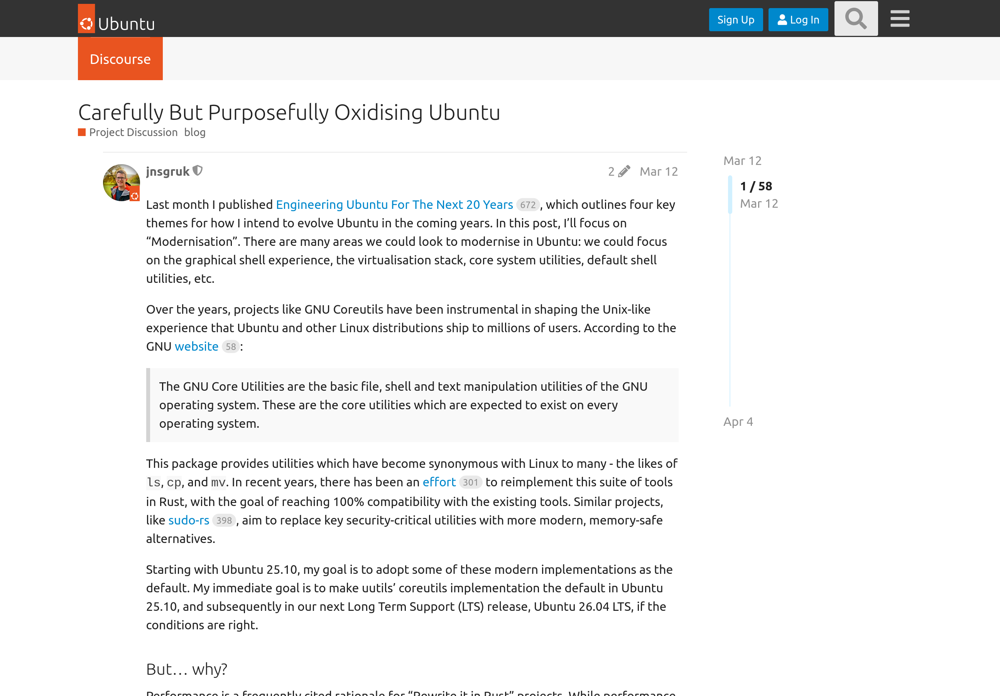

Я немного в шоке от этих новостей. На замену GNU Core Utilities в Ubuntu придёт
uutils. Сколько я не перечитываю анонс от VP Engineering из Canonical, никак не
могу получить внятного ответа на вопрос: зачем? Зачем даже пытаться впихнуть в
критичную инфраструктуру вокруг ядра что-то, что не проходит полный набор тестов
GNU Core Utilities? Есть над чем подумать на днях...

- [Анонс от VP Engineering из Canonical](https://discourse.ubuntu.com/t/carefully-but-purposefully-oxidising-ubuntu/56995)
- [Домашняя страница uutils](https://uutils.github.io/)
- [Динамика покрытия тестами uutils](https://uutils.github.io/coreutils/docs/test_coverage.html)
