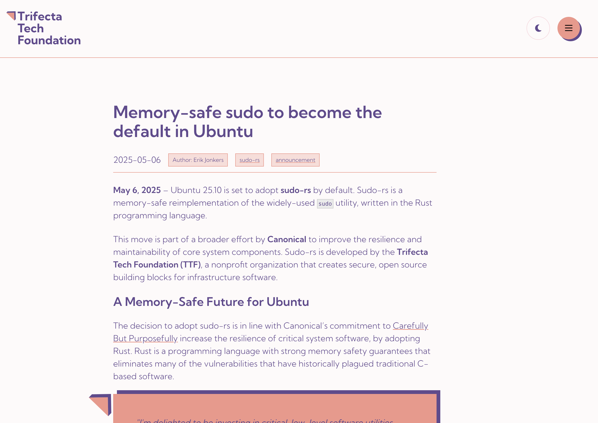

---
title: Ubuntu заменит sudo на sudo-rs
author: Антон Муравьев
date: 2025-05-06T17:44:21+03:00
description: Странный случай оксидирования 2
guid: c3d71bc6-4626-42e8-9015-f6271b99ddd5
---

Читаю в очередной раз новости и вижу, что в Ubuntu всё также преследуют цель
переехать на Rust просто ради Rust.

Никаких специфических деталей, почему это делают, как всегда нет. А вот
абстрактных слов, конечно же, хватает. Закинули бы для приличия хоть пару
критических CVE для sudo, которые пофиксил бы Rust.

Я не против Rust, а против переезда на незаконченное решение, которое ещё никто
не обкатал.

Почему не взять doas? Он куда проще, чем sudo, кода значительно меньше. Doas уже
обкатан в мирах BSD и Arch.

Эх. Ладно. Наверное, в этом и есть прелесть мира Linux. Творят, что хотят. Их
право.

- [Новость на Phoronix](https://www.phoronix.com/news/Ubuntu-25.10-sudo-rs-Default)
