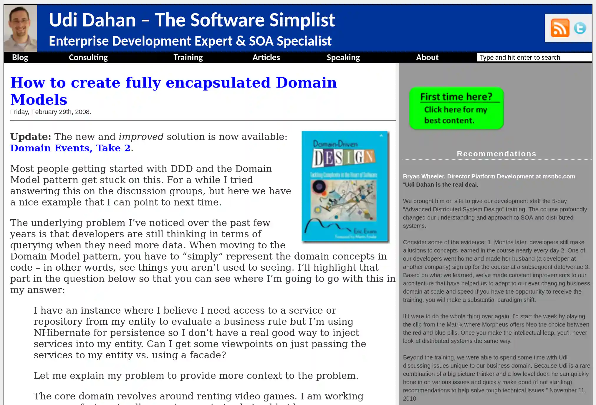

Уди Дахан -- один из первопроходцев DDD в C#.

Он смог показать, как именно можно применить очевидные инфраструктурные практики
типа сервисной шины в контексте доменных событий.

Да, на сегодняшний день имплементация инфраструктуры для доменных событий может
выглядеть совсем иначе. Но ознакомление с 3-я заметками Дахана крайне важно для
понимания исторического контекста.

Статьи на сайте Дахана:

- [How to create fully encapsulated Domain Models](https://udidahan.com/2008/02/29/how-to-create-fully-encapsulated-domain-models/)
- [Domain Events – Take 2](https://udidahan.com/2008/08/25/domain-events-take-2/)
- [Domain Events – Salvation ](https://udidahan.com/2009/06/14/domain-events-salvation/)
