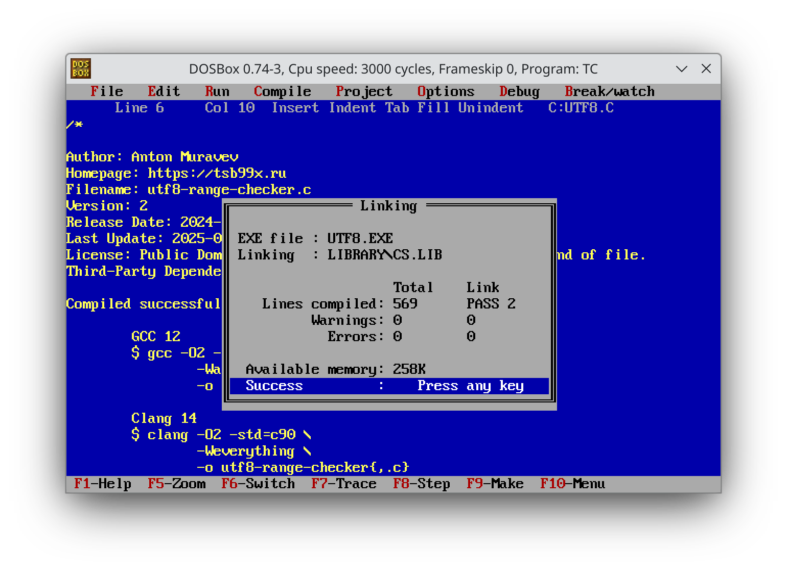

Настоящая разработка это не только про то, чтобы написать программу. Программу
ещё нужно поддерживать. Только поддержка покажет, насколько код удобен в работе.

Хороший тон поддержки -- не сломать старые функции, а только улучшить софт.
Немного решил поработать над парой своих "игрушечных" проектов на Си. Обе
программы предельно просты, но имеют несколько недостатков.

Первым делом, включил в работу [ClangFormat]. Инструмент не самый простой, но
позволяет добиться унифицированного форматирования. Меня особо заинтересовала
возможность автоматического оборачивания в скобки кода в `if` и `else`. История
показывает, что это источник некоторых очевидных ошибок, включая [баг Apple].

Кроме этого, подключил компиляцию с помощью Clang и MSVC 2010. Польза Clang --
он предоставляет замечательный флаг `-Weverything`. Не все предупреждения будут
ошибками, но дают повод задуматься. Мне очень не хватает такого флага для GCC.

С MSVC 2010 иная ситуация. Я хотел получить универсальный код. Windows оказался
хорошим тестом. Особенно Windows XP, где MSVC 2010 -- последний релиз MSVC. Да,
мало кто будет сейчас его использовать. Но, если проект компилируется и там, то
скомпилируется практически везде. [Tiny C Compiler] в этих целях тоже подходит.

По тулчейну понятно, теперь к деталям.

Начнём с [Access Log Tabulator]. Проблемы, которые я решал -- поиск альтернативы
для нестандартной функции `strptime` и что делать с оффсетами в `struct tm`.

Предельно наивная имплементация `strptime` для формата даты-времени Apache не
вызвала проблем. Достаточно использовать стандартный `sscanf`.

А вот пример структуры `tm` в заголовочных файлах у Clang и GCC на моём Debian:

```c
struct tm
{
  int tm_sec;			/* Seconds.	[0-60] (1 leap second) */
  int tm_min;			/* Minutes.	[0-59] */
  int tm_hour;			/* Hours.	[0-23] */
  int tm_mday;			/* Day.		[1-31] */
  int tm_mon;			/* Month.	[0-11] */
  int tm_year;			/* Year	- 1900.  */
  int tm_wday;			/* Day of week.	[0-6] */
  int tm_yday;			/* Days in year.[0-365]	*/
  int tm_isdst;			/* DST.		[-1/0/1]*/

# ifdef	__USE_MISC
  long int tm_gmtoff;		/* Seconds east of UTC.  */
  const char *tm_zone;		/* Timezone abbreviation.  */
# else
  long int __tm_gmtoff;		/* Seconds east of UTC.  */
  const char *__tm_zone;	/* Timezone abbreviation.  */
# endif
};
```

Стандарт Си совсем не предусматривает использование оффсетов относительно GMT.
То есть, поле `tm_gmtoff` -- нестандартное расширение и на MSVC его нет. Оффсет
пришлось вынести за пределы структуры `tm` отдельной переменной, но не беда.

Результат -- полностью совместимая с C89/C90 версия программы.

Обновил и [UTF8 Range Checker]. Самая большая боль там -- размерность переменной
для Unicode codepoint. Такая переменная должна иметь как минимум 32 битный
беззнаковый тип. Я же использовал `unsigned int`. Теоретически это проблема.

Да-да, я знаю, это неправильно. Стандарт Си гарантирует размерность `int` не
менее 16 бит. То есть, для некоторых платформ невозможно будет получить
корректный codepoint, ведь размерность будет меньше 32. Программа выдаст мусор.



Ради интереса, постарался найти такую платформу и компилятор. Из тех пар, что
пробовал, только [i16gcc] на [FreeDOS] 1.3 или [Turbo C] на [DOSBox] показали
проблему с битностью. У них `int` занимает 16 бит, а не 32.

Не беда, меняем `unsigned int` на `unsigned long` и дело в шляпе!

Что же, опробовал вторые версии программ на DOS, мои тесты проходят. Прекрасно!

P.S.: переносы строк постоянно приходилось менять при переходе из Unix окружения
в Win или DOS. В Vim есть опция для установки окончания строк, `:set ff=dos` или
`:set ff=unix`. Очень удобно. Применил опцию, сохраняешь файл и готово.

[ClangFormat]: https://clang.llvm.org/docs/ClangFormat.html
[баг Apple]: https://www.imperialviolet.org/2014/02/22/applebug.html
[Tiny C Compiler]: https://bellard.org/tcc/
[Access Log Tabulator]: https://github.com/tsb99x/access-log-tabulator
[UTF8 Range Checker]: https://github.com/tsb99x/utf8-range-checker
[i16gcc]: https://github.com/tkchia/gcc-ia16/
[FreeDOS]: https://www.freedos.org/
[Turbo C]: https://en.wikipedia.org/wiki/Turbo_C
[DOSBox]: https://www.dosbox.com/
