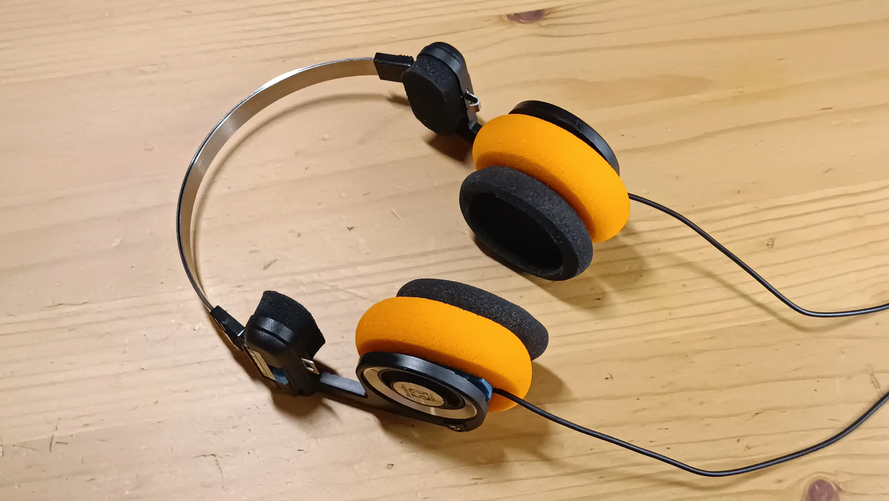
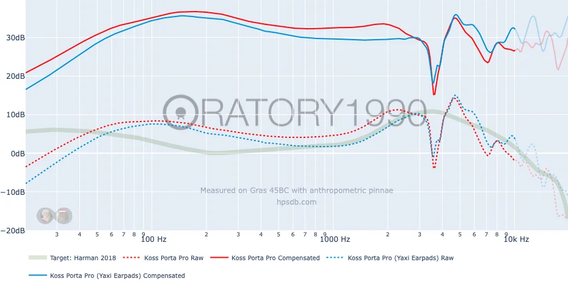

Прошлым летом я купил себе Koss Porta Pro. Наушники интересные как по внешнему
виду, так и по звуковому профилю. Их легко определить в категорию "тёмных"
наушников, ведь в них преобладают низкие частоты. Аудиофилы даже говорят фразу
"грязные низы" применительно к басу Koss Porta Pro.

И действительно, я сам уже отмечал, что разобрать мужскую речь ближе к частоте
в 100Гц становится сложно. Раньше исправлял это с помощью программного EQ, но
этот метод не подходит для устройств без эквалайзера. Поэтому Porta Pro
отправились на полку после месяца активного прослушивания.

Но вчера для Porta Pro приехали амбушюры типа Yaxi Pads. Специально заказывал
яркие, чтобы завершить образ ретро-наушников. В интернете есть хвалебные
отзывы. Комментаторы отмечают, что амбушюры от Yaxi улучшают качество звука
Porta Pro. Для внешнего наблюдателя, не занимающегося звуком, это может вызвать
ряд вопросов. Как же простая поролоновая губка может улучшить звук?

Если посмотреть на амбушюры типа Yaxi и оригинальные от Porta Pro, видно:
тюнинговые амбушюры значительно больше по всем параметрам, в особенности -- по
толщине. В ней и кроется весь секрет. Ушам с ними банально мягче и приятнее,
ушная раковина не соприкасается с корпусом драйвера.

Теперь между ухом и динамиком стало больше места, появился воздушный зазор. Это
значит давление звуковой волны стало меньше, что особо влияет на агрессивность
басов (она снижается). Для практического объяснения этого эффекта можно провести
аналогию с микрофоном (особенно в свете того, что динамический микрофон и
динамик -- две стороны одной технологии). Чем ближе рот находится к микрофону,
тем больше низких частот будет считываться устройством и тем более басовитым
получится голос (proximity effect). Чтобы не быть голословным, приведу [замеры
от oratory1990], где специалист верифицирует подобные выводы.

С новыми амбушюрами получается эффект естественного EQ, для которого не
требуется программного вмешательства в сигнал. Конечно, звук не становится супер
чётким, наушники сохраняют свой тёмный профиль, но мужской голос теперь более
ясный, слова можно разбирать без сложности. Музыка стала звучать чуть более
естественно. Вот так, теперь обкатываю Porta Pro вместе с FiiO BTR11 и
обновлёнными амбушюрами, комбо супер!

[замеры от oratory1990]: https://www.reddit.com/r/oratory1990/comments/jx27p7/the_effect_of_yaxi_earpads_on_the_koss_porta_pro/
